# Dataflow Diagrams

Visual diagrams of message, event, and command flow through the system.

---

## System component overview

> **Legend:**
> - `pub:` / `sub:` = Pub/sub via MessageBus topics (blue)
> - `send:` / `recv:` = Point-to-point command via MessageBus endpoint (red)
> - `req:` / `resp:` = Request/response via MessageBus correlation ID (purple)
> - `chan:` = Direct tokio channel, bypasses MessageBus (green)
> - Dotted gray = cache read/write

```mermaid
graph LR
    subgraph Clients
        DC[Data Clients]
        EC[Exec Clients]
    end

    subgraph Engines
        DE[DataEngine]
        RE[RiskEngine]
        EE[ExecutionEngine]
        OE[OrderEmulator]
        PE[Portfolio]
        ME[MatchingEngine - backtest only]
    end

    CLK((LiveClock))
    MB((MessageBus))

    subgraph Timers
        T1[/"stop_check (100ms)"/]
        T2[/"maintenance (100ms)"/]
        T3[/"shutdown_deadline"/]
    end

    subgraph Users
        S[Strategy]
        A[Actor]
        EA[Exec Algorithm]
    end

    CA[(Cache)]

    %% ====== TIME EVENTS via channel (green, links 0-1) ======
    CLK -.->|"chan: TimeEventHandler"| S
    CLK -.->|"chan: TimeEventHandler"| OE

    %% ====== SYSTEM TIMERS (green, links 2-8) ======
    T1 -.->|"check stop signal"| EE
    T2 -.->|"reconcile inflight/open"| EE
    T2 -.->|"purge closed orders"| EE
    T2 -.->|"purge closed positions"| EE
    T2 -.->|"audit own books"| CA
    T2 -.->|"prune recent fills"| EE
    T3 -.->|"break select! loop"| EE

    %% ====== PUB/SUB via MessageBus (blue, links 1-14) ======
    DC -->|"chan: DataEvent"| DE
    DE -->|"pub: data.quotes/trades/bars"| MB
    DE -->|"pub: data.instrument.*"| MB
    MB -->|"sub: data.quotes/trades/bars"| S
    MB -->|"sub: data.quotes/trades/bars"| A
    MB -->|"sub: data.quotes/trades"| OE
    MB -->|"sub: data.instrument.*"| EE
    EE -->|"pub: events.order.SID"| MB
    EE -->|"pub: events.position.SID"| MB
    MB -->|"sub: events.order.SID"| S
    MB -->|"sub: events.position.SID"| S
    MB -->|"sub: events.order.* wildcard"| RE
    MB -->|"sub: events.order.SID"| EA
    MB -->|"sub: events.order.SID"| OE

    %% ====== POINT-TO-POINT COMMANDS (red, links 14-22) ======
    %% Arrows show logical direction; internally routed via msgbus endpoints
    S ==>|"send: SubmitOrder"| RE
    S ==>|"send: CancelOrder"| EE
    S ==>|"send: emulated order"| OE
    S ==>|"send: algo order"| EA
    S ==>|"send: Subscribe/Unsub"| DE
    RE ==>|"send: approved"| EE
    RE ==>|"send: OrderDenied"| EE
    OE ==>|"send: released"| RE
    EA ==>|"send: child order"| RE

    %% ====== REQUEST/RESPONSE (purple, links 23-27) ======
    %% Arrows show logical direction; internally uses msgbus correlation_id
    S -.->|"req: RequestBars"| DE
    S -.->|"req: RequestInstruments"| DE
    DE -.->|"req: forward to client"| DC
    DC -.->|"resp: BarsResponse"| DE
    DE -.->|"resp: correlation_id callback"| S

    %% ====== EXECUTION via channels (green, links 28-33) ======
    EE -.->|"chan: submit/cancel/modify"| EC
    EE -.->|"chan: submit/cancel/modify"| ME
    EC -.->|"chan: ExecutionEvent"| EE
    ME -.->|"chan: OrderEventAny"| EE
    EE -.->|"send: OrderFilled"| PE
    EC -.->|"chan: AccountState"| PE

    %% ====== CACHE (gray, links 34-37) ======
    EE -.-> CA
    DE -.-> CA
    PE -.-> CA
    RE -.-> CA

    %% ====== STYLES ======
    %% Green: timers + channels (links 0-9)
    linkStyle 0 stroke:#4CAF50,stroke-width:2px
    linkStyle 1 stroke:#4CAF50,stroke-width:2px
    linkStyle 2 stroke:#4CAF50,stroke-width:1px
    linkStyle 3 stroke:#4CAF50,stroke-width:1px
    linkStyle 4 stroke:#4CAF50,stroke-width:1px
    linkStyle 5 stroke:#4CAF50,stroke-width:1px
    linkStyle 6 stroke:#4CAF50,stroke-width:1px
    linkStyle 7 stroke:#4CAF50,stroke-width:1px
    linkStyle 8 stroke:#4CAF50,stroke-width:1px
    %% Green: DC channel (link 9)
    linkStyle 9 stroke:#4CAF50,stroke-width:2px
    %% Blue: pub/sub (links 10-22)
    linkStyle 10 stroke:#2196F3,stroke-width:2px
    linkStyle 11 stroke:#2196F3,stroke-width:2px
    linkStyle 12 stroke:#2196F3,stroke-width:2px
    linkStyle 13 stroke:#2196F3,stroke-width:2px
    linkStyle 14 stroke:#2196F3,stroke-width:2px
    linkStyle 15 stroke:#2196F3,stroke-width:2px
    linkStyle 16 stroke:#2196F3,stroke-width:2px
    linkStyle 17 stroke:#2196F3,stroke-width:2px
    linkStyle 18 stroke:#2196F3,stroke-width:2px
    linkStyle 19 stroke:#2196F3,stroke-width:2px
    linkStyle 20 stroke:#2196F3,stroke-width:2px
    linkStyle 21 stroke:#2196F3,stroke-width:2px
    linkStyle 22 stroke:#2196F3,stroke-width:2px

    %% Red: point-to-point commands (links 23-31)
    linkStyle 23 stroke:#F44336,stroke-width:2px
    linkStyle 24 stroke:#F44336,stroke-width:2px
    linkStyle 25 stroke:#F44336,stroke-width:2px
    linkStyle 26 stroke:#F44336,stroke-width:2px
    linkStyle 27 stroke:#F44336,stroke-width:2px
    linkStyle 28 stroke:#F44336,stroke-width:2px
    linkStyle 29 stroke:#F44336,stroke-width:2px
    linkStyle 30 stroke:#F44336,stroke-width:2px
    linkStyle 31 stroke:#F44336,stroke-width:2px

    %% Purple: request/response (links 32-36)
    linkStyle 32 stroke:#9C27B0,stroke-width:2px
    linkStyle 33 stroke:#9C27B0,stroke-width:2px
    linkStyle 34 stroke:#9C27B0,stroke-width:2px
    linkStyle 35 stroke:#9C27B0,stroke-width:2px
    linkStyle 36 stroke:#9C27B0,stroke-width:2px

    %% Green: execution channels (links 37-42)
    linkStyle 37 stroke:#4CAF50,stroke-width:2px
    linkStyle 38 stroke:#4CAF50,stroke-width:2px
    linkStyle 39 stroke:#4CAF50,stroke-width:2px
    linkStyle 40 stroke:#4CAF50,stroke-width:2px
    linkStyle 41 stroke:#4CAF50,stroke-width:2px
    linkStyle 42 stroke:#4CAF50,stroke-width:2px

    %% Gray: cache access (links 43-46)
    linkStyle 43 stroke:#9E9E9E,stroke-width:1px
    linkStyle 44 stroke:#9E9E9E,stroke-width:1px
    linkStyle 45 stroke:#9E9E9E,stroke-width:1px
    linkStyle 46 stroke:#9E9E9E,stroke-width:1px
```

---

## Normal order flow (live, happy path)

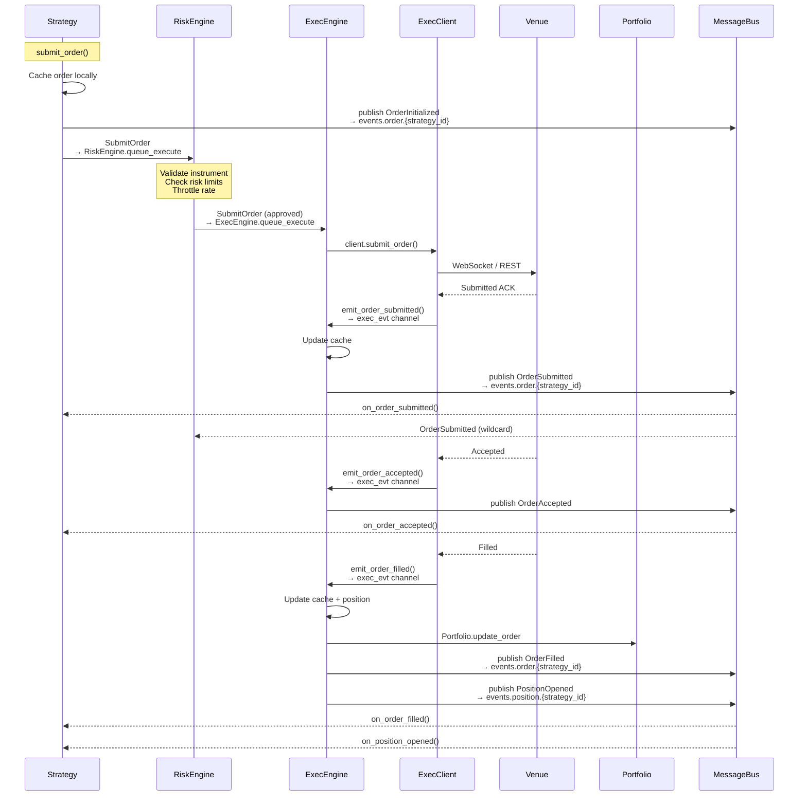
```mermaid
sequenceDiagram
    participant S as Strategy
    participant R as RiskEngine
    participant E as ExecEngine
    participant C as ExecClient
    participant V as Venue
    participant P as Portfolio
    participant MB as MessageBus

    Note over S: submit_order()
    S->>S: Cache order locally
    S->>MB: publish OrderInitialized<br/>→ events.order.{strategy_id}

    S->>R: SubmitOrder<br/>→ RiskEngine.queue_execute
    Note over R: Validate instrument<br/>Check risk limits<br/>Throttle rate

    R->>E: SubmitOrder (approved)<br/>→ ExecEngine.queue_execute

    E->>C: client.submit_order()
    C->>V: WebSocket / REST

    V-->>C: Submitted ACK
    C->>E: emit_order_submitted()<br/>→ exec_evt channel
    E->>E: Update cache
    E->>MB: publish OrderSubmitted<br/>→ events.order.{strategy_id}
    MB-->>S: on_order_submitted()
    MB-->>R: OrderSubmitted (wildcard)

    V-->>C: Accepted
    C->>E: emit_order_accepted()<br/>→ exec_evt channel
    E->>MB: publish OrderAccepted
    MB-->>S: on_order_accepted()

    V-->>C: Filled
    C->>E: emit_order_filled()<br/>→ exec_evt channel
    E->>E: Update cache + position
    E->>P: Portfolio.update_order
    E->>MB: publish OrderFilled<br/>→ events.order.{strategy_id}
    E->>MB: publish PositionOpened<br/>→ events.position.{strategy_id}
    MB-->>S: on_order_filled()
    MB-->>S: on_position_opened()
```

---

## Order denied by RiskEngine

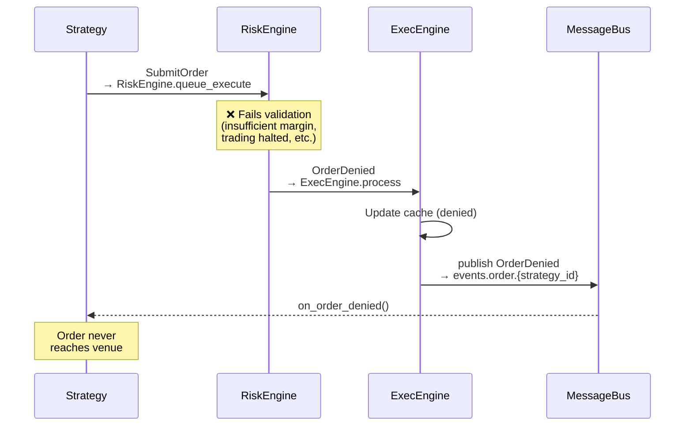
```mermaid
sequenceDiagram
    participant S as Strategy
    participant R as RiskEngine
    participant E as ExecEngine
    participant MB as MessageBus

    S->>R: SubmitOrder<br/>→ RiskEngine.queue_execute
    Note over R: ❌ Fails validation<br/>(insufficient margin,<br/>trading halted, etc.)

    R->>E: OrderDenied<br/>→ ExecEngine.process
    E->>E: Update cache (denied)
    E->>MB: publish OrderDenied<br/>→ events.order.{strategy_id}
    MB-->>S: on_order_denied()

    Note over S: Order never<br/>reaches venue
```

---

## Emulated order flow

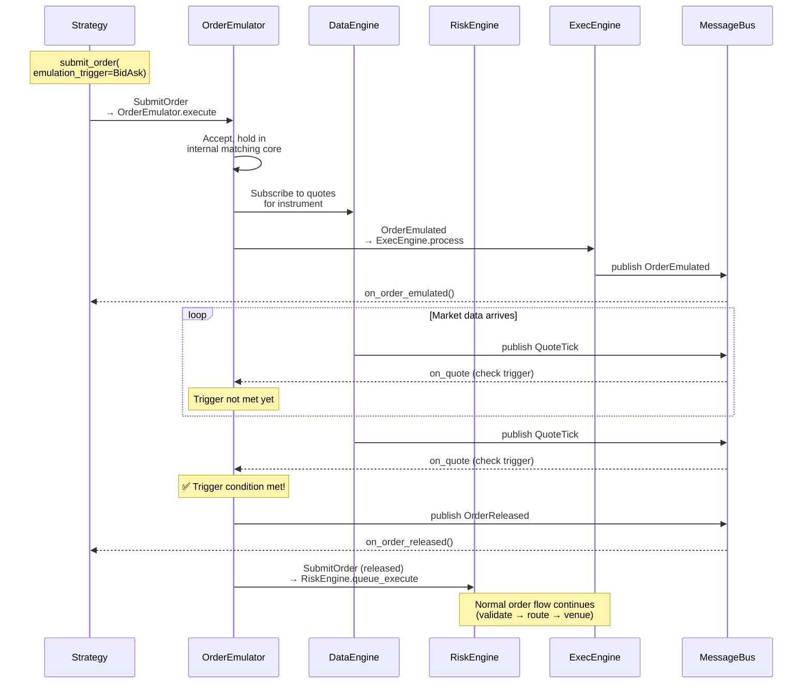
```mermaid
sequenceDiagram
    participant S as Strategy
    participant OE as OrderEmulator
    participant DE as DataEngine
    participant R as RiskEngine
    participant E as ExecEngine
    participant MB as MessageBus

    Note over S: submit_order(<br/>  emulation_trigger=BidAsk)
    S->>OE: SubmitOrder<br/>→ OrderEmulator.execute

    OE->>OE: Accept, hold in<br/>internal matching core
    OE->>DE: Subscribe to quotes<br/>for instrument
    OE->>E: OrderEmulated<br/>→ ExecEngine.process
    E->>MB: publish OrderEmulated
    MB-->>S: on_order_emulated()

    loop Market data arrives
        DE->>MB: publish QuoteTick
        MB-->>OE: on_quote (check trigger)
        Note over OE: Trigger not met yet
    end

    DE->>MB: publish QuoteTick
    MB-->>OE: on_quote (check trigger)
    Note over OE: ✅ Trigger condition met!

    OE->>MB: publish OrderReleased
    MB-->>S: on_order_released()
    OE->>R: SubmitOrder (released)<br/>→ RiskEngine.queue_execute

    Note over R,E: Normal order flow continues<br/>(validate → route → venue)
```

---

## Execution algorithm flow (TWAP)

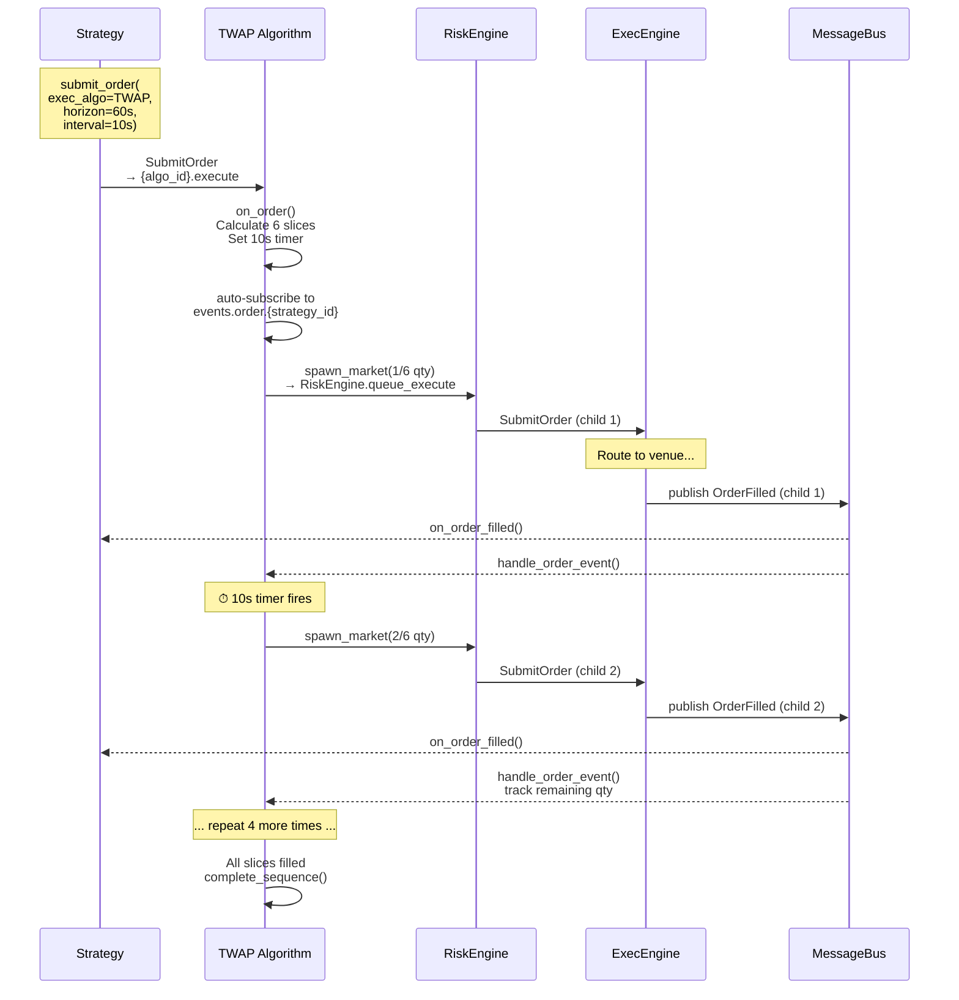
```mermaid
sequenceDiagram
    participant S as Strategy
    participant TW as TWAP Algorithm
    participant R as RiskEngine
    participant E as ExecEngine
    participant MB as MessageBus

    Note over S: submit_order(<br/>  exec_algo=TWAP,<br/>  horizon=60s,<br/>  interval=10s)
    S->>TW: SubmitOrder<br/>→ {algo_id}.execute

    TW->>TW: on_order()<br/>Calculate 6 slices<br/>Set 10s timer
    TW->>TW: auto-subscribe to<br/>events.order.{strategy_id}

    TW->>R: spawn_market(1/6 qty)<br/>→ RiskEngine.queue_execute
    R->>E: SubmitOrder (child 1)
    Note over E: Route to venue...
    E->>MB: publish OrderFilled (child 1)
    MB-->>S: on_order_filled()
    MB-->>TW: handle_order_event()

    Note over TW: ⏱ 10s timer fires

    TW->>R: spawn_market(2/6 qty)
    R->>E: SubmitOrder (child 2)
    E->>MB: publish OrderFilled (child 2)
    MB-->>S: on_order_filled()
    MB-->>TW: handle_order_event()<br/>track remaining qty

    Note over TW: ... repeat 4 more times ...

    TW->>TW: All slices filled<br/>complete_sequence()
```

---

## Cancel order flow

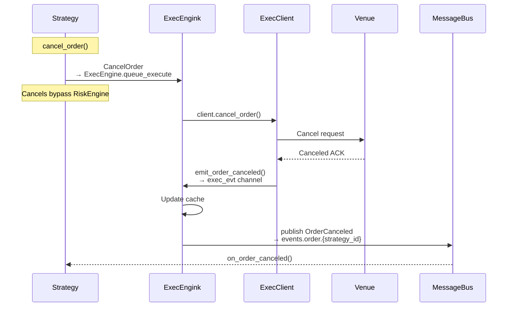
```mermaid
sequenceDiagram
    participant S as Strategy
    participant E as ExecEngink
    participant C as ExecClient
    participant V as Venue
    participant MB as MessageBus

    Note over S: cancel_order()
    S->>E: CancelOrder<br/>→ ExecEngine.queue_execute
    Note over S: Cancels bypass RiskEngine

    E->>C: client.cancel_order()
    C->>V: Cancel request

    V-->>C: Canceled ACK
    C->>E: emit_order_canceled()<br/>→ exec_evt channel
    E->>E: Update cache
    E->>MB: publish OrderCanceled<br/>→ events.order.{strategy_id}
    MB-->>S: on_order_canceled()
```

---

## Modify order flow

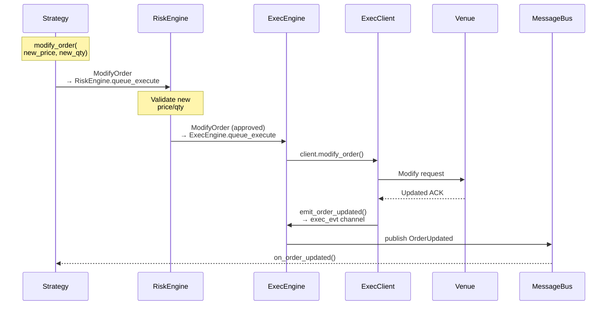
```mermaid
sequenceDiagram
    participant S as Strategy
    participant R as RiskEngine
    participant E as ExecEngine
    participant C as ExecClient
    participant V as Venue
    participant MB as MessageBus

    Note over S: modify_order(<br/>  new_price, new_qty)
    S->>R: ModifyOrder<br/>→ RiskEngine.queue_execute
    Note over R: Validate new<br/>price/qty

    R->>E: ModifyOrder (approved)<br/>→ ExecEngine.queue_execute
    E->>C: client.modify_order()
    C->>V: Modify request

    V-->>C: Updated ACK
    C->>E: emit_order_updated()<br/>→ exec_evt channel
    E->>MB: publish OrderUpdated
    MB-->>S: on_order_updated()
```

---

## Data request/response flow

> Strategies can **request** historical or snapshot data from the DataEngine.
> The request is routed to the appropriate DataClient, which fetches from the
> venue (REST/cache) and returns a typed response through the DataEngine back
> to the requester.

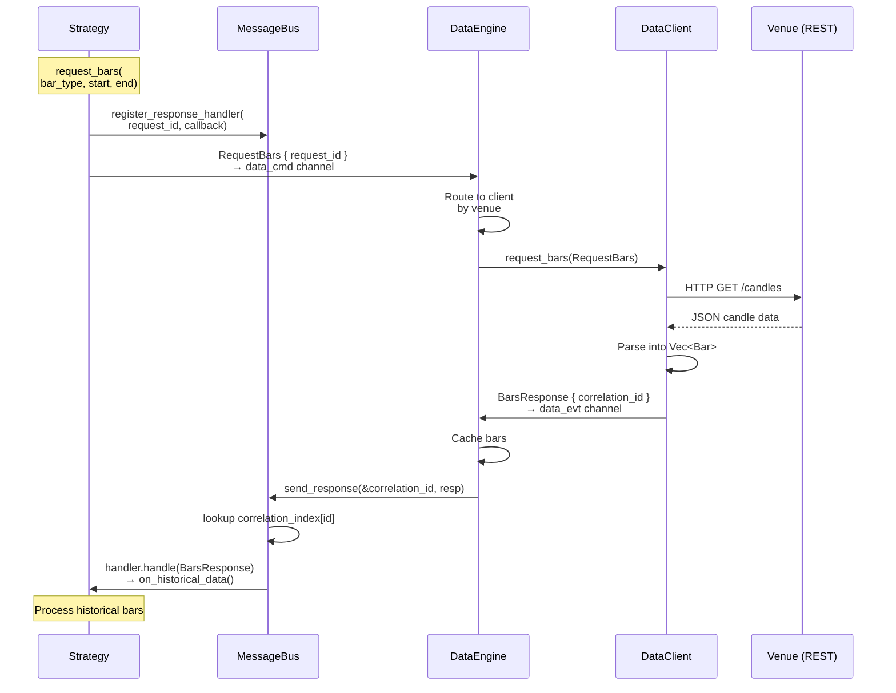
```mermaid
sequenceDiagram
    participant S as Strategy
    participant MB as MessageBus
    participant DE as DataEngine
    participant DC as DataClient
    participant V as Venue (REST)

    Note over S: request_bars(<br/>  bar_type, start, end)
    S->>MB: register_response_handler(<br/>  request_id, callback)
    S->>DE: RequestBars { request_id }<br/>→ data_cmd channel

    DE->>DE: Route to client<br/>by venue

    DE->>DC: request_bars(RequestBars)
    DC->>V: HTTP GET /candles

    V-->>DC: JSON candle data
    DC->>DC: Parse into Vec<Bar>

    DC->>DE: BarsResponse { correlation_id }<br/>→ data_evt channel
    DE->>DE: Cache bars
    DE->>MB: send_response(&correlation_id, resp)
    MB->>MB: lookup correlation_index[id]
    MB->>S: handler.handle(BarsResponse)<br/>→ on_historical_data()

    Note over S: Process historical bars
```

### Available request/response pairs

| Request | Response | What it fetches |
|---------|----------|-----------------|
| `RequestInstrument` | `InstrumentResponse` | Single instrument definition |
| `RequestInstruments` | `InstrumentsResponse` | All instruments for a venue |
| `RequestBookSnapshot` | `BookResponse` | Current order book snapshot |
| `RequestBookDepth` | `BookDepthResponse` | Book depth at N levels |
| `RequestBookDeltas` | `BookDeltasResponse` | Historical book deltas |
| `RequestQuotes` | `QuotesResponse` | Historical quote ticks |
| `RequestTrades` | `TradesResponse` | Historical trade ticks |
| `RequestBars` | `BarsResponse` | Historical OHLCV bars |
| `RequestFundingRates` | `FundingRatesResponse` | Funding rate history |
| `RequestForwardPrices` | `ForwardPricesResponse` | Forward/mark prices |
| `RequestCustomData` | `CustomDataResponse` | Adapter-specific data |

### Key differences from pub/sub

- **Pub/sub** (subscribe): real-time streaming, DataEngine pushes to all subscribers.
- **Request/response**: one-shot fetch, DataEngine routes the request to one client,
  response is delivered only to the requester via a correlation ID callback.

Both flows go through the same `data_evt` / `data_cmd` channels and the DataEngine,
but request/response is point-to-point while pub/sub is broadcast.

---

## Data flow (streaming pub/sub)

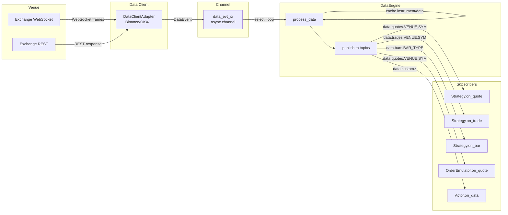
```mermaid
graph LR
    subgraph Venue
        V1[Exchange WebSocket]
        V2[Exchange REST]
    end

    subgraph Data Client
        DC[DataClientAdapter<br/>Binance/OKX/...]
    end

    subgraph Channel
        CH[data_evt_rx<br/>async channel]
    end

    subgraph DataEngine
        DE[process_data]
        PUB[publish to topics]
    end

    subgraph Subscribers
        S1[Strategy.on_quote]
        S2[Strategy.on_trade]
        S3[Strategy.on_bar]
        S4[OrderEmulator.on_quote]
        S5[Actor.on_data]
    end

    V1 -->|WebSocket frames| DC
    V2 -->|REST response| DC
    DC -->|DataEvent| CH
    CH -->|select! loop| DE
    DE -->|cache instrument/data| DE
    DE --> PUB

    PUB -->|data.quotes.VENUE.SYM| S1
    PUB -->|data.trades.VENUE.SYM| S2
    PUB -->|data.bars.BAR_TYPE| S3
    PUB -->|data.quotes.VENUE.SYM| S4
    PUB -->|data.custom.*| S5
```

---

## Live event loop

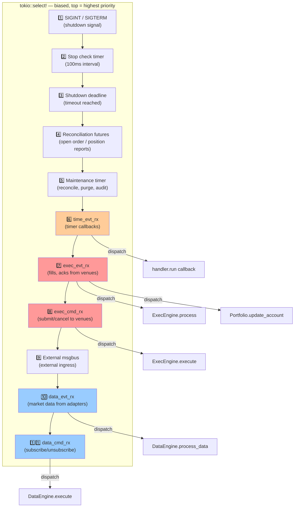
```mermaid
graph TD
    subgraph "tokio::select! — biased, top = highest priority"
        P1["1️⃣ SIGINT / SIGTERM<br/>(shutdown signal)"]
        P2["2️⃣ Stop check timer<br/>(100ms interval)"]
        P3["3️⃣ Shutdown deadline<br/>(timeout reached)"]
        P4["4️⃣ Reconciliation futures<br/>(open order / position reports)"]
        P5["5️⃣ Maintenance timer<br/>(reconcile, purge, audit)"]
        P6["6️⃣ time_evt_rx<br/>(timer callbacks)"]
        P7["7️⃣ exec_evt_rx<br/>(fills, acks from venues)"]
        P8["8️⃣ exec_cmd_rx<br/>(submit/cancel to venues)"]
        P9["9️⃣ External msgbus<br/>(external ingress)"]
        P10["🔟 data_evt_rx<br/>(market data from adapters)"]
        P11["1️⃣1️⃣ data_cmd_rx<br/>(subscribe/unsubscribe)"]
    end

    P1 --> P2 --> P3 --> P4 --> P5 --> P6 --> P7 --> P8 --> P9 --> P10 --> P11

    P7 -->|dispatch| EE1[ExecEngine.process]
    P7 -->|dispatch| PO1[Portfolio.update_account]
    P8 -->|dispatch| EE2[ExecEngine.execute]
    P10 -->|dispatch| DE1[DataEngine.process_data]
    P11 -->|dispatch| DE2[DataEngine.execute]
    P6 -->|dispatch| TMR[handler.run callback]

    style P7 fill:#ff9999
    style P8 fill:#ff9999
    style P10 fill:#99ccff
    style P11 fill:#99ccff
    style P6 fill:#ffcc99
```

---

## Backtest flow

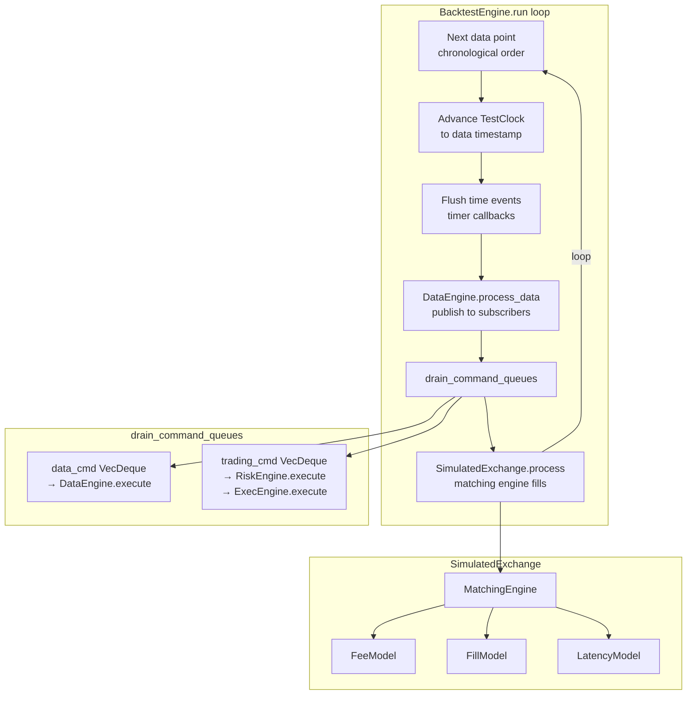
```mermaid
graph TD
    subgraph BacktestEngine.run loop
        A[Next data point<br/>chronological order]
        B[Advance TestClock<br/>to data timestamp]
        C[Flush time events<br/>timer callbacks]
        D[DataEngine.process_data<br/>publish to subscribers]
        E[drain_command_queues]
        F[SimulatedExchange.process<br/>matching engine fills]
    end

    subgraph drain_command_queues
        E1[data_cmd VecDeque<br/>→ DataEngine.execute]
        E2[trading_cmd VecDeque<br/>→ RiskEngine.execute<br/>→ ExecEngine.execute]
    end

    A --> B --> C --> D --> E --> F
    F -->|loop| A
    E --> E1
    E --> E2

    subgraph SimulatedExchange
        ME[MatchingEngine]
        FE[FeeModel]
        FM[FillModel]
        LM[LatencyModel]
    end

    F --> ME
    ME --> FE
    ME --> FM
    ME --> LM
```

---

## Live startup sequence

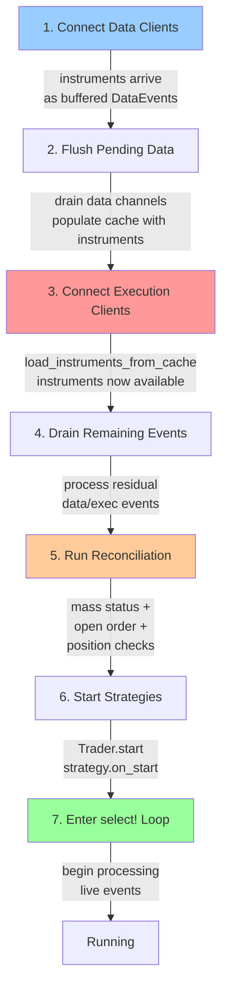
```mermaid
graph TD
    A[1. Connect Data Clients] -->|instruments arrive<br/>as buffered DataEvents| B
    B[2. Flush Pending Data] -->|drain data channels<br/>populate cache with instruments| C
    C[3. Connect Execution Clients] -->|load_instruments_from_cache<br/>instruments now available| D
    D[4. Drain Remaining Events] -->|process residual<br/>data/exec events| E
    E[5. Run Reconciliation] -->|mass status +<br/>open order +<br/>position checks| F
    F[6. Start Strategies] -->|Trader.start<br/>strategy.on_start| G
    G[7. Enter select! Loop] -->|begin processing<br/>live events| H[Running]

    style A fill:#99ccff
    style C fill:#ff9999
    style E fill:#ffcc99
    style G fill:#99ff99
```

---

## Live shutdown sequence

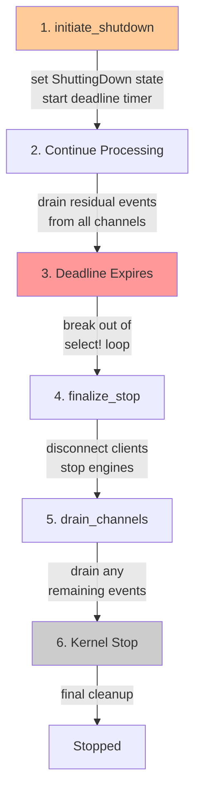
```mermaid
graph TD
    A[1. initiate_shutdown] -->|set ShuttingDown state<br/>start deadline timer| B
    B[2. Continue Processing] -->|drain residual events<br/>from all channels| C
    C[3. Deadline Expires] -->|break out of<br/>select! loop| D
    D[4. finalize_stop] -->|disconnect clients<br/>stop engines| E
    E[5. drain_channels] -->|drain any<br/>remaining events| F
    F[6. Kernel Stop] -->|final cleanup|G[Stopped]

    style A fill:#ffcc99
    style C fill:#ff9999
    style F fill:#cccccc
```

---

## Message bus topic map

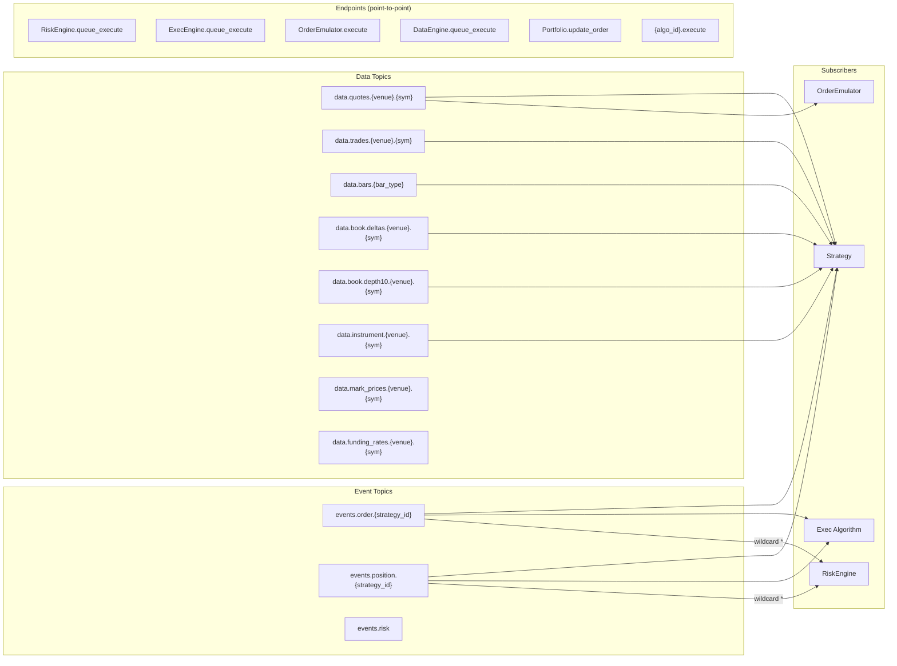
```mermaid
graph LR
    subgraph "Data Topics"
        DQ["data.quotes.{venue}.{sym}"]
        DT["data.trades.{venue}.{sym}"]
        DB["data.bars.{bar_type}"]
        DD["data.book.deltas.{venue}.{sym}"]
        D10["data.book.depth10.{venue}.{sym}"]
        DI["data.instrument.{venue}.{sym}"]
        DM["data.mark_prices.{venue}.{sym}"]
        DF["data.funding_rates.{venue}.{sym}"]
    end

    subgraph "Event Topics"
        EO["events.order.{strategy_id}"]
        EP["events.position.{strategy_id}"]
        ER["events.risk"]
    end

    subgraph "Endpoints (point-to-point)"
        RE["RiskEngine.queue_execute"]
        EE["ExecEngine.queue_execute"]
        OEM["OrderEmulator.execute"]
        DEE["DataEngine.queue_execute"]
        PP["Portfolio.update_order"]
        ALG["{algo_id}.execute"]
    end

    subgraph Subscribers
        S[Strategy]
        R[RiskEngine]
        OE[OrderEmulator]
        EA[Exec Algorithm]
    end

    DQ --> S
    DQ --> OE
    DT --> S
    DB --> S
    DD --> S
    D10 --> S
    DI --> S

    EO --> S
    EO --> EA
    EP --> S
    EP --> EA
    EO -->|"wildcard *"| R
    EP -->|"wildcard *"| R
```

---

## Position lifecycle

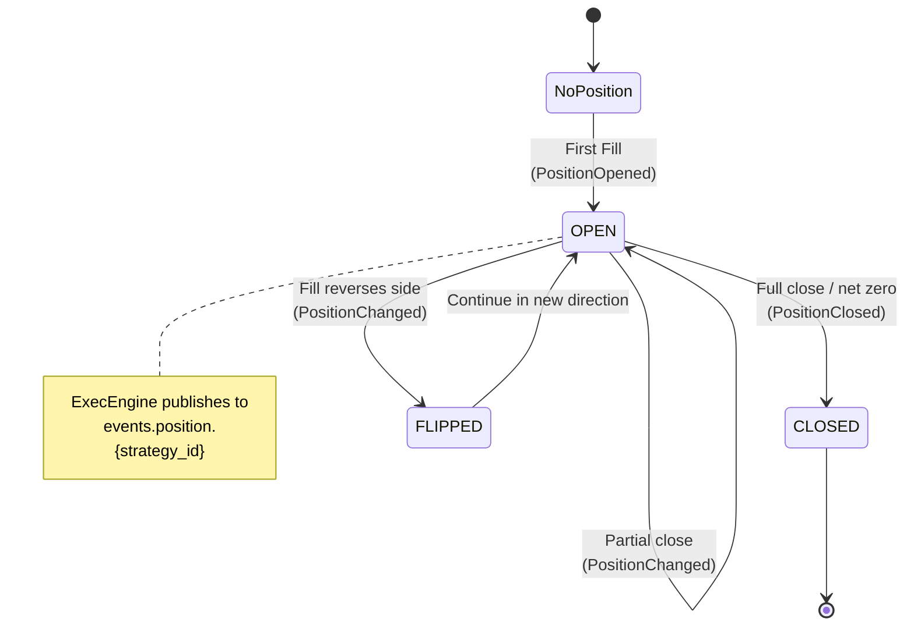
```mermaid
stateDiagram-v2
    [*] --> NoPosition

    NoPosition --> OPEN: First Fill<br/>(PositionOpened)
    OPEN --> OPEN: Partial Fill same side<br/>(PositionChanged)
    OPEN --> OPEN: Partial close<br/>(PositionChanged)
    OPEN --> CLOSED: Full close / net zero<br/>(PositionClosed)
    OPEN --> FLIPPED: Fill reverses side<br/>(PositionChanged)
    FLIPPED --> OPEN: Continue in new direction

    CLOSED --> [*]

    note right of OPEN
        ExecEngine publishes to
        events.position.{strategy_id}
    end note
```

---

## Order state machine

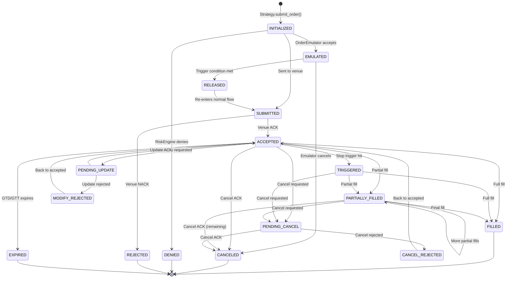
```mermaid
stateDiagram-v2
    [*] --> INITIALIZED: Strategy.submit_order()

    INITIALIZED --> EMULATED: OrderEmulator accepts
    INITIALIZED --> DENIED: RiskEngine denies
    INITIALIZED --> SUBMITTED: Sent to venue

    EMULATED --> RELEASED: Trigger condition met
    EMULATED --> CANCELED: Emulator cancels
    RELEASED --> SUBMITTED: Re-enters normal flow

    SUBMITTED --> ACCEPTED: Venue ACK
    SUBMITTED --> REJECTED: Venue NACK

    ACCEPTED --> PARTIALLY_FILLED: Partial fill
    ACCEPTED --> FILLED: Full fill
    ACCEPTED --> PENDING_UPDATE: Modify requested
    ACCEPTED --> PENDING_CANCEL: Cancel requested
    ACCEPTED --> EXPIRED: GTD/GTT expires
    ACCEPTED --> TRIGGERED: Stop trigger hit
    ACCEPTED --> CANCELED: Cancel ACK

    TRIGGERED --> PARTIALLY_FILLED: Partial fill
    TRIGGERED --> FILLED: Full fill
    TRIGGERED --> PENDING_CANCEL: Cancel requested

    PARTIALLY_FILLED --> PARTIALLY_FILLED: More partial fills
    PARTIALLY_FILLED --> FILLED: Final fill
    PARTIALLY_FILLED --> PENDING_CANCEL: Cancel requested
    PARTIALLY_FILLED --> CANCELED: Cancel ACK (remaining)

    PENDING_UPDATE --> ACCEPTED: Update ACK
    PENDING_UPDATE --> MODIFY_REJECTED: Update rejected

    PENDING_CANCEL --> CANCELED: Cancel ACK
    PENDING_CANCEL --> CANCEL_REJECTED: Cancel rejected

    MODIFY_REJECTED --> ACCEPTED: Back to accepted
    CANCEL_REJECTED --> ACCEPTED: Back to accepted

    FILLED --> [*]
    CANCELED --> [*]
    DENIED --> [*]
    REJECTED --> [*]
    EXPIRED --> [*]
```

---

## Who sends what

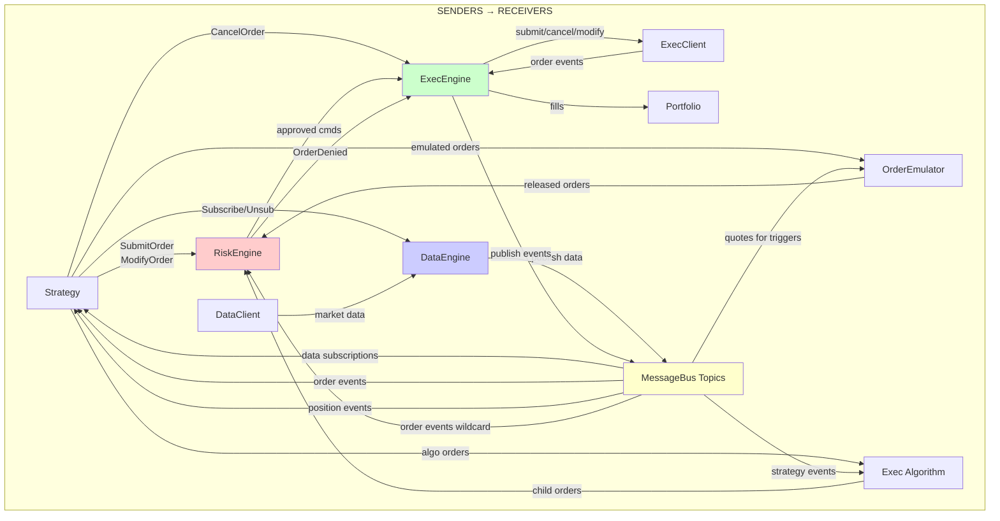
```mermaid
graph TD
    subgraph "SENDERS → RECEIVERS"
        S["Strategy"] -->|SubmitOrder<br/>ModifyOrder| R["RiskEngine"]
        S -->|CancelOrder| E["ExecEngine"]
        S -->|emulated orders| OE["OrderEmulator"]
        S -->|algo orders| EA["Exec Algorithm"]
        S -->|Subscribe/Unsub| DE["DataEngine"]

        R -->|approved cmds| E
        R -->|OrderDenied| E

        OE -->|released orders| R
        EA -->|child orders| R

        E -->|submit/cancel/modify| EC["ExecClient"]
        E -->|fills| P["Portfolio"]

        EC -->|order events| E
        DC["DataClient"] -->|market data| DE

        DE -->|publish data| MB["MessageBus Topics"]
        E -->|publish events| MB

        MB -->|data subscriptions| S
        MB -->|order events| S
        MB -->|position events| S
        MB -->|order events wildcard| R
        MB -->|quotes for triggers| OE
        MB -->|strategy events| EA
    end

    style R fill:#ffcccc
    style E fill:#ccffcc
    style DE fill:#ccccff
    style MB fill:#ffffcc
```
