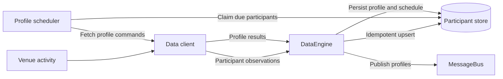

# Participant discovery and profile enrichment

## Purpose

Participant discovery is fast and continuous. Profile construction is slower,
rate-limited, and eventually consistent. The system therefore treats them as
independent pipelines joined by durable participant state.



## Domain model

```text
Participant
- id
- venue
- kind
- first_seen_at
- last_seen_at

ParticipantProfile
- participant_id
- balances
- margins
- positions
- open_orders
- transactions
- ts_init
```

Participants are identified by `(venue, participant_id)`. A profile is a
timestamped, bounded snapshot of public venue data, not a complete history.

## Participant persistence

PostgreSQL is the authoritative participant store. It provides durable unique
upserts, transactional writes, compact indexes, and the row-locking primitives
required by the later profile scheduler. Redis may cache hot participants but
is not the source of truth.

| Requirement | PostgreSQL | Redis | Existing Cache writer |
|---|---|---|---|
| Durable source of truth | Yes | Not preferred | No acknowledgement |
| Composite uniqueness | Native constraint | Application or script | In memory only |
| Batched range-preserving upsert | Native SQL | Lua or application logic | Not implemented |
| Transactional profile-job claims | `SKIP LOCKED` | Possible with scripts | Not supported |
| Cursor paging over all participants | Native | Possible but memory-heavy | Loads maps |

The initial participant operations extend `CacheDatabaseAdapter`, but the
PostgreSQL implementation executes them directly against its `PgPool`. They do
not use the current Cache writer because that writer only confirms that a
command entered an in-memory channel; it cannot acknowledge a commit or provide
transactional claim results. Profile scheduling will require a separate
transactional contract once its state machine is defined.

### Table

```sql
CREATE TABLE participant (
  participant_pk BIGINT GENERATED ALWAYS AS IDENTITY PRIMARY KEY,
  venue TEXT NOT NULL,
  participant_id TEXT NOT NULL,
  kind TEXT NOT NULL,
  first_seen_ns BIGINT NOT NULL,
  last_seen_ns BIGINT NOT NULL,
  ts_init_ns BIGINT NOT NULL,
  profile_state TEXT NOT NULL DEFAULT 'MISSING',
  profile_ttl_seconds INTEGER NOT NULL DEFAULT 86400,
  profile_next_refresh_at TIMESTAMPTZ DEFAULT CURRENT_TIMESTAMP,

  CONSTRAINT uq_participant_venue_id
    UNIQUE (venue, participant_id),
  CONSTRAINT ck_participant_kind
    CHECK (kind IN ('WALLET', 'PERSON', 'ORGANIZATION')),
  CONSTRAINT ck_participant_seen_range
    CHECK (first_seen_ns >= 0 AND last_seen_ns >= first_seen_ns),
  CONSTRAINT ck_participant_ts_init
    CHECK (ts_init_ns >= 0),
  CONSTRAINT ck_participant_venue_length
    CHECK (octet_length(venue) BETWEEN 1 AND 64),
  CONSTRAINT ck_participant_id_length
    CHECK (octet_length(participant_id) BETWEEN 1 AND 255),
  CONSTRAINT ck_participant_profile_state
    CHECK (
      profile_state IN ('MISSING', 'IN_FLIGHT', 'READY', 'RETRY', 'FAILED')
    ),
  CONSTRAINT ck_participant_profile_ttl
    CHECK (profile_ttl_seconds > 0),
  CONSTRAINT ck_participant_failed_schedule
    CHECK (profile_state <> 'FAILED' OR profile_next_refresh_at IS NULL)
) WITH (fillfactor = 85);

CREATE INDEX ix_participant_profile_due
  ON participant (profile_next_refresh_at, participant_pk)
  WHERE profile_state <> 'FAILED'
    AND profile_next_refresh_at IS NOT NULL;

CREATE TABLE participant_profile (
  participant_pk BIGINT PRIMARY KEY
    REFERENCES participant(participant_pk) ON DELETE CASCADE,
  profile JSONB NOT NULL,
  ts_init_ns BIGINT NOT NULL,
  created_at TIMESTAMPTZ NOT NULL DEFAULT CURRENT_TIMESTAMP,
  updated_at TIMESTAMPTZ NOT NULL DEFAULT CURRENT_TIMESTAMP,

  CONSTRAINT ck_participant_profile_payload
    CHECK (jsonb_typeof(profile) = 'object'),
  CONSTRAINT ck_participant_profile_ts_init
    CHECK (ts_init_ns >= 0)
);
```

`participant` contains identity, discovery metadata, and the stable metadata
that controls profile enrichment. It does not contain profile data.
`participant_profile` contains the latest successful profile data and has a
one-to-one relationship with its participant. A participant can exist before a
profile is available, but a profile cannot exist without a participant.

`profile_ttl_seconds` is refresh policy. `profile_next_refresh_at` is the
effective schedule and may differ from the TTL because of backoff, manual
refresh, or cold-participant suspension. A `NULL` value disables automatic
refresh. New participants default to `MISSING` and immediately due. `FAILED` is
terminal and therefore requires a `NULL` schedule.

`participant_pk` is an internal storage key used by profile and future job
foreign keys. The domain identity remains `(venue, participant_id)`. A numeric
foreign key avoids repeating long text keys in every dependent table and index.
Profile history, if required, is a separate append-only analytical fact rather
than additional rows in `participant_profile`.

`BIGINT` stores operational Unix nanoseconds through the year 2262. Conversion
from `UnixNanos` must reject values greater than `i64::MAX`. If the full `u64`
range becomes a requirement, use `NUMERIC(20, 0)` instead at a higher storage
and index cost.

Identifiers are case-sensitive. Adapters must canonicalize identifiers before
creating `ParticipantId` values; for example, hexadecimal wallet addresses are
lowercase. The 64-byte venue and 255-byte participant limits must also be added
to model validation so invalid values fail before reaching PostgreSQL.

Do not add a B-tree index on `last_seen_ns` initially. It changes on every
activity update and would prevent PostgreSQL HOT updates. Profile scheduling
uses the partial index on `profile_next_refresh_at`; analytical activity indexes
can be added later from measured query requirements.

### Batched upsert

Discovery observations are coalesced by `(venue, participant_id)` before each
flush. One multi-row statement inserts new participants and extends the observed
time range of existing participants:

```sql
INSERT INTO participant AS p (
  venue,
  participant_id,
  kind,
  first_seen_ns,
  last_seen_ns,
  ts_init_ns
)
SELECT *
FROM UNNEST(
  $1::TEXT[],
  $2::TEXT[],
  $3::TEXT[],
  $4::BIGINT[],
  $5::BIGINT[],
  $6::BIGINT[]
)
ON CONFLICT (venue, participant_id) DO UPDATE
SET first_seen_ns = LEAST(p.first_seen_ns, EXCLUDED.first_seen_ns),
  last_seen_ns = GREATEST(p.last_seen_ns, EXCLUDED.last_seen_ns)
WHERE EXCLUDED.first_seen_ns < p.first_seen_ns
   OR EXCLUDED.last_seen_ns > p.last_seen_ns;
```

No-op conflicts are skipped to avoid unnecessary heap tuples and WAL. Existing
`kind` and `ts_init_ns` values are preserved; conflicting kinds are counted as a
data-quality error rather than silently overwritten.

The persistence writer must differ from the current fire-and-forget Cache writer:

- Use a bounded input channel.
- Coalesce duplicate observations by key.
- Initially flush at 1,000 unique rows or 100 milliseconds, whichever occurs
  first; confirm these values with benchmarks.
- Acknowledge a batch only after the transaction commits.
- Retain and retry failed batches with backoff.
- Expose pending rows, oldest pending age, commit latency, and retry count.

If discovery must remain lossless through a prolonged database outage or process
crash, a local disk write-ahead spool is required. An in-memory channel cannot
provide both non-blocking discovery and durable delivery during such an outage.

### Repository contract

The first participant-only repository surface is:

```text
upsert_observations(observations) -> committed count
get_participant(venue, participant_id) -> participant or none
page_participants(after_participant_pk, limit) -> ordered page
count_participants(venue or all) -> count
```

`page_participants` uses keyset pagination:

```sql
SELECT participant_pk, venue, participant_id, kind,
       first_seen_ns, last_seen_ns, ts_init_ns
FROM participant
WHERE participant_pk > $1
ORDER BY participant_pk
LIMIT $2;
```

The full participant universe is never loaded into `CacheMap`. Cache holds only
the hot working set required by running actors. Bootstrap, exports, and audits
page directly from PostgreSQL.

### Capacity estimates

For a 42-byte wallet address and a short venue name, plan approximately 250-300
bytes per participant for the heap row, identity primary key, and unique text
index. Fillfactor, free space, and operational headroom increase the practical
budget to roughly 500 bytes per participant. These are planning estimates, not
benchmark results.

| Participants | Base table and indexes | Planned disk budget |
|---:|---:|---:|
| 1 million | 0.25-0.30 GB | 0.5 GB |
| 10 million | 2.5-3.0 GB | 5 GB |
| 100 million | 25-30 GB | 50 GB |

Sustained unique discovery determines table growth:

| New unique participants | Participants per day | Planned growth per day |
|---:|---:|---:|
| 10/second | 864,000 | 0.43 GB |
| 100/second | 8.64 million | 4.3 GB |
| 1,000/second | 86.4 million | 43 GB |

WAL, backups, replicas, and temporary vacuum headroom are additional. PostgreSQL
is suitable for these cardinalities, but the ingestion path must batch writes.
At 1,000 uncoalesced observations per second, individual upserts would produce
86.4 million updates per day. Coalescing repeated addresses and writing one
multi-row transaction per batch is therefore a correctness and operational
requirement, not only a performance optimization.

Partitioning is not required for the initial table. Reconsider hash partitioning
after measured table size, vacuum behavior, or write contention demonstrates a
need; premature partitioning complicates uniqueness and foreign keys.

## Discovery pipeline

Adapters derive participants from venue activity and emit observations without
waiting for profile construction. DataEngine validates each observation and
performs an idempotent participant upsert:

- Insert a participant when first observed.
- Preserve the earliest `first_seen_at`.
- Advance `last_seen_at` on later observations.
- Publish accepted observations to MessageBus.
- Persist discovery independently of profile availability.

Discovery must remain non-blocking even when profile enrichment is delayed.

## Profile pipeline

The profile scheduler queries the participant store for due work. It does not
scan every participant in memory, and adapters do not own the global refresh
schedule.

Each profile job is a one-shot request:

```text
FetchParticipantProfiles
- request_id
- venue
- participant_ids

ParticipantProfileResult
- request_id
- participant_id
- success(profile) | failure(error)
```

The scheduler:

1. Selects due participants using an indexed query.
2. Atomically claims a bounded batch with a lease.
3. Routes work to the client responsible for the venue.
4. Limits concurrent profiles according to venue capacity.
5. Persists each result as soon as it arrives.
6. Schedules the next refresh or a retry.

Actor profile subscriptions are local MessageBus subscriptions only. They do
not create or own profile jobs.

## Persistent scheduling state

The participant row is the source of truth for profile enrichment metadata. The
initial schema stores:

```text
profile_state             MISSING | IN_FLIGHT | READY | RETRY | FAILED
profile_ttl_seconds
profile_next_refresh_at
```

The scheduler design will extend that metadata with the equivalent of:

```text
attempt_count
last_error
lease_generation
lease_until
priority
```

`IN_FLIGHT` identifies claimed work and `RETRY` identifies a transient failure
waiting for another attempt. The existing `participant_profile` row is retained
while either state is active, so a failed refresh does not discard the previous
successful profile.

Due work is selected without a full-table scan:

```sql
WHERE profile_state <> 'FAILED'
  AND profile_next_refresh_at <= now
  AND (lease_until IS NULL OR lease_until < now)
ORDER BY priority DESC, profile_next_refresh_at ASC
LIMIT batch_size
```

The initial index begins with `profile_next_refresh_at` and excludes terminal or
unscheduled participants. It can be extended after lease and priority semantics
are finalized. Leases provide crash recovery: if a scheduler or adapter stops
after claiming work, the participant becomes eligible again when the lease
expires.

## Reliability

The pipeline uses at-least-once processing:

- Participant upserts are idempotent.
- Profile jobs are deduplicated by `(venue, participant_id)` while pending or
  in flight.
- Profile cache and database writes are upserts.
- A job completes only after DataEngine accepts and persists the result.
- Transient failures use exponential backoff with jitter.
- Exhausted or permanent failures remain visible as `FAILED`.

Profiles are initially atomic. If any required venue request fails, retain the
previous profile and retry the job. Partial profile merging requires explicit
field-level freshness rules and is outside the initial design.

## Capacity and freshness

Let:

- `lambda` be newly discovered participants per second.
- `N` be the number of tracked participants.
- `T` be the average profile TTL in seconds.
- `mu` be sustainable profile throughput per second.

Approximate required throughput is:

```text
required_rate = lambda + N / T
```

The backlog is stable only when `required_rate < mu`. If `N / T >= mu`, every
profile cannot be refreshed within its TTL; the system must increase TTLs,
reduce profile cost, or prioritize a subset of participants.

Refresh policy should be activity-aware:

| Participant state | Refresh policy |
|---|---|
| Newly discovered | Fetch once promptly |
| Recently active or high priority | Short TTL |
| Previously active | Medium TTL |
| Long inactive or empty | Long TTL |
| Repeated transient failure | Exponential backoff |

Initial bootstrap may have substantial lag. Steady state is reached only after
the initial backlog drains and ongoing demand remains below venue capacity.

## Ownership

- **Adapter:** Participant extraction, venue I/O, response normalization, and
  venue-specific rate limiting.
- **DataEngine:** Validation, routing, persistence, cache updates, and
  MessageBus publication.
- **Profile scheduler:** Due-work selection, leases, priority, TTLs, retries,
  and admission control.
- **Participant store:** Durable participant, profile, and scheduling state.
- **Cache:** Low-latency access to current state; not the authoritative work
  queue.

## Observability

Required metrics are:

- Discovered and unique participants.
- Due, in-flight, retrying, and failed profile jobs.
- Oldest due-job age and profile freshness lag.
- Profile request latency and success rate by venue.
- Retry counts and terminal failure reasons.
- Venue rate-limit consumption and effective profile throughput.

These metrics determine whether bootstrap is converging and whether the chosen
TTLs are sustainable.

## Open design findings

The following findings must be resolved before implementation. They are listed
independently so each decision can be reviewed and closed separately.

### 1. Participant identity

The design identifies participants by `(venue, participant_id)`, but the current
model and Cache key participants and profiles only by `ParticipantId`. The same
address observed on multiple venues can therefore collide.

**Decision required:** Adopt a venue-scoped `ParticipantKey`, or explicitly
define and justify `ParticipantId` as globally unique across venues. The chosen
key must be used consistently by models, Cache, persistence, jobs, and routing.

### 2. Lease fencing and stale results

A lease may expire while an adapter request is still running. A retry can then
start before the original result arrives, allowing an older result to overwrite
a newer profile.

**Decision required:** Every claim must carry a unique lease token or generation.
Profile persistence and job completion must be one atomic operation that accepts
the result only when its token still owns the active claim.

### 3. Job states and atomic claiming

The proposed due-work query does not filter terminal states, and the state list
does not define every allowed transition. Multiple schedulers must not claim the
same participant.

**Decision required:** Define the complete state machine and implement claiming
as one atomic database operation, for example with `FOR UPDATE SKIP LOCKED` or
`UPDATE ... RETURNING`. `FAILED` jobs must remain terminal until explicitly
reset.

### 4. Backpressure and lease timing

Claiming work before adapter capacity is available can move jobs into another
queue where their leases expire before execution begins. An unbounded command
queue would hide overload rather than control it.

**Decision required:** Use bounded queues and claim only enough work for
available venue execution slots. Define whether adapters pull work or explicitly
accept or reject scheduler submissions. Queue wait time must not consume an
execution lease.

### 5. Cold participant policy

If every discovered participant is refreshed forever, `N / T` grows with the
participant universe and eventually exceeds venue capacity, even with long TTLs.

**Decision required:** Define hot, warm, and cold eligibility. Cold participants
receive no scheduled refresh and become active again through rediscovery or
explicit demand.

### 6. Persistence boundary

The current Cache database adapter does not persist participants, profiles, job
states, claims, or leases. Treating Cache as the scheduler repository would mix
an in-memory projection with durable work ownership.

**Proposed resolution:** Keep the initial committed participant upsert and load
operations on `CacheDatabaseAdapter`, implemented directly with the PostgreSQL
pool rather than its fire-and-forget writer. Cache remains a low-latency
projection. Profile payload persistence uses `participant_profile`; stable
profile and scheduling metadata uses `participant`. Transactional claim, lease
renewal, completion, retry, and terminal-failure operations should be added
behind a scheduler-focused contract. Lossless behavior during a PostgreSQL
outage remains an explicit decision because it requires a local disk spool.

### 7. Fair scheduling

Strict `priority DESC` ordering allows a continuous stream of high-priority work
to starve lower-priority bootstrap and backfill jobs indefinitely.

**Decision required:** Add priority aging, weighted queues, or per-class quotas
for new participants, active refreshes, retries, and backfill work. Define a
maximum acceptable wait for each class.

### 8. Profile completeness

Venues expose different profile sections. A missing section can mean unsupported,
successfully empty, transiently unavailable, or permanently invalid. Treating
all missing data as a failed atomic profile would cause unnecessary retries.

**Decision required:** Each adapter must classify fields and failures:

- Unsupported field: `None`.
- Supported but empty field: `Some([])`.
- Transient request failure: preserve the previous profile and retry.
- Permanent invalid participant: record a terminal failure.

The required fields for an atomic profile must be defined per venue.
