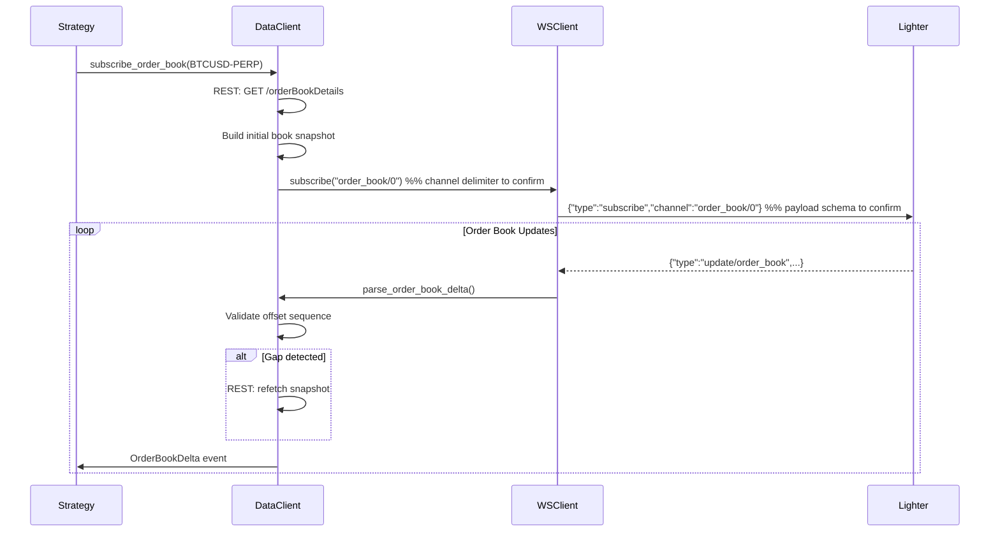
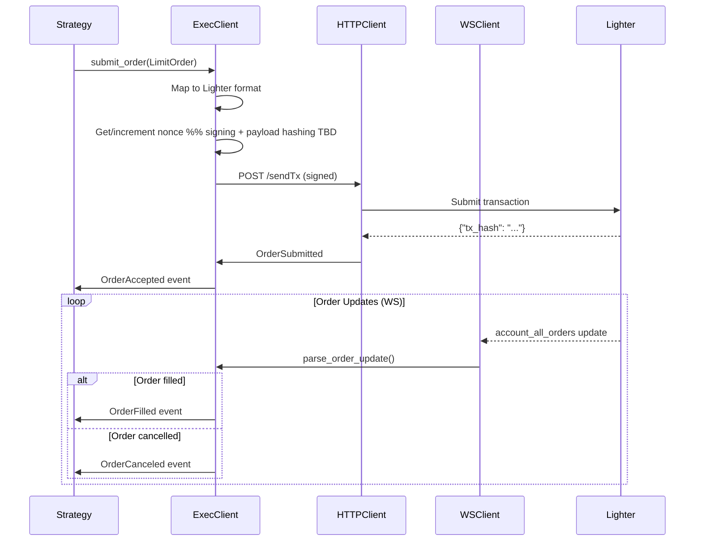

# 04_INTEGRATION_DESIGN.md

## Integration Design: Nautilus ↔ Lighter Mapping

### Validation notes
- Signing algorithm + payload hashing are **unknown**; do not implement `sendTx`/`sendTxBatch` until testnet captures confirm curve/hash/encoding.
- Auth token requirement for private REST + WS is **unsettled**; plan for token support and feature-flag until validated.
- WS channel naming/schemas need confirmation (`order_book/0` vs `order_book:0`, field names, snapshot vs delta behavior).
- Fee schedule differs across sources; avoid hardcoded maker/taker until verified from live responses.

### Concept Mapping Matrix

#### Instruments

| Nautilus Concept | Lighter Concept | Notes |
|-----------------|-----------------|-------|
| `InstrumentId` | `market_index` + symbol | e.g., `BTCUSD-PERP.LIGHTER` |
| `CryptoPerpetual` | Perpetual market | All Lighter markets |
| `price_precision` | `supported_price_decimals` | From `orderBooks` |
| `size_precision` | `supported_size_decimals` | From `orderBooks` |
| `min_quantity` | `min_base_amount` | From `orderBooks` |
| `tick_size` | Derived from decimals | 10^(-price_decimals) |

#### Orders

| Nautilus Concept | Lighter Concept | Mapping |
|-----------------|-----------------|---------|
| `ClientOrderId` | `client_order_index` | Direct 1:1 (uint64) |
| `VenueOrderId` | `order_index` | Exchange-assigned ID |
| `OrderType.LIMIT` | `ORDER_TYPE_LIMIT` | Direct |
| `OrderType.MARKET` | `ORDER_TYPE_MARKET` | Direct |
| `OrderType.STOP_MARKET` | `ORDER_TYPE_STOP_LOSS` | Direct |
| `OrderType.STOP_LIMIT` | `ORDER_TYPE_STOP_LOSS_LIMIT` | Direct |
| `TimeInForce.IOC` | `ORDER_TIME_IN_FORCE_IMMEDIATE_OR_CANCEL` | Direct |
| `TimeInForce.GTC` | `ORDER_TIME_IN_FORCE_GOOD_TILL_TIME` | Set far future expiry |
| `TimeInForce.FOK` | Not supported | Use IOC with full qty |
| `OrderSide.BUY` | `is_ask: false` | Inverted logic |
| `OrderSide.SELL` | `is_ask: true` | Inverted logic |

#### Order Status Mapping

| Nautilus Status | Lighter Status | Trigger |
|----------------|----------------|---------|
| `SUBMITTED` | (local state) | After sendTx call |
| `ACCEPTED` | `open` | Order acknowledged |
| `PARTIALLY_FILLED` | `partial` | `filled_base_amount` &gt; 0 |
| `FILLED` | `filled` | `remaining_base_amount` = 0 |
| `CANCELED` | `cancelled` | Cancel confirmed |
| `REJECTED` | `rejected` | sendTx error response |
| `EXPIRED` | `expired` | GTT expiry passed |

#### Market Data

| Nautilus Type | Lighter Source | Channel |
|--------------|----------------|---------|
| `OrderBookDelta` | order_book WS | `order_book/{market_index}` *(channel name TBD: `/` vs `:`)* |
| `TradeTick` | trade WS | `trade/{market_index}` |
| `QuoteTick` | Derived from order_book | Best bid/ask from book |
| `Bar` | candlesticks REST | `/api/v1/candlesticks` |
| `MarkPrice` | market_stats WS | `market_stats/{market_index}` |
| `IndexPrice` | market_stats WS | `market_stats/{market_index}` |
| `FundingRate` | market_stats WS | `market_stats/{market_index}` |

#### Account/Portfolio

| Nautilus Concept | Lighter Concept | Source |
|-----------------|-----------------|--------|
| `AccountBalance` | `collateral` | account endpoint |
| `Position` | positions array | account endpoint |
| `Position.quantity` | `position` × `sign` | Signed quantity |
| `Position.avg_price` | `avg_entry_price` | Direct |
| `Position.unrealized_pnl` | `unrealized_pnl` | Direct |
| `Position.realized_pnl` | `realized_pnl` | Direct |
| `Position.liquidation_price` | `liquidation_price` | Direct |

### Event Flow Diagrams

#### Market Data Flow



#### Order Execution Flow



### Reconnect & Resync Strategy

```
1. DISCONNECT DETECTED
   └─> Set connection_state = DISCONNECTED
   └─> Stop order submission (queue locally)

2. RECONNECT WITH BACKOFF
   └─> Initial delay: 1s
   └─> Exponential backoff: 2x per attempt
   └─> Max delay: 30s
   └─> Add jitter: ±500ms

3. CONNECTION ESTABLISHED
   └─> Regenerate auth token (if needed)
   └─> Set connection_state = CONNECTED

4. RESUBSCRIBE CHANNELS
   └─> Resubscribe all active data channels
   └─> Resubscribe user order/position channels

5. STATE RECONCILIATION
   └─> REST: GET /accountActiveOrders → reconcile order cache
   └─> REST: GET /account → reconcile positions
   └─> REST: GET /orderBookDetails → rebuild order books
   └─> Compare cached vs exchange state
   └─> Emit reconciliation events for differences

6. RESUME OPERATIONS
   └─> Process queued orders
   └─> Set connection_state = READY
```

### Idempotency Strategy

| Operation | Idempotency Key | Strategy |
|-----------|-----------------|----------|
| Order Submit | `client_order_index` | Unique per account, reuse on retry |
| Order Cancel | `order_index` | Idempotent by design |
| Batch Cancel | `order_indices[]` | Idempotent by design |

**Nonce Management**:
- Track nonce locally per `api_key_index`
- Increment after successful `sendTx`
- On nonce mismatch error: fetch via `/nextNonce` and retry

### Error Handling Taxonomy

| Error Category | Examples | Retry | Action |
|---------------|----------|-------|--------|
| **Transient** | Network timeout, 503 | Yes | Exponential backoff |
| **Rate Limit** | HTTP 429 | Yes | Backoff per rate limit |
| **Auth** | Invalid token, expired | Yes* | Refresh token, retry |
| **Validation** | Invalid price, qty | No | Reject with reason |
| **Nonce** | Nonce mismatch | Yes | Fetch nonce, retry |
| **Insufficient** | Margin, balance | No | Reject with reason |
| **Fatal** | Account banned | No | Stop adapter |

### Security Notes

1. **Private Key Storage**: Use environment variables or secrets manager; never log
2. **Auth Token Refresh**: Proactively refresh before 8-hour expiry
3. **Nonce Tracking**: Critical for replay protection; persist on restart
4. **TLS Verification**: Always verify certificates in production

---
