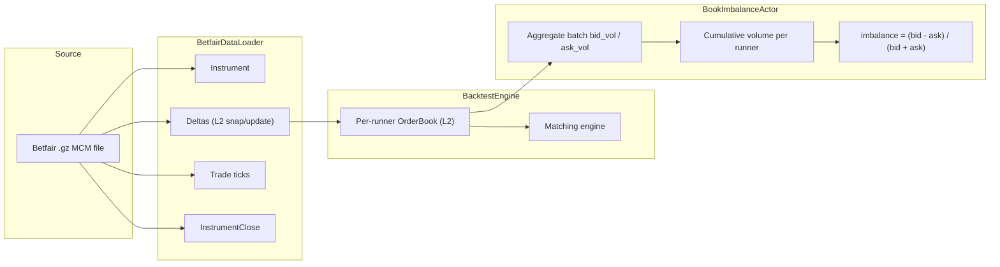
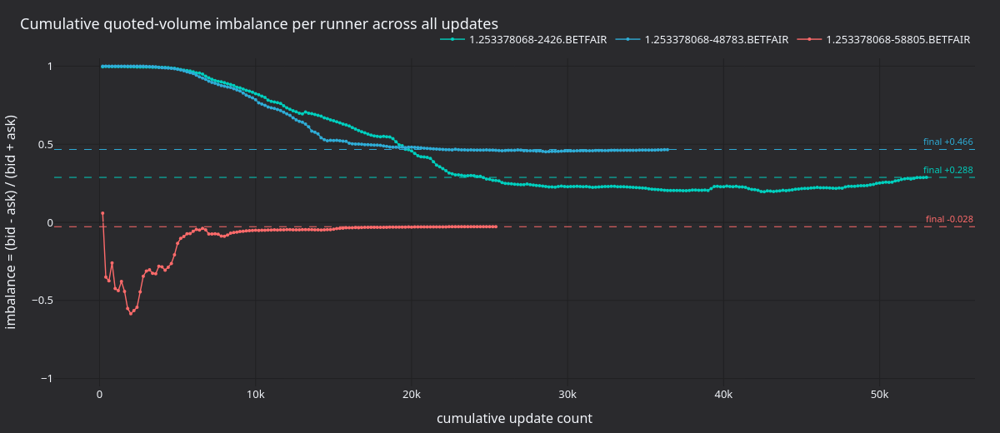
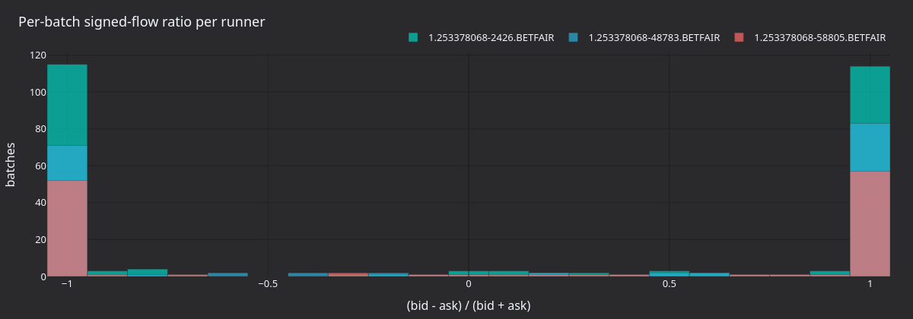
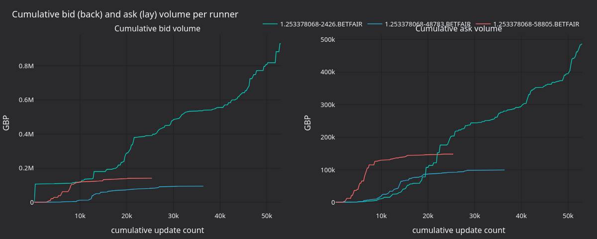

# Book Imbalance Backtest (Betfair)

:::note
This is a **Rust-only** v2 system tutorial. It drives the Rust `BacktestEngine`
directly with raw Betfair streaming data, bypassing the Python and Parquet paths.
:::

This tutorial backtests a `BookImbalanceActor` on a Betfair MATCH_ODDS market.
It loads a raw historical streaming `.gz` file, feeds it through the Rust
`BacktestEngine`, and tracks the bid/ask quoted-volume imbalance per runner.

## Introduction

Betfair is a sports betting exchange where participants back (bid) and lay
(ask) outcomes at decimal odds. Each runner has its own L2 order book that
behaves like a financial order book.

The actor reads `OrderBookDeltas` for every runner and accumulates two
running totals per side: bid volume (back orders) and ask volume (lay
orders). Per-batch and cumulative imbalance are computed as:

```
imbalance = (bid_volume - ask_volume) / (bid_volume + ask_volume)
```

A positive value means the market is leaning toward backing the outcome.
Sports traders use this as a starting block, often combined with price
momentum or market-wide features.

A release build processes about three million data points per second with
full order book maintenance in the matching engine.



## Prerequisites

- A working Rust toolchain ([rustup.rs](https://rustup.rs)).
- The NautilusTrader repository cloned and building.
- A Betfair historical `.gz` file containing MCM (Market Change Message)
  data. Source it from
  [Betfair historic data](https://historicdata.betfair.com/), a third-party
  archive, or by recording the Exchange Streaming API yourself.

Place the file at:

```
tests/test_data/local/betfair/1.253378068.gz
```

This path is gitignored and not shipped with the repository. The bundled
example dataset is a football MATCH_ODDS market with 3 runners and around
82,000 MCM lines recorded over 18 days.

## Loading the data

`BetfairDataLoader` reads gzip-compressed Betfair Exchange Streaming API
files and parses each line into Nautilus domain objects:

```rust
use nautilus_betfair::loader::{BetfairDataItem, BetfairDataLoader};
use nautilus_model::types::Currency;

let mut loader = BetfairDataLoader::new(Currency::GBP(), None);
let items = loader.load(&filepath)?;
```

The loader returns a `Vec<BetfairDataItem>`:

| Variant             | Description                                     | Maps to `Data` enum?       |
|:--------------------|:------------------------------------------------|:---------------------------|
| `Instrument`        | Runner definition from market definition.       | No (added separately)      |
| `Status`            | Market status transition (PreOpen, Trading...). | No (`Data` has no variant) |
| `Deltas`            | Order book snapshot or delta update.            | Yes, `Data::Deltas`        |
| `Trade`             | Incremental trade tick from cumulative volumes. | Yes, `Data::Trade`         |
| `Ticker`            | Last traded price, volume, BSP near/far.        | -                          |
| `StartingPrice`     | Betfair Starting Price for a runner.            | -                          |
| `BspBookDelta`      | BSP-specific book delta.                        | -                          |
| `InstrumentClose`   | Settlement event.                               | Yes, `Data::InstrumentClose` |
| `SequenceCompleted` | Batch completion marker.                        | -                          |
| `RaceRunnerData`    | GPS tracking data (horse/greyhound racing).     | -                          |
| `RaceProgress`      | Race‑level progress data.                       | -                          |

The backtest engine accepts the `Data` enum, so we map the variants we need
and skip the Betfair-specific types:

```rust
use nautilus_model::data::{Data, OrderBookDeltas_API};

let mut instruments = AHashMap::new();
let mut data: Vec<Data> = Vec::new();

for item in items {
    match item {
        BetfairDataItem::Instrument(inst) => {
            instruments.insert(inst.id(), *inst);
        }
        BetfairDataItem::Deltas(d) => {
            data.push(Data::Deltas(OrderBookDeltas_API::new(d)));
        }
        BetfairDataItem::Trade(t) => {
            data.push(Data::Trade(t));
        }
        BetfairDataItem::InstrumentClose(c) => {
            data.push(Data::InstrumentClose(c));
        }
        _ => {}
    }
}
```

`OrderBookDeltas_API` is a thin FFI wrapper around `OrderBookDeltas`
required by the `Data` enum.

Instruments are re-emitted on every market definition update in the stream,
so the map deduplicates them by keeping the latest version.

:::warning
The `Status` variant carries market status transitions (PreOpen, Trading,
Suspended, Closed) but the `Data` enum has no variant for it. This example
does not replay status transitions. If you extend this into a strategy that
places orders, the matching engine will not see market suspensions or
closures from the stream. Subscribe to instrument status separately or add
status routing to the engine.
:::

## The actor

NautilusTrader ships `BookImbalanceActor` in the trading crate's examples
module. The example wires it up with a per-runner instrument list and a
log interval:

```rust
use nautilus_trading::examples::actors::BookImbalanceActor;

let actor = BookImbalanceActor::new(instrument_ids, 5000, None);
engine.add_actor(actor)?;
```

The second argument is the log interval: print a progress line every 5,000
updates per runner. The example reads `IMBALANCE_LOG_INTERVAL` from the
environment, so set it to a smaller value (`200`) when you want to capture
finer-grained data for the panels at the end of this tutorial.

The full source is at
[`crates/trading/src/examples/actors/imbalance/actor.rs`](https://github.com/nautechsystems/nautilus_trader/tree/develop/crates/trading/src/examples/actors/imbalance/actor.rs).

### How it works

A `DataActor` in Rust needs three pieces:

1. A struct holding a `DataActorCore` field plus your own state.
2. `nautilus_actor!(YourType)` to wire up the core, plus a `Debug`
   implementation.
3. The `DataActor` trait implementation with your callbacks.

The framework provides blanket `Actor` and `Component` implementations for
any type that implements `DataActor + Debug`, so you do not need to
implement those manually.

On start the actor subscribes to `OrderBookDeltas` for each instrument. On
each update it sums per-side volume from the individual deltas and
accumulates running totals. On stop it prints a per-instrument summary.

Setting `managed: false` in `subscribe_book_deltas` means the data engine
does not maintain a separate order book copy in the cache for the actor.
The exchange-side matching engine still maintains its own book through
`book.apply_delta()` on every delta. Set `managed: true` if your actor
needs to read the full book state from
`self.cache().order_book(&instrument_id)`.

## Backtest engine setup

### Create the engine and venue

Betfair is a cash-settled betting exchange. The venue uses
`AccountType::Cash`, `OmsType::Netting`, and `BookType::L2_MBP`:

```rust
let mut engine = BacktestEngine::new(BacktestEngineConfig::default())?;

engine.add_venue(
    SimulatedVenueConfig::builder()
        .venue(Venue::from("BETFAIR"))
        .oms_type(OmsType::Netting)
        .account_type(AccountType::Cash)
        .book_type(BookType::L2_MBP)
        .starting_balances(vec![Money::from("1_000_000 GBP")])
        .build(),
)?;
```

### Add instruments, actor, and data

```rust
for instrument in instruments.values() {
    engine.add_instrument(instrument)?;
}

let actor = BookImbalanceActor::new(instrument_ids, 5000, None);
engine.add_actor(actor)?;

engine.add_data(data, None, true, true)?;
```

The `add_data` parameters are `(data, client_id, validate, sort)`. With
`validate: true` the engine checks the first element's instrument is
registered (the batch is assumed homogeneous). With `sort: true` it sorts
by timestamp.

### Run

```rust
engine.run(None, None, None, false)?;
```

The four parameters are `(start, end, run_config_id, streaming)`. Passing
`None` for start/end uses the full time range of the loaded data.

## What happens during the run

For each data point in timestamp order the engine:

1. Advances the clock to the data timestamp.
2. Routes the data to the simulated exchange, which applies each delta to
   the per-instrument `OrderBook` and runs the matching engine cycle.
3. Publishes the data through the data engine and message bus, triggering
   the actor's `on_book_deltas` callback.
4. Drains command queues and settles venues (processes any pending orders).

The matching engine maintains a full order book per instrument. The example
has no orders to match, so the book state is ready to use as soon as it is
swapped for a `Strategy`.

## Results

The bundled MATCH_ODDS dataset has three runners and 143,098 data points;
a release build completes in about 48 ms:

```
--- Book imbalance summary ---
  1.253378068-2426.BETFAIR   updates: 53197  bid_vol: 212225339.34  ask_vol: 117422531.85  imbalance:  0.2876
  1.253378068-48783.BETFAIR  updates: 36475  bid_vol:  52506905.49  ask_vol:  19104694.72  imbalance:  0.4664
  1.253378068-58805.BETFAIR  updates: 25426  bid_vol:  24295351.82  ask_vol:  25692733.11  imbalance: -0.0280
```

Runner `2426` (the eventual winner, settled at BSP 2.22) ends at +0.288:
backing flow dominates lay flow throughout the market. Runner `48783` shows
even stronger backing pressure (+0.466) over fewer updates, while `58805`
ends close to neutral (-0.028).



**Figure 1.** *Cumulative `(bid - ask) / (bid + ask)` per runner across the
~143k updates of the market lifetime. Dashed lines mark each runner's final
imbalance.*



**Figure 2.** *Distribution of per-batch signed flow ratio
`(bid - ask) / (bid + ask)` over `IMBALANCE_LOG_INTERVAL=200` batches per
runner. The shape of each runner's batch distribution is a sharper signal
than the cumulative imbalance.*



**Figure 3.** *Cumulative back (bid) and lay (ask) volume per runner. Both
sides are non-monotonic: lay flow occasionally outpaces back flow within
short bursts even when cumulative imbalance stays positive.*

### Regenerate the panels

The actor logs `[runner] update #N: batch bid=B ask=A cumulative imbalance=I`
on every Nth update. The renderer parses those lines and writes static PNGs
using the `nautilus_dark` tearsheet theme.

```bash
IMBALANCE_LOG_INTERVAL=200 cargo run -p nautilus-betfair --features examples --release \
    --example betfair-backtest > /tmp/betfair.log 2>&1

uv sync --extra visualization
BETFAIR_LOG=/tmp/betfair.log \
    python3 docs/tutorials/assets/backtest_book_imbalance_betfair/render_panels.py
```

## Running the example

```bash
# Debug build
cargo run -p nautilus-betfair --features examples --example betfair-backtest

# Release build (recommended)
cargo run -p nautilus-betfair --features examples --release --example betfair-backtest

# Custom data file
cargo run -p nautilus-betfair --features examples --release --example betfair-backtest -- path/to/file.gz
```

## Complete source

The complete example is at
[`crates/adapters/betfair/examples/betfair_backtest.rs`](https://github.com/nautechsystems/nautilus_trader/tree/develop/crates/adapters/betfair/examples/betfair_backtest.rs).

## Next steps

- **Add a strategy**. Replace the actor with a `Strategy` implementation
  that places back/lay orders based on the imbalance signal. See the
  `EmaCross` example in
  `crates/trading/src/examples/strategies/ema_cross/strategy.rs` for the
  pattern.
- **Use managed books**. Set `managed: true` in `subscribe_book_deltas` and
  read the full book via `self.cache().order_book(&id)` for richer signals
  like top-of-book spread, depth ratios, or weighted mid-price.
- **Multiple markets**. Load several `.gz` files and run them through the
  same engine to test cross-market signals.
- **Compare with Python**. Run the same backtest from Python using the
  `BacktestEngine` Python API. The Rust engine processes the same data
  pipeline at roughly six times the throughput of the Python/Cython path.
