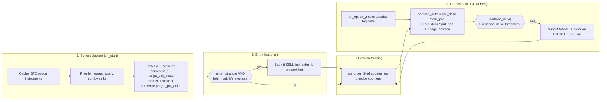
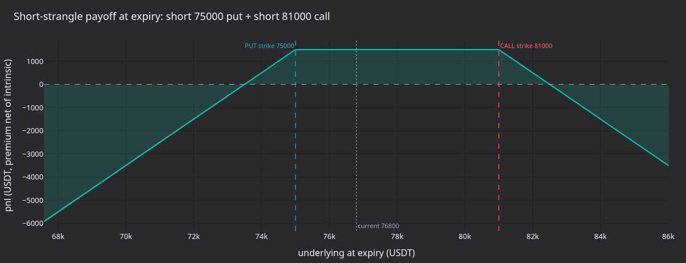
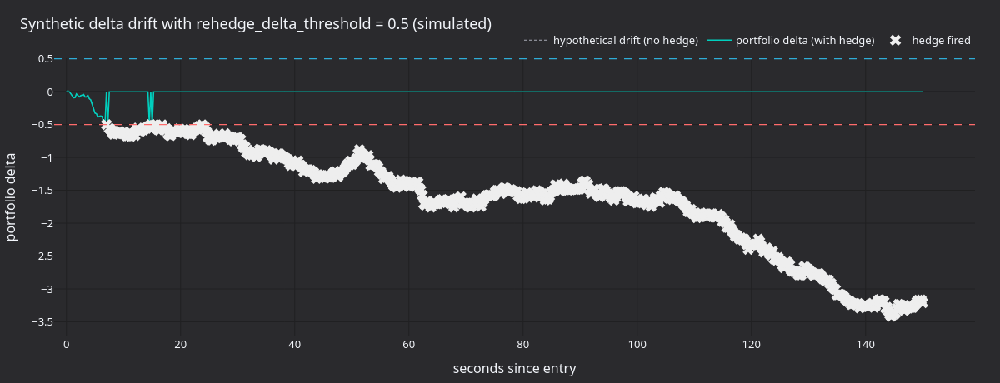
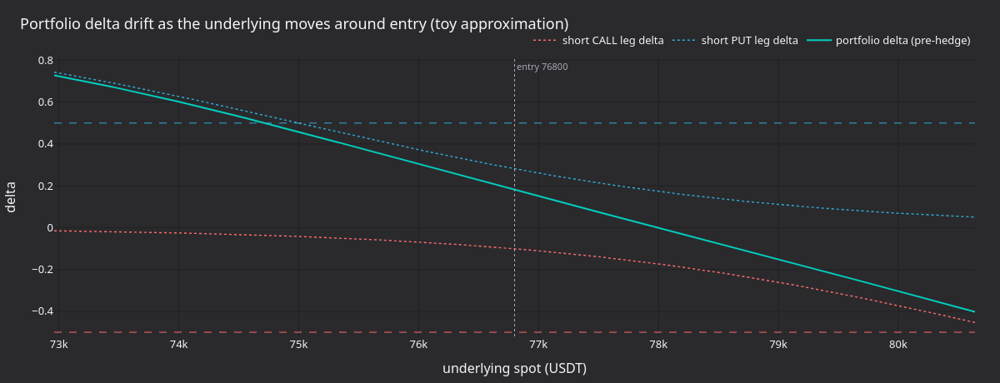
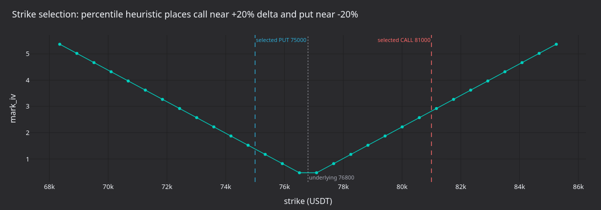

# Delta-Neutral Options Strategy (Bybit)

:::note
This is a **Rust-only** v2 system tutorial. It runs a live delta-neutral
short-volatility strategy on Bybit using the Rust `LiveNode`.
:::

This tutorial runs a short OTM strangle on Bybit BTC options and
delta-hedges with the BTCUSDT perpetual. The strategy selects call and
put strikes at startup, enters via implied-volatility limit orders,
tracks portfolio delta from venue-provided Greeks, and submits market
hedge orders on the perpetual when the delta drifts beyond a threshold.

:::warning
This strategy trades real money on mainnet. Setting `enter_strangle: false`
only disables the initial strangle entry orders. The strategy still
hydrates existing positions from the cache at startup and still submits
hedge orders on the perpetual when portfolio delta breaches the
threshold. If the account holds option or hedge positions from a prior
session, the strategy will trade.
:::

## Prerequisites

- Completion of the [options data tutorial](options_data_bybit.md), which
  covers instrument discovery, Greeks subscriptions, and the `DataActor`
  pattern.
- A Bybit API key with **trading permissions** for options and linear
  perpetuals.
- Environment variables:

```bash
export BYBIT_API_KEY="your-api-key"
export BYBIT_API_SECRET="your-api-secret"
```

## Strategy overview

The `DeltaNeutralVol` strategy ships in the trading crate's `examples`
module and runs in five stages:

1. **Strike selection**: queries the instrument cache for all BTC
   options, filters to the nearest expiry, selects OTM call and put
   strikes by percentile rank.
2. **Entry**: places SELL limit orders on both legs priced by implied
   volatility (via Bybit's `order_iv` parameter). Entry is optional and
   disabled by default in the example.
3. **Greeks tracking**: subscribes to `OptionGreeks` for both legs.
   Deltas and IVs come directly from Bybit's option ticker stream.
4. **Rehedging**: computes portfolio delta and submits a market order on
   the BTCUSDT perpetual when the threshold is breached. Triggers on
   every Greeks update and on a periodic safety timer.
5. **Position tracking**: tracks call, put, and hedge positions via
   `on_order_filled`. Hydrates existing positions from the cache at
   startup.



### Portfolio delta

The strategy computes net exposure as:

```
portfolio_delta = call_delta * call_position
                + put_delta * put_position
                + hedge_position
```

A short strangle starts near delta-neutral because the call and put
deltas offset. With the default `target_call_delta = 0.20` and
`target_put_delta = -0.20`, the two legs cancel at entry. As the
underlying moves, net delta drifts and the strategy hedges to bring it
back toward zero.

## Configuration

The example file at
[`crates/adapters/bybit/examples/node_delta_neutral.rs`](https://github.com/nautechsystems/nautilus_trader/tree/develop/crates/adapters/bybit/examples/node_delta_neutral.rs)
configures the strategy:

```rust
let hedge_instrument_id = InstrumentId::from("BTCUSDT-LINEAR.BYBIT");

let strategy_config =
    DeltaNeutralVolConfig::new("BTC".to_string(), hedge_instrument_id, client_id)
        .with_contracts(1)
        .with_rehedge_delta_threshold(0.5)
        .with_rehedge_interval_secs(30)
        .with_enter_strangle(false)
        .with_iv_param_key("order_iv".to_string());

let strategy = DeltaNeutralVol::new(strategy_config);
```

Parameters (defaults shown are the struct defaults; the example
overrides `enter_strangle` to `false` and `iv_param_key` to
`"order_iv"`):

| Parameter                 | Default    | Example          | Description                                  |
|---------------------------|------------|------------------|----------------------------------------------|
| `option_family`           | required   | `"BTC"`          | Underlying filter for instrument discovery.  |
| `hedge_instrument_id`     | required   | `BTCUSDT-LINEAR` | Perpetual used for delta hedging.            |
| `client_id`               | required   | `"BYBIT"`        | Data and execution client identifier.        |
| `target_call_delta`       | `0.20`     | -                | Target call delta for strike selection.      |
| `target_put_delta`        | `-0.20`    | -                | Target put delta for strike selection.       |
| `contracts`               | `1`        | -                | Contracts per leg.                           |
| `rehedge_delta_threshold` | `0.5`      | -                | Portfolio delta that triggers a hedge.       |
| `rehedge_interval_secs`   | `30`       | -                | Periodic rehedge timer interval.             |
| `enter_strangle`          | `true`     | `false`          | Place entry orders when Greeks arrive.       |
| `entry_iv_offset`         | `0.0`      | -                | Vol points below mark IV for entry pricing.  |
| `iv_param_key`            | `"px_vol"` | `"order_iv"`     | Adapter‑specific IV parameter key.           |

The `iv_param_key` is the key difference between venues. Bybit uses
`order_iv`, which the adapter maps to the `orderIv` field in the
place-order API. OKX uses `px_vol`. Setting this correctly is required
for IV-based order placement.

## Node setup

The example configures both data and execution clients with `Option` and
`Linear` product types:

```rust
let data_config = BybitDataClientConfig {
    api_key: None,
    api_secret: None,
    product_types: vec![BybitProductType::Option, BybitProductType::Linear],
    ..Default::default()
};

let exec_config = BybitExecClientConfig {
    api_key: None,
    api_secret: None,
    product_types: vec![BybitProductType::Option, BybitProductType::Linear],
    account_id: Some(account_id),
    ..Default::default()
};
```

Both product types are needed: `Option` for the strangle legs, `Linear`
for the BTCUSDT perpetual hedge instrument. The execution client requires
`account_id` for order identity tracking.

```rust
let mut node = LiveNode::builder(trader_id, environment)?
    .with_name("BYBIT-DELTA-NEUTRAL-001".to_string())
    .add_data_client(None, Box::new(data_factory), Box::new(data_config))?
    .add_exec_client(None, Box::new(exec_factory), Box::new(exec_config))?
    .with_reconciliation(true)
    .with_delay_post_stop_secs(5)
    .build()?;

node.add_strategy(strategy)?;
node.run().await?;
```

`with_reconciliation(true)` queries Bybit at startup for open orders and
positions, hydrating the cache before the strategy starts. The strategy
then picks up any existing positions from a prior session.

## How the strategy works

### Strike selection

On start the strategy queries the cache for all option instruments
matching `option_family`. It discards expired options, selects the
nearest expiry, separates calls and puts, and sorts each list by strike
price.

Strikes are chosen by percentile in the sorted list:

- **Call**: index = `(1.0 - target_call_delta) * count`. With 0.20
  target delta and 50 calls, this selects the 40th strike (80th
  percentile, OTM).
- **Put**: index = `|target_put_delta| * count`. With -0.20 target
  delta, this selects the 10th strike (20th percentile, OTM).

This is a heuristic. Strike price ordering approximates delta ordering
for options at the same expiry. A production strategy would subscribe
to Greeks for all strikes first, then select by actual delta.

### Entry via implied volatility

When `enter_strangle` is `true` and both mark IVs have arrived, the
strategy places SELL limit orders using the `order_iv` parameter:

```rust
let mut call_params = Params::new();
call_params.insert("order_iv".to_string(), json!(call_entry_iv.to_string()));

self.submit_order_with_params(call_order, None, Some(client_id), call_params)?;
```

Bybit converts `orderIv` to a limit price server-side and gives it
priority over any explicit price. The `entry_iv_offset` config subtracts
vol points from mark IV: an offset of 0.02 sells two vol points below
mark for faster fills.

:::note
Bybit's demo environment rejects orders with `order_iv`. The adapter
denies them before they reach the API. Use mainnet or testnet for
IV-based order placement.
:::

### Rehedging

Two triggers check portfolio delta:

- **Every Greeks update**: `on_option_greeks` recomputes portfolio delta
  after updating the leg's delta value.
- **Periodic timer**: fires every `rehedge_interval_secs` as a safety
  net when Greeks updates stop arriving.

When `|portfolio_delta| > rehedge_delta_threshold`, the strategy submits
a market order on the hedge instrument. A `hedge_pending` flag prevents
duplicate submissions while an order is in flight.

### Position tracking

The strategy tracks positions via `on_order_filled`, not by querying
the cache on every tick. Each fill updates the corresponding position
counter (call, put, or hedge). At startup, existing positions are
hydrated from the cache (populated by reconciliation).

### Shutdown

On stop the strategy cancels open orders, unsubscribes from all data
feeds, and resets the hedge-pending flag. It does not close positions.
Unwinding the strangle and hedge requires manual action or a separate
exit strategy.

## What the run produces

A 30-second mainnet run with `enter_strangle: false` against a clean
account places no orders. The strategy logs the discovered instruments
and the strike selection:

```
Selected call: BTC-28APR26-81000-C-USDT-OPTION.BYBIT (strike=81000)
Selected put: BTC-28APR26-75000-P-USDT-OPTION.BYBIT (strike=75000)
Strangle: 1 contracts per leg, hedge on BTCUSDT-LINEAR.BYBIT
```

That is enough to reason about the strategy's structural behaviour. The
panels below visualise the mechanics around the actual selected strikes
(75,000 / 81,000) at the captured underlying.



**Figure 1.** *Pnl at expiry of the short 75,000 PUT plus short 81,000
CALL combination, assuming a 1,500 USDT total premium and zero discount.
The flat top is the credit-only zone between strikes; loss grows
linearly past either strike.*



**Figure 2.** *Synthetic Brownian delta drift over 150 seconds with
`rehedge_delta_threshold=0.5`. The dotted curve is the un-hedged drift;
the line is the strategy's portfolio delta after each market hedge fire
(crosses).*



**Figure 3.** *Toy approximation of how the short call and short put leg
deltas move with a 5% spot range around entry, plus the resulting
portfolio delta before hedging. Negative gamma compresses the curve in
the wings and steepens it across the strikes.*



**Figure 4.** *The strike-selection heuristic against an illustrative IV
smile. The CALL strike sits at the (1 - 0.20) percentile and the PUT at
the 0.20 percentile, placing both legs OTM at roughly equal-magnitude
deltas around the underlying.*

### Regenerate the panels

```bash
timeout 30 ./target/release/examples/bybit-delta-neutral > /tmp/bybit_dn.log 2>&1

uv sync --extra visualization
DN_LOG=/tmp/bybit_dn.log \
    python3 docs/tutorials/assets/delta_neutral_options_bybit/render_panels.py
```

The renderer parses selected strikes from the log; the panels themselves
are illustrative because the default config does not place orders.

## Risk considerations

- **Gamma risk**: a short strangle has negative gamma. Large underlying
  moves increase delta exposure faster than the rehedge timer responds.
  Tighten `rehedge_delta_threshold` and reduce `rehedge_interval_secs`
  for faster response, at the cost of more hedge trades.
- **Vega risk**: an IV spike increases mark-to-market loss on the short
  options. The strategy does not manage vega exposure.
- **Liquidity**: OTM crypto options can have wide spreads. Hedge quality
  degrades when the underlying gaps or the perpetual trades in coarse
  size increments.
- **Lifecycle risk**: stopping the strategy stops hedging. Positions
  remain open and unhedged until manually managed.

## Running the example

```bash
cargo run --example bybit-delta-neutral --package nautilus-bybit --features examples
```

The example runs with `enter_strangle: false` by default, so it does not
place strangle entry orders. It still hydrates existing positions and
submits hedge orders if portfolio delta breaches the threshold. On a
clean account with no prior positions, no orders are placed.

Stop with Ctrl+C. The strategy cancels open orders and unsubscribes
before shutdown.

## Complete source

- Example runner: [`crates/adapters/bybit/examples/node_delta_neutral.rs`](https://github.com/nautechsystems/nautilus_trader/tree/develop/crates/adapters/bybit/examples/node_delta_neutral.rs)
- Strategy implementation: [`crates/trading/src/examples/strategies/delta_neutral_vol/`](https://github.com/nautechsystems/nautilus_trader/tree/develop/crates/trading/src/examples/strategies/delta_neutral_vol/)
- Strategy README with full config reference: [`crates/trading/src/examples/strategies/delta_neutral_vol/README.md`](https://github.com/nautechsystems/nautilus_trader/tree/develop/crates/trading/src/examples/strategies/delta_neutral_vol/README.md)

## See also

- [Options data and Greeks on Bybit](options_data_bybit.md): prerequisite
  tutorial covering Greeks subscriptions and option chain snapshots.
- [Options](../concepts/options.md): option instrument types and data
  architecture.
- [Bybit integration](../integrations/bybit.md#options-trading): options
  order parameters including `order_iv` and `mmp`.
