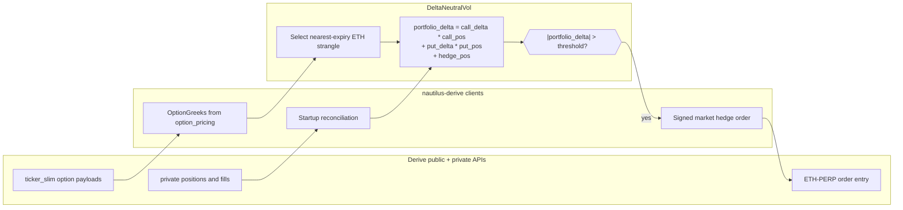
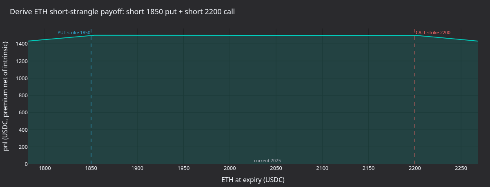
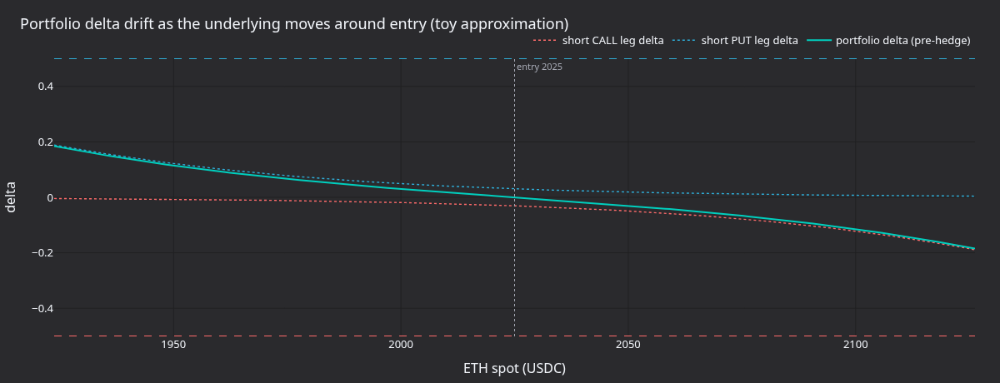
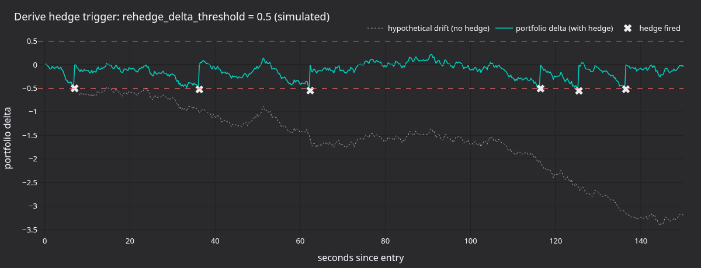
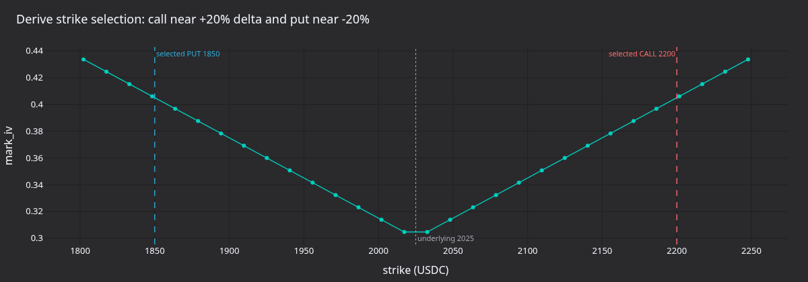

# Delta-Neutral Options Strategy (Derive)

:::note
This is a **Rust-only** v2 system tutorial. It runs the live delta-neutral
short-volatility strategy on Derive using the Rust `LiveNode`.
:::

This tutorial runs the shared `DeltaNeutralVol` strategy with the Derive adapter. The shipped
example discovers ETH options, selects an out-of-the-money call and put, subscribes to
venue-provided Greeks, and delta-hedges with `ETH-PERP.DERIVE`.

The Derive runner starts in hedge-only mode: it sets `enter_strangle: false`, so it does not place
the initial option entry orders. It still hydrates existing positions through reconciliation and can
submit market hedge orders on the perpetual when portfolio delta breaches the configured threshold.
For smoke tests, set `DERIVE_DELTA_NEUTRAL_HEDGE_ENABLED=false` to keep the strategy from submitting
hedge orders while it still loads instruments, reconciles the account, and subscribes to Greeks.
For an entry-order smoke test, set `DERIVE_DELTA_NEUTRAL_ENTER_STRANGLE=true`; the runner submits
Derive-premium option orders instead of IV-priced option orders.

:::warning
This strategy can trade real money on mainnet. Setting `enter_strangle: false` only disables the
initial strangle entry orders. If the selected option legs or the hedge instrument already have open
positions, the strategy can submit hedge orders.
:::

## Prerequisites

- Completion of the [Derive integration guide](../integrations/derive.md), including wallet,
  subaccount, session-key, and funding setup.
- A Derive testnet or mainnet subaccount with enough USDC collateral for the hedge orders you plan
  to allow.
- A working Rust toolchain and a built NautilusTrader workspace.
- Environment variables for the selected Derive environment.

For testnet:

```fish
set -gx DERIVE_TESTNET_WALLET_ADDRESS      "0x..."
set -gx DERIVE_TESTNET_SESSION_PRIVATE_KEY "0x..."
set -gx DERIVE_TESTNET_SUBACCOUNT_ID       "12345"
```

For mainnet:

```fish
set -gx DERIVE_WALLET_ADDRESS      "0x..."
set -gx DERIVE_SESSION_PRIVATE_KEY "0x..."
set -gx DERIVE_SUBACCOUNT_ID       "12345"
set -gx DERIVE_ENVIRONMENT         "mainnet"
```

The example defaults to testnet. Set `DERIVE_ENVIRONMENT=mainnet` only for real-funds runs.

## Strategy overview

The `DeltaNeutralVol` strategy lives in the trading crate's examples module. The Derive runner uses
it in five stages:

1. **Instrument load**: configures the Derive data client with `currencies: ["ETH"]`, so the adapter
   loads ETH perps and options into the cache.
2. **Strike selection**: filters the cache to live ETH options, selects the nearest expiry, then
   chooses OTM call and put strikes by percentile rank.
3. **Greeks tracking**: subscribes to `OptionGreeks` for both legs. Derive Greeks come from the
   shared `ticker_slim` feed and the `option_pricing` payload.
4. **Rehedging**: computes portfolio delta and submits a Derive market order on `ETH-PERP.DERIVE`
   when the threshold is breached.
5. **Position tracking**: tracks call, put, and hedge positions through fills. Reconciliation
   hydrates existing positions before the strategy starts.



### Portfolio delta

The strategy computes net exposure as:

```
portfolio_delta = call_delta * call_position
                + put_delta * put_position
                + hedge_position
```

A short strangle starts close to delta-neutral when the call and put deltas offset. As the
underlying moves, net delta drifts and the strategy hedges with the perpetual to bring the portfolio
back toward zero.

## Configuration

The example runner at `crates/adapters/derive/examples/node_delta_neutral.rs` configures the
strategy:

```rust
let option_family = env_string("DERIVE_DELTA_NEUTRAL_OPTION_FAMILY", "ETH")?;
let default_hedge = format!("{option_family}-PERP.DERIVE");
let hedge_instrument = env_string("DERIVE_DELTA_NEUTRAL_HEDGE_INSTRUMENT", &default_hedge)?;
let enter_strangle = env_bool("DERIVE_DELTA_NEUTRAL_ENTER_STRANGLE", false)?;
let hedge_enabled = env_bool("DERIVE_DELTA_NEUTRAL_HEDGE_ENABLED", true)?;
let rehedge_delta_threshold = if hedge_enabled {
    env_f64("DERIVE_DELTA_NEUTRAL_REHEDGE_DELTA_THRESHOLD", 0.5)?
} else {
    1.0e12
};

let hedge_instrument_id = InstrumentId::from(hedge_instrument.as_str());
let mut strategy_config = DeltaNeutralVolConfig::builder()
    .option_family(option_family)
    .hedge_instrument_id(hedge_instrument_id)
    .client_id(client_id)
    .target_call_delta(env_f64("DERIVE_DELTA_NEUTRAL_TARGET_CALL_DELTA", 0.20)?)
    .target_put_delta(env_f64("DERIVE_DELTA_NEUTRAL_TARGET_PUT_DELTA", -0.20)?)
    .contracts(env_u64("DERIVE_DELTA_NEUTRAL_CONTRACTS", 1)?)
    .rehedge_delta_threshold(rehedge_delta_threshold)
    .rehedge_interval_secs(env_u64("DERIVE_DELTA_NEUTRAL_REHEDGE_INTERVAL_SECS", 30)?)
    .enter_strangle(enter_strangle)
    .entry_iv_offset(env_f64("DERIVE_DELTA_NEUTRAL_ENTRY_IV_OFFSET", 0.0)?)
    .entry_premium_offset_ticks(env_i32("DERIVE_DELTA_NEUTRAL_ENTRY_PREMIUM_OFFSET_TICKS", 1)?)
    .build();

if let Some(expiry) = env_optional_string("DERIVE_DELTA_NEUTRAL_EXPIRY")? {
    strategy_config.expiry_filter = Some(expiry);
}

let strategy = DeltaNeutralVol::new(strategy_config);
```

Parameters:

| Parameter                    | Default    | Derive runner | Description                                   |
|------------------------------|------------|---------------|-----------------------------------------------|
| `option_family`              | required   | `"ETH"`       | Underlying filter for instrument discovery.   |
| `hedge_instrument_id`        | required   | `ETH-PERP`    | Perpetual used for delta hedging.             |
| `client_id`                  | required   | `"DERIVE"`    | Data and execution client identifier.         |
| `target_call_delta`          | `0.20`     | `0.20`        | Target call delta for strike selection.       |
| `target_put_delta`           | `-0.20`    | `-0.20`       | Target put delta for strike selection.        |
| `contracts`                  | `1`        | `1`           | Contracts per option leg.                     |
| `rehedge_delta_threshold`    | `0.5`      | `0.5`         | Portfolio delta that triggers a hedge.        |
| `rehedge_interval_secs`      | `30`       | `30`          | Periodic rehedge timer interval.              |
| `expiry_filter`              | `None`     | unset         | Optional expiry substring filter.             |
| `enter_strangle`             | `true`     | `false`       | Place entry orders when premium data arrives. |
| `entry_premium_offset_ticks` | `None`     | `1`           | Ticks above option ask for sell entry.        |
| `entry_iv_offset`            | `0.0`      | `0.0`         | Used only when premium mode is disabled.      |
| `iv_param_key`               | `"px_vol"` | unused        | IV parameter key for IV-priced venues.        |

The Derive runner reads these environment variables:

| Variable                                          | Default                | Description                        |
|---------------------------------------------------|------------------------|------------------------------------|
| `DERIVE_DELTA_NEUTRAL_OPTION_FAMILY`              | `ETH`                  | Option family / Derive currency.   |
| `DERIVE_DELTA_NEUTRAL_HEDGE_INSTRUMENT`           | `<family>-PERP.DERIVE` | Perpetual hedge instrument.        |
| `DERIVE_DELTA_NEUTRAL_ENTER_STRANGLE`             | `false`                | Enable option entry orders.        |
| `DERIVE_DELTA_NEUTRAL_HEDGE_ENABLED`              | `true`                 | Enable perpetual hedge orders.     |
| `DERIVE_DELTA_NEUTRAL_REHEDGE_DELTA_THRESHOLD`    | `0.5`                  | Portfolio delta hedge threshold.   |
| `DERIVE_DELTA_NEUTRAL_REHEDGE_INTERVAL_SECS`      | `30`                   | Periodic hedge check interval.     |
| `DERIVE_DELTA_NEUTRAL_CONTRACTS`                  | `1`                    | Contracts per option leg.          |
| `DERIVE_DELTA_NEUTRAL_TARGET_CALL_DELTA`          | `0.20`                 | Call strike‑selection target.      |
| `DERIVE_DELTA_NEUTRAL_TARGET_PUT_DELTA`           | `-0.20`                | Put strike‑selection target.       |
| `DERIVE_DELTA_NEUTRAL_EXPIRY`                     | unset                  | Optional expiry substring filter.  |
| `DERIVE_DELTA_NEUTRAL_ENTRY_PREMIUM_OFFSET_TICKS` | `1`                    | Sell‑entry ticks above option ask. |
| `DERIVE_DELTA_NEUTRAL_ENTRY_IV_OFFSET`            | `0.0`                  | Used only outside premium mode.    |
| `DERIVE_DELTA_NEUTRAL_MAX_FEE_PER_CONTRACT`       | `1000`                 | Signed per‑contract fee cap.       |
| `DERIVE_DELTA_NEUTRAL_MARKET_ORDER_SLIPPAGE_BPS`  | adapter default        | Market hedge slippage bound.       |

Derive signs explicit premium limit prices. The runner enables the strategy's premium-entry mode
with `entry_premium_offset_ticks=1`, so entry orders use a live option ask when available and fall
back to Derive IV fields when the quote side is empty. Bybit and OKX keep using the shared IV-param
path.

## Node setup

The Derive runner uses the live environment and selects testnet or mainnet from
`DERIVE_ENVIRONMENT`:

```rust
let environment = Environment::Live;
let derive_environment = derive_environment_from_env();
let trader_id = TraderId::from("TESTER-001");
let account_id = AccountId::from("DERIVE-001");
let client_id = *DERIVE_CLIENT_ID;
```

The data client bulk-loads ETH instruments. This is important because the strategy selects option
legs from the cache during `on_start`.

```rust
let data_config = DeriveDataClientConfig {
    environment: derive_environment,
    currencies: vec![option_family.clone()],
    ..Default::default()
};
```

The execution client reads wallet, session key, and subaccount values from the Derive environment
variables when the config fields are left unset. The example sets a fee cap and allows optional
protocol-constant overrides for local testing.

```rust
let exec_config = DeriveExecClientConfig {
    environment: derive_environment,
    max_fee_per_contract: Some(Decimal::from_str_exact("1000")?),
    domain_separator: env_override(
        derive_environment,
        "DERIVE_DOMAIN_SEPARATOR",
        "DERIVE_TESTNET_DOMAIN_SEPARATOR",
    ),
    action_typehash: env_override(
        derive_environment,
        "DERIVE_ACTION_TYPEHASH",
        "DERIVE_TESTNET_ACTION_TYPEHASH",
    ),
    trade_module_address: env_override(
        derive_environment,
        "DERIVE_TRADE_MODULE_ADDRESS",
        "DERIVE_TESTNET_TRADE_MODULE_ADDRESS",
    ),
    ..Default::default()
};
```

Execution clients need `DeriveExecFactoryConfig`, which carries the trader and account IDs:

```rust
let exec_factory_config = DeriveExecFactoryConfig {
    trader_id,
    account_id,
    config: exec_config,
};
```

The node enables reconciliation so open orders, positions, balances, and reports are loaded before
the strategy starts:

```rust
let mut node = LiveNode::builder(trader_id, environment)?
    .with_name("DERIVE-DELTA-NEUTRAL-001".to_string())
    .add_data_client(None, Box::new(data_factory), Box::new(data_config))?
    .add_exec_client(None, Box::new(exec_factory), Box::new(exec_factory_config))?
    .with_reconciliation(true)
    .with_delay_post_stop_secs(5)
    .build()?;

node.add_strategy(strategy)?;
node.run().await?;
```

## How the strategy works

### Strike selection

On start the strategy queries the cache for all option instruments matching `option_family`. For
Derive, the example uses `ETH`, so matching instruments have symbols such as
`ETH-20260626-3000-C.DERIVE`.

It discards expired options, optionally applies `expiry_filter`, and uses the nearest expiry when no
filter is set. Calls and puts are sorted by strike:

- **Call**: index = `(1.0 - target_call_delta) * count`. With the default `0.20`, this selects
  around the 80th percentile strike.
- **Put**: index = `abs(target_put_delta) * count`. With the default `-0.20`, this selects around
  the 20th percentile strike.

This is a strike-ordering heuristic. A production strategy can subscribe to Greeks for the full
chain first and then select by actual delta.

### Greeks and shared ticker feeds

Derive publishes option pricing fields on the same `ticker_slim` channel used for quotes. The
adapter derives `OptionGreeks` from `option_pricing`, so the strategy only needs to subscribe to the
two selected option legs:

```rust
self.subscribe_option_greeks(call_id, Some(client_id), None);
self.subscribe_option_greeks(put_id, Some(client_id), None);
```

The adapter reference-counts the underlying ticker subscription. Quotes, mark prices, index prices,
funding rates, and option Greeks for the same instrument can share a single WebSocket channel.

### Rehedging on Derive

The Derive execution adapter sends market orders as signed orders with a slippage-bound limit price.
Before signing, it refreshes the current ticker snapshot for the hedge instrument and writes the
worst acceptable price into the EIP-712 payload. The default
`market_order_slippage_bps` is `50`.

The strategy submits a hedge when both selected option legs have emitted Greeks and:

```
abs(portfolio_delta) > rehedge_delta_threshold
```

A positive portfolio delta triggers a SELL on `ETH-PERP.DERIVE`; a negative portfolio delta triggers
a BUY. A `hedge_pending` flag blocks duplicate submissions while an order is in flight.

### Position tracking

The strategy tracks positions via `on_order_filled` rather than polling positions on every update.
Reconciliation hydrates existing positions at startup; subsequent fills update the in-memory call,
put, and hedge counters.

### Shutdown

On stop the strategy cancels open orders for the selected option legs and the hedge instrument,
unsubscribes from data feeds, and leaves positions open. Unwinding the strangle and hedge requires
manual action or a separate exit strategy.

## What the run produces

On testnet with `enter_strangle: false`, the strategy should discover the selected legs, subscribe
to Greeks, and place no entry orders. The selected symbols depend on the live Derive chain:

```
Selected call: ETH-<expiry>-<strike>-C.DERIVE (strike=<strike>)
Selected put: ETH-<expiry>-<strike>-P.DERIVE (strike=<strike>)
Strangle: 1 contracts per leg, hedge on ETH-PERP.DERIVE
Strangle entry disabled: hedging externally-held positions only.
```

If no existing positions are present, the run should remain data-only after startup. If the account
already holds positions in the selected legs or hedge instrument, the periodic rehedge timer can
submit hedge orders.

The panels below use the same selected-strike mechanics as the Derive runner. They parse selected
strikes from the smoke-test log when available and otherwise fall back to illustrative ETH strikes.



**Figure 1.** *Pnl at expiry of the short ETH put plus short ETH call combination, assuming a fixed
USDC premium and zero discount. The flat top is the credit-only zone between strikes; loss grows
linearly past either strike.*



**Figure 2.** *Toy approximation of how the short call and short put leg deltas move around entry,
plus the resulting portfolio delta before hedging.*



**Figure 3.** *Synthetic Brownian delta drift over 150 seconds with
`rehedge_delta_threshold=0.5`. Crosses show where the strategy would submit a hedge order when
hedging is enabled.*



**Figure 4.** *The strike-selection heuristic against an illustrative IV smile. The call strike
sits near the `(1 - target_call_delta)` percentile and the put near `abs(target_put_delta)`.*

### Regenerate the panels

```fish
set -gx DERIVE_ENVIRONMENT mainnet
set -gx DERIVE_DELTA_NEUTRAL_HEDGE_ENABLED false
timeout 45 cargo run --example derive-delta-neutral --package nautilus-derive --features examples \
    > /tmp/derive_dn.log 2>&1

uv sync --extra visualization
set -gx DN_LOG /tmp/derive_dn.log
python3 docs/tutorials/assets/delta_neutral_options_derive/render_panels.py
```

The renderer only uses the log to pick strikes. The plots remain illustrative because the no-order
smoke configuration disables entry and hedge submissions.

## Risk considerations

- **Gamma risk**: a short strangle has negative gamma. Large ETH moves can increase delta exposure
  faster than the rehedge timer responds.
- **Slippage risk**: Derive market orders sign a slippage-bound limit price before submission.
  Tight bounds can reject useful hedges; loose bounds can fill worse than expected.
- **Entry-price risk**: Derive entry uses live option asks plus a tick offset, or computes a premium
  from Derive IV fields when the quote side is empty. A small or negative offset can cross the book
  and fill immediately.
- **Collateral risk**: Derive rejects orders when the subaccount lacks initial-margin headroom.
  Check `private/get_subaccount` or the adapter account snapshot before enabling live hedging.
- **Lifecycle risk**: stopping the strategy stops hedging. Positions remain open and unhedged until
  they are managed elsewhere.

## Running the example

```fish
cargo run --example derive-delta-neutral --package nautilus-derive --features examples
```

Stop with Ctrl+C. The strategy cancels open orders and unsubscribes before shutdown, but it does not
close positions.

For a mainnet smoke test that loads the venue and account without submitting orders:

```fish
set -gx DERIVE_ENVIRONMENT mainnet
set -gx DERIVE_DELTA_NEUTRAL_HEDGE_ENABLED false
timeout 45 cargo run --example derive-delta-neutral --package nautilus-derive --features examples
```

For a mainnet smoke test that submits Derive-premium option entry orders:

```fish
set -gx DERIVE_ENVIRONMENT mainnet
set -gx DERIVE_DELTA_NEUTRAL_ENTER_STRANGLE true
set -gx DERIVE_DELTA_NEUTRAL_ENTRY_PREMIUM_OFFSET_TICKS 1
timeout --signal=INT 45 cargo run --example derive-delta-neutral --package nautilus-derive \
    --features examples
```

## Complete source

- Example runner: `crates/adapters/derive/examples/node_delta_neutral.rs`
- Strategy implementation: `crates/trading/src/examples/strategies/delta_neutral_vol/`
- Strategy README: `crates/trading/src/examples/strategies/delta_neutral_vol/README.md`

## See also

- [Derive integration](../integrations/derive.md): environment setup, symbology, capabilities, and
  execution semantics.
- [Options](../concepts/options.md): option instrument types and data architecture.
- [Delta-neutral options strategy on Bybit](delta_neutral_options_bybit.md): the same shared
  strategy with Bybit-specific IV entry parameters.
