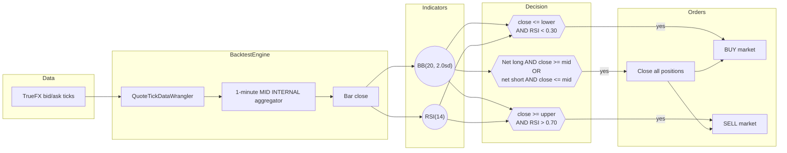
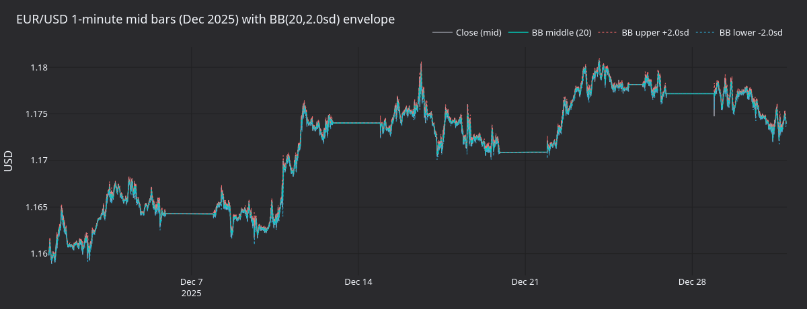
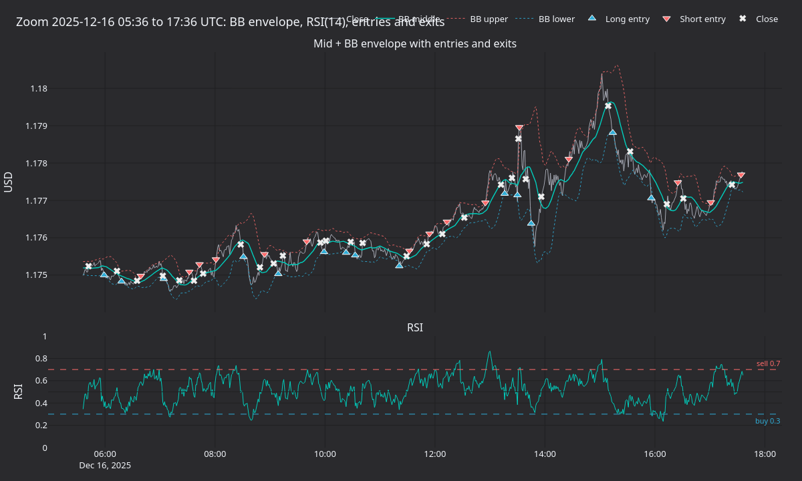
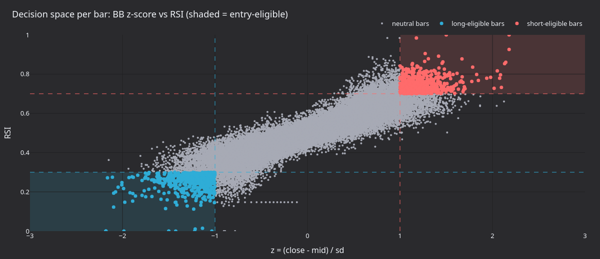
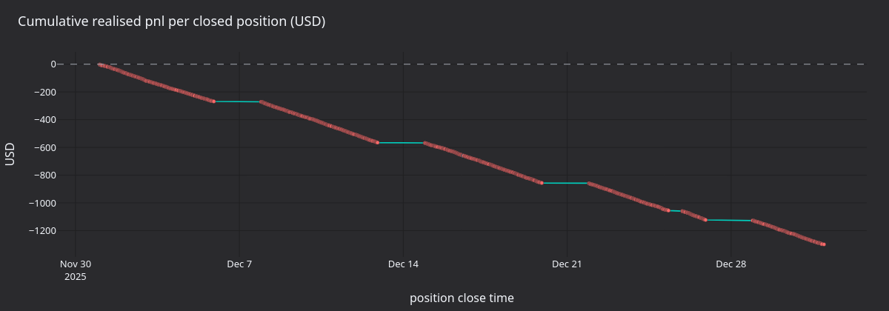

# Mean Reversion with Proxy FX Data (AX Exchange)

This tutorial backtests a Bollinger-band mean-reversion strategy on
**EURUSD-PERP** at [AX Exchange](https://architect.exchange) using
[TrueFX](https://www.truefx.com) EUR/USD spot ticks as a proxy.

## Introduction

The strategy combines two indicators on 1-minute mid bars:

- **Bollinger Bands** (`BBMeanReversion`'s `BB(20, 2.0sd)`): a rolling
  20-bar mean and a +/-2sd envelope. The bands flag price as overextended
  relative to recent volatility.
- **Relative Strength Index** (`RSI(14)`): a 14-bar momentum oscillator.
  NautilusTrader RSI is on `[0, 1]`, so the conventional 30/70 thresholds
  become `0.30` / `0.70`.

Entry needs both signals at once: a touch of the lower band with `RSI < 0.30`
opens a long; a touch of the upper band with `RSI > 0.70` opens a short.
Exit is one-sided: any open position closes when the close crosses back
through the BB middle. Existing positions on the opposite side are flattened
before a new entry.

The shipped `BBMeanReversion` strategy is intentionally simple and has no
edge.



### Why proxy data

AX Exchange is a new venue not yet covered by historical data vendors.
[TrueFX](https://www.truefx.com) publishes free, institutional-grade EUR/USD
spot tick archives (Integral and Jefferies pools) that stand in cleanly
for AX EURUSD-PERP backtests.

## Prerequisites

- Python 3.12+
- [NautilusTrader](https://pypi.org/project/nautilus_trader/) installed.
- A free TrueFX account, used to download a monthly tick archive.

## Data preparation

### Download TrueFX EUR/USD ticks

1. Go to the [TrueFX historical downloads page](https://www.truefx.com/truefx-historical-downloads/).
2. Pick **EUR/USD** and a month, for example **December 2025**.
3. Extract the ZIP. The CSV is headerless with columns
   `pair, timestamp, bid, ask`.

### Load into Nautilus quote ticks

```python
from pathlib import Path

import pandas as pd

from nautilus_trader.persistence.wranglers import QuoteTickDataWrangler

df = pd.read_csv(
    Path("EURUSD-2025-12.csv"),
    header=None,
    names=["pair", "timestamp", "bid", "ask"],
)
df["timestamp"] = pd.to_datetime(df["timestamp"], format="%Y%m%d %H:%M:%S.%f")
df = df.set_index("timestamp")[["bid", "ask"]]

wrangler = QuoteTickDataWrangler(instrument=EURUSD_PERP)  # defined below
ticks = wrangler.process(df)
```

The wrangler tags every tick with the instrument ID. The strategy declares
`1-MINUTE-MID-INTERNAL`, so the engine builds 1-minute MID bars from the
tick stream internally.

## Instrument definition

Proxy data needs a manual instrument definition. The multiplier of `1000`
gives one contract a notional of 1,000 EUR.

```python
from decimal import Decimal

from nautilus_trader.model.currencies import USD
from nautilus_trader.model.enums import AssetClass
from nautilus_trader.model.identifiers import InstrumentId
from nautilus_trader.model.identifiers import Symbol
from nautilus_trader.model.instruments import PerpetualContract
from nautilus_trader.model.objects import Price
from nautilus_trader.model.objects import Quantity

instrument_id = InstrumentId.from_str("EURUSD-PERP.AX")

EURUSD_PERP = PerpetualContract(
    instrument_id=instrument_id,
    raw_symbol=Symbol("EURUSD-PERP"),
    underlying="EUR",
    asset_class=AssetClass.FX,
    quote_currency=USD,
    settlement_currency=USD,
    is_inverse=False,
    price_precision=5,
    size_precision=0,
    price_increment=Price.from_str("0.00001"),
    size_increment=Quantity.from_int(1),
    multiplier=Quantity.from_int(1000),
    lot_size=Quantity.from_int(1),
    margin_init=Decimal("0.05"),
    margin_maint=Decimal("0.025"),
    maker_fee=Decimal("0.0002"),
    taker_fee=Decimal("0.0005"),
    ts_event=0,
    ts_init=0,
)
```

Fees and margin are explicit backtest assumptions. Check the
[AX Exchange documentation](https://docs.architect.exchange/) for current
rates.

## Configuration

| Parameter            | Value  | Description                                          |
| -------------------- | ------ | ---------------------------------------------------- |
| `bb_period`          | `20`   | Rolling window for the BB mean and the standard deviation. |
| `bb_std`             | `2.0`  | Band width in standard deviations.                   |
| `rsi_period`         | `14`   | RSI lookback in bars.                                |
| `rsi_buy_threshold`  | `0.30` | Long entry confirmation (NautilusTrader RSI is `[0, 1]`). |
| `rsi_sell_threshold` | `0.70` | Short entry confirmation.                            |
| `trade_size`         | `1`    | One contract per trade (1,000 EUR notional).         |

:::tip
NautilusTrader RSI returns values in `[0.0, 1.0]`, not `[0, 100]`. The
`0.30` / `0.70` thresholds correspond to the textbook 30 / 70 levels.
:::

## Backtest setup

```python
from nautilus_trader.backtest.config import BacktestEngineConfig
from nautilus_trader.backtest.engine import BacktestEngine
from nautilus_trader.config import LoggingConfig
from nautilus_trader.examples.strategies.bb_mean_reversion import BBMeanReversion
from nautilus_trader.examples.strategies.bb_mean_reversion import BBMeanReversionConfig
from nautilus_trader.model.data import BarType
from nautilus_trader.model.enums import AccountType
from nautilus_trader.model.enums import OmsType
from nautilus_trader.model.identifiers import TraderId
from nautilus_trader.model.identifiers import Venue
from nautilus_trader.model.objects import Money

engine = BacktestEngine(
    BacktestEngineConfig(
        trader_id=TraderId("BACKTESTER-001"),
        logging=LoggingConfig(log_level="INFO"),
    ),
)

AX = Venue("AX")
engine.add_venue(
    venue=AX,
    oms_type=OmsType.NETTING,
    account_type=AccountType.MARGIN,
    base_currency=USD,
    starting_balances=[Money(100_000, USD)],
)

engine.add_instrument(EURUSD_PERP)
engine.add_data(ticks)

strategy = BBMeanReversion(
    BBMeanReversionConfig(
        instrument_id=instrument_id,
        bar_type=BarType.from_str("EURUSD-PERP.AX-1-MINUTE-MID-INTERNAL"),
        trade_size=Decimal("1"),
        bb_period=20,
        bb_std=2.0,
        rsi_period=14,
        rsi_buy_threshold=0.30,
        rsi_sell_threshold=0.70,
    ),
)
engine.add_strategy(strategy)
engine.run()
```

Reports come straight off `engine.trader`:

```python
print(engine.trader.generate_account_report(AX))
print(engine.trader.generate_order_fills_report())
print(engine.trader.generate_positions_report())

engine.reset()
engine.dispose()
```

The runnable example is at
[`architect_ax_mean_reversion.py`](https://github.com/nautechsystems/nautilus_trader/tree/develop/examples/backtest/architect_ax_mean_reversion.py).

## What the run produces

Replaying TrueFX EUR/USD December 2025 through `BBMeanReversion(20, 2sd, RSI 14)`
prints 44,591 1-minute mid bars and closes 1,089 positions across 2,178 fills.
Cumulative realised pnl ends at **-1,287 USD**: the strategy bleeds steadily
through the month with no clear regime-driven recovery. Mean reversion
without a regime filter pays the spread on every cycle, and EUR/USD ran a
pronounced uptrend through the second half of December which the strategy
fought repeatedly.



**Figure 1.** *EUR/USD 1-minute mid bars across December 2025 with the BB
middle and +/-2sd envelope. Long flat patches are weekend gaps in the TrueFX
feed.*



**Figure 2.** *Twelve-hour zoom around the dataset midpoint. Top: mid with
BB envelope, long entries (triangles up), short entries (triangles down),
and closing fills (crosses). Bottom: RSI(14) with the 0.30 buy / 0.70 sell
thresholds.*



**Figure 3.** *Per-bar BB z-score against RSI for the whole month. Shaded
regions mark the entry-eligible quadrants: lower-left (long) and upper-right
(short). The diagonal lobe is the natural co-movement of band-relative price
and RSI.*



**Figure 4.** *Cumulative realised USD pnl across closed positions. The
curve declines roughly linearly, dominated by spread and small adverse
moves on each cycle.*

### Regenerate the panels

A self-contained renderer re-runs the backtest, computes BB and RSI on the
captured bars, and writes PNG panels using the shared `nautilus_dark`
tearsheet theme.

```bash
uv sync --extra visualization
TRUEFX_CSV=tests/test_data/local/truefx/EURUSD-2025-12.csv \
    python3 docs/tutorials/assets/fx_mean_reversion_ax/render_panels.py
```

Set `TRUEFX_CSV` to wherever you saved the EUR/USD archive.

## Next steps

- **Add a regime filter**. The drawdown is concentrated in trending sessions.
  Suppress entries when realised range or a slower trend filter says the
  market is directional.
- **Tune thresholds**. A wider band (`bb_std=2.5`) or stricter RSI cutoffs
  (`0.25` / `0.75`) cut entries but raise the bar for confirmation.
- **Add stops**. Hard stop-loss orders cap downside per cycle and prevent
  carrying a losing position to the BB middle reversion.
- **Go live on the AX sandbox**. Connect to the AX sandbox for paper
  trading once the backtest behaves. See the
  [AX Exchange integration guide](../integrations/architect_ax.md) for
  setup.

## Running live

The same `BBMeanReversion` strategy runs live against AX Exchange. The
launch script swaps the `BacktestEngine` for a `TradingNode` with the AX
data and execution clients configured. See the live example:
[`ax_mean_reversion.py`](https://github.com/nautechsystems/nautilus_trader/tree/develop/examples/live/architect_ax/ax_mean_reversion.py).

For connection setup and API key configuration, see the
[AX Exchange integration guide](../integrations/architect_ax.md).

## Further reading

- [`BBMeanReversion` strategy source](https://github.com/nautechsystems/nautilus_trader/tree/develop/nautilus_trader/examples/strategies/bb_mean_reversion.py)
- [Gold perpetual book imbalance tutorial](gold_book_imbalance_ax.md)
- [Architect Exchange documentation](https://docs.architect.exchange/)
