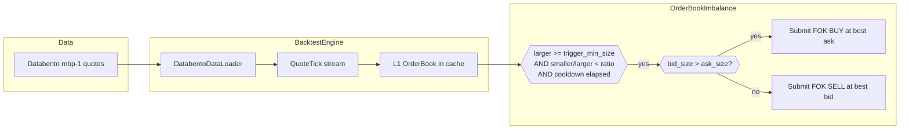
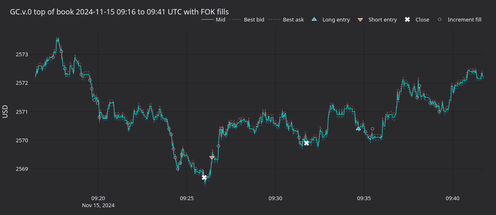
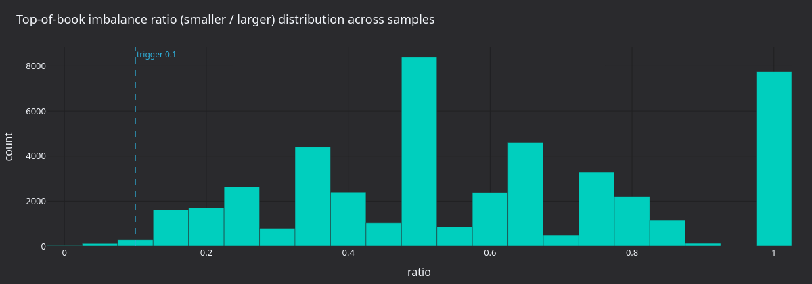
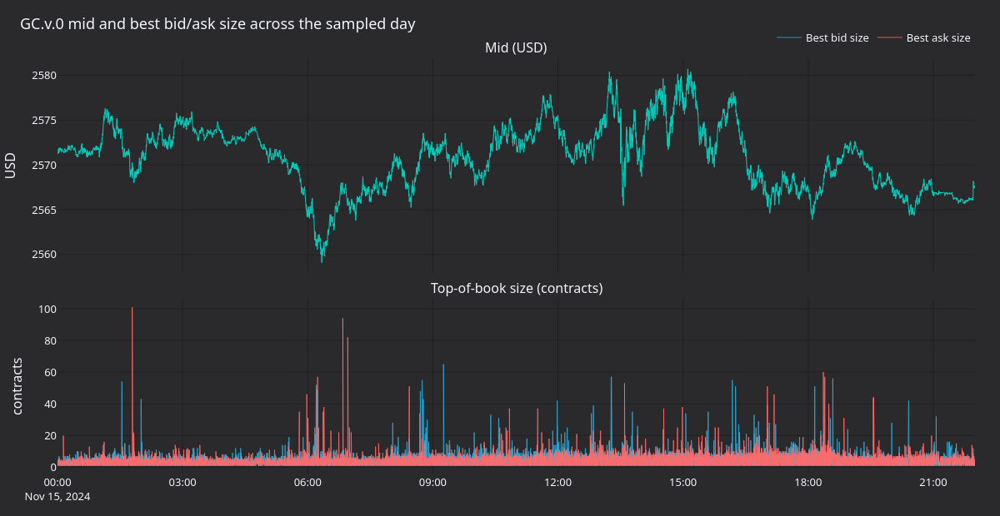
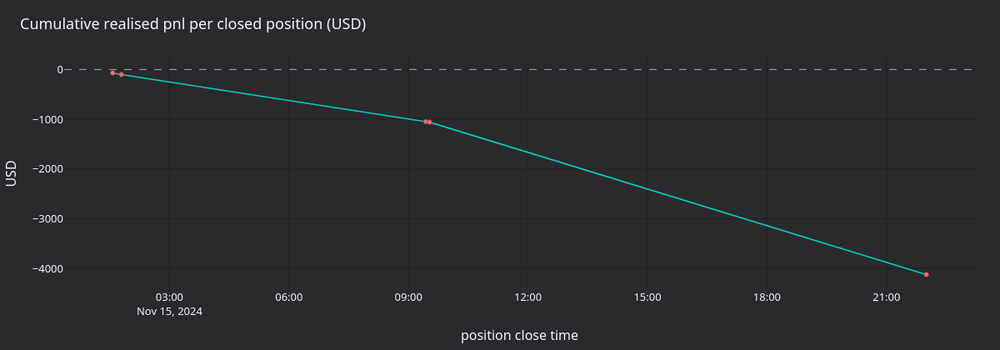

# Gold Perpetual Book Imbalance with Proxy Futures Data (AX Exchange)

This tutorial backtests a top-of-book imbalance strategy on **XAU-PERP** at
[AX Exchange](https://architect.exchange) using
[Databento](https://databento.com) CME gold futures (`GC.v.0`) `mbp-1`
quotes as a proxy.

## Introduction

Top-of-book imbalance is a microstructure signal: when one side of the BBO
holds significantly more resting size than the other, the book is leaning
and short-term price often moves toward the thinner side as the heavier
side absorbs flow. The shipped `OrderBookImbalance` strategy fires a
fill-or-kill (FOK) limit order against the thicker side every time the
ratio between sides clears a threshold and a cooldown has elapsed.

Because the strategy only needs the BBO, it works with `mbp-1` (market by
price, single best bid/ask) quote data rather than the full L2 book. That
keeps source costs down for backtesting.

`OrderBookImbalance` is a teaching strategy and has no edge.



### Why proxy data

AX Exchange is new and not yet covered by Databento. CME `GC` gold futures
are the most liquid gold derivatives globally and provide representative
microstructure for backtesting gold strategies. We use the **continuous
contract** `GC.v.0` so the file stitches across expiries on the highest-volume
contract, mirroring how a perpetual chases liquidity. The
`stype_in="continuous"` parameter resolves the symbol through Databento's
continuous mapping at request time. The `instrument_id` override at load
time is safe because the continuous contract maps to a single underlying
instrument at any moment.

For a deeper read on the predictive power of book imbalance features, see
Databento's
[blog post on HFT signals with sklearn](https://databento.com/blog/hft-sklearn-python).

## Prerequisites

- Python 3.12+
- [NautilusTrader](https://pypi.org/project/nautilus_trader/) installed.
- A Databento API key:

```bash
export DATABENTO_API_KEY="your-api-key"
```

- The Databento Python client: `pip install databento`.

## Data preparation

### Download CME gold futures quotes

```python
import databento as db
from pathlib import Path

data_path = Path("gc_gold_quotes.dbn.zst")

if not data_path.exists():
    client = db.Historical()
    data = client.timeseries.get_range(
        dataset="GLBX.MDP3",
        symbols=["GC.v.0"],
        stype_in="continuous",
        schema="mbp-1",
        start="2024-11-15",
        end="2024-11-16",
    )
    data.to_file(data_path)
```

This pulls one trading day. The file is reused on subsequent runs.

### Load into Nautilus quote ticks

`DatabentoDataLoader.from_dbn_file` parses the `.dbn.zst` archive and
emits `QuoteTick` objects. The `instrument_id` argument overrides the
Databento symbology so every tick appears to come from `XAU-PERP.AX`.

```python
from nautilus_trader.adapters.databento import DatabentoDataLoader
from nautilus_trader.model.identifiers import InstrumentId

instrument_id = InstrumentId.from_str("XAU-PERP.AX")

loader = DatabentoDataLoader()
quotes = loader.from_dbn_file(
    path="gc_gold_quotes.dbn.zst",
    instrument_id=instrument_id,
)
```

## Instrument definition

Proxy data needs a manual instrument definition. Price precision and tick
size match the CME source data; margin and fee parameters reflect AX
conditions.

```python
from decimal import Decimal

from nautilus_trader.model.currencies import USD
from nautilus_trader.model.enums import AssetClass
from nautilus_trader.model.identifiers import Symbol
from nautilus_trader.model.instruments import PerpetualContract
from nautilus_trader.model.objects import Price
from nautilus_trader.model.objects import Quantity

XAU_PERP = PerpetualContract(
    instrument_id=instrument_id,
    raw_symbol=Symbol("XAU-PERP"),
    underlying="XAU",
    asset_class=AssetClass.COMMODITY,
    quote_currency=USD,
    settlement_currency=USD,
    is_inverse=False,
    price_precision=2,
    size_precision=0,
    price_increment=Price.from_str("0.01"),
    size_increment=Quantity.from_int(1),
    multiplier=Quantity.from_int(1),
    lot_size=Quantity.from_int(1),
    margin_init=Decimal("0.08"),
    margin_maint=Decimal("0.04"),
    maker_fee=Decimal("0.0002"),
    taker_fee=Decimal("0.0005"),
    ts_event=0,
    ts_init=0,
)
```

Fees are explicit backtest assumptions. Check
[AX documentation](https://docs.architect.exchange/) for current rates.

## Strategy configuration

`use_quote_ticks=True` and `book_type="L1_MBP"` together tell the strategy
to consume quotes and maintain its own L1 book in cache rather than
subscribing to L2 deltas.

| Parameter                      | Value     | Description                                   |
| ------------------------------ | --------- | --------------------------------------------- |
| `max_trade_size`               | `10`      | Cap on contracts per FOK order.               |
| `trigger_min_size`             | `1.0`     | Larger side must hold at least one contract.  |
| `trigger_imbalance_ratio`      | `0.10`    | Trigger when smaller / larger < 10%.          |
| `min_seconds_between_triggers` | `5.0`     | Cooldown between consecutive triggers.        |
| `book_type`                    | `L1_MBP`  | Top of book only.                             |
| `use_quote_ticks`              | `True`    | Drive the strategy from quote ticks.          |

```python
from nautilus_trader.examples.strategies.orderbook_imbalance import OrderBookImbalance
from nautilus_trader.examples.strategies.orderbook_imbalance import OrderBookImbalanceConfig

strategy = OrderBookImbalance(
    OrderBookImbalanceConfig(
        instrument_id=instrument_id,
        max_trade_size=Decimal(10),
        trigger_min_size=1.0,
        trigger_imbalance_ratio=0.10,
        min_seconds_between_triggers=5.0,
        book_type="L1_MBP",
        use_quote_ticks=True,
    ),
)
```

## Backtest setup

```python
from nautilus_trader.backtest.config import BacktestEngineConfig
from nautilus_trader.backtest.engine import BacktestEngine
from nautilus_trader.config import LoggingConfig
from nautilus_trader.model.enums import AccountType
from nautilus_trader.model.enums import OmsType
from nautilus_trader.model.identifiers import TraderId
from nautilus_trader.model.identifiers import Venue
from nautilus_trader.model.objects import Money

engine = BacktestEngine(
    BacktestEngineConfig(
        trader_id=TraderId("BACKTESTER-001"),
        logging=LoggingConfig(log_level="INFO"),
    ),
)

AX = Venue("AX")
engine.add_venue(
    venue=AX,
    oms_type=OmsType.NETTING,
    account_type=AccountType.MARGIN,
    base_currency=USD,
    starting_balances=[Money(100_000, USD)],
)

engine.add_instrument(XAU_PERP)
engine.add_data(quotes)
engine.add_strategy(strategy)
engine.run()
```

Reports are on `engine.trader`:

```python
print(engine.trader.generate_account_report(AX))
print(engine.trader.generate_order_fills_report())
print(engine.trader.generate_positions_report())

engine.reset()
engine.dispose()
```

The runnable example is at
[`architect_ax_book_imbalance.py`](https://github.com/nautechsystems/nautilus_trader/tree/develop/examples/backtest/architect_ax_book_imbalance.py).

## What the run produces

Replaying 2024-11-15 GC.v.0 mbp-1 (one trading day) through
`OrderBookImbalance(0.10, 1.0, 5s)` prints 2,378 FOK fills net into 5 closed
position cycles. Cumulative realised pnl ends at **-4,170 USD**: the
strategy bleeds steadily across the day, mostly through spread cost on
incremental FOK fills that add to existing positions.



**Figure 1.** *GC.v.0 top of book around the cycle that opened with a short
entry near 09:26 and exited near 09:31, then re-entered long until 09:35.
Triangles are entries from flat, crosses are returns to flat, open circles
are incremental FOK fills that grew the position.*



**Figure 2.** *`smaller / larger` BBO size ratio across all sampled top-of-book
snapshots, with the 0.10 trigger threshold marked. The mass left of the
threshold is the addressable trigger region.*



**Figure 3.** *Mid price (top) and best bid/ask size in contracts (bottom)
across the trading day. Top-of-book sizes flicker between roughly two and
fifty contracts; the mid traverses about a fifteen-dollar range.*



**Figure 4.** *Cumulative realised USD pnl across the five closed position
cycles. The slope is consistently negative and the per-cycle pnl is
dominated by spread.*

### Regenerate the panels

A self-contained renderer re-runs the backtest with a quote-sampling actor
and writes PNGs to the asset directory using the `nautilus_dark` tearsheet
theme.

```bash
uv sync --extra visualization
GC_DBN=tests/test_data/local/Databento/gc_gold_quotes.dbn.zst \
    python3 docs/tutorials/assets/gold_book_imbalance_ax/render_panels.py
```

## Next steps

- **Stricter trigger**. Lower `trigger_imbalance_ratio` to `0.05` or raise
  `trigger_min_size` to `5` to require more conviction before firing.
- **Different sessions**. Replay regular trading hours (RTH) only or roll
  through several days to see how the strategy behaves across regimes.
- **Other instruments**. AX offers FX perpetuals (`EURUSD-PERP`,
  `GBPUSD-PERP`) and silver (`XAG-PERP`). The same proxy approach works
  with the corresponding CME futures.
- **Go live on the AX sandbox**. See the
  [AX Exchange integration guide](../integrations/architect_ax.md) once the
  backtest behaves.

## Running live

The same `OrderBookImbalance` strategy runs live against AX Exchange. The
launch script swaps the `BacktestEngine` for a `TradingNode` with the AX
data and execution clients configured. See the live example:
[`ax_book_imbalance.py`](https://github.com/nautechsystems/nautilus_trader/tree/develop/examples/live/architect_ax/ax_book_imbalance.py).

For connection setup and API key configuration, see the
[AX Exchange integration guide](../integrations/architect_ax.md).

## Further reading

- [`OrderBookImbalance` strategy source](https://github.com/nautechsystems/nautilus_trader/tree/develop/nautilus_trader/examples/strategies/orderbook_imbalance.py)
- [Mean Reversion with Proxy FX Data tutorial](fx_mean_reversion_ax.md)
- [Architect Exchange documentation](https://docs.architect.exchange/)
- [Databento: HFT signals with sklearn](https://databento.com/blog/hft-sklearn-python)
