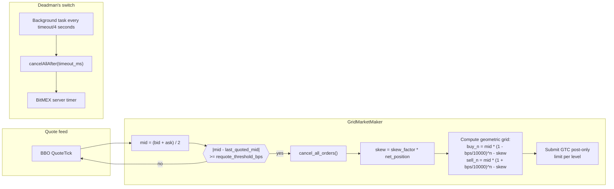
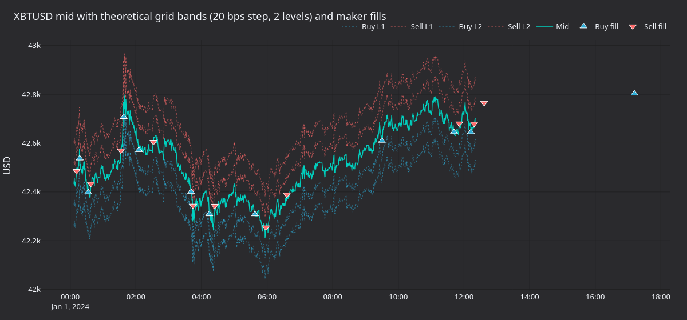
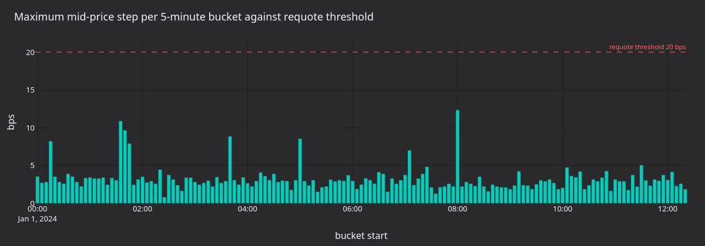
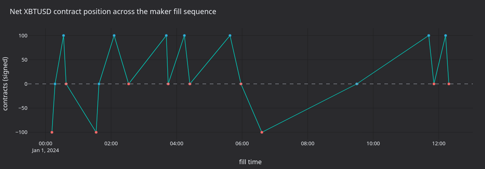
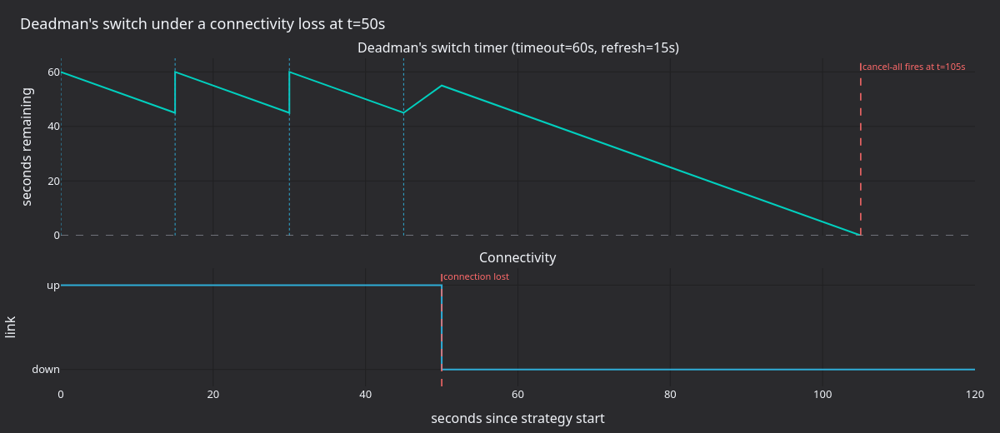
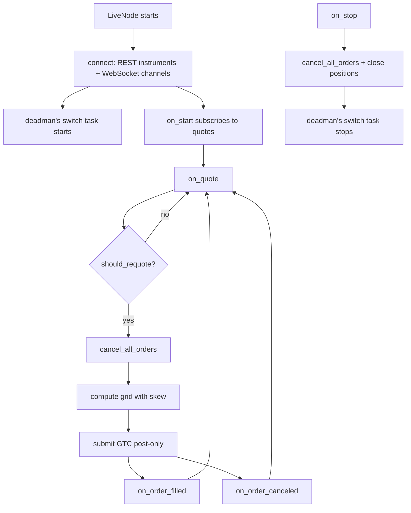

# Grid Market Making with a Deadman's Switch (BitMEX)

This tutorial backtests the shipped `GridMarketMaker` strategy on BitMEX
XBTUSD with free historical quote data from
[Tardis.dev](https://tardis.dev), then runs the same configuration live
through a Rust `LiveNode`. It focuses on BitMEX's **deadman's switch**: a
server-side cancel-all timer that protects the strategy from stranded
quotes if the client loses connectivity.

## Introduction

XBTUSD is BitMEX's USD-denominated, BTC-margined inverse perpetual swap
with a deep order book back to 2014. Tight spreads and predictable depth
make it a natural venue for grid market making.



### Why BitMEX for grid market making

Two adapter features land cleanly on this strategy:

1. **Deadman's switch** (`cancelAllAfter`): BitMEX maintains a server-side
   cancel-all timer. The execution client refreshes it on a schedule. If
   the link drops and the timer expires, BitMEX cancels every open order
   on the account.
2. **Submit/cancel broadcaster**: the adapter can fan out submissions and
   cancellations across multiple HTTP connections in parallel, with the
   first successful response short-circuiting the rest.

### Deadman's switch mechanics

When `deadmans_switch_timeout_secs` is set, a background task continuously
refreshes the server-side timer at one-quarter of the timeout:

```
timeout = 60s -> refresh interval = timeout / 4 = 15s

 t=0s    Strategy starts, cancelAllAfter(60000ms) sent
 t=15s   Refresh: cancelAllAfter(60000ms) sent (resets timer)
 t=30s   Refresh: cancelAllAfter(60000ms) sent
 t=45s   Refresh: cancelAllAfter(60000ms) sent
 t=50s   Connectivity lost (last refresh was at t=45s)
 t=105s  Server timer fires -> BitMEX cancels all open orders
```

Stranded quotes are a serious risk for market making: a crashed client
holding grid orders around mid can take an unbounded loss before manual
intervention. The deadman's switch caps the exposure window at `timeout`
seconds.

## Prerequisites

- [NautilusTrader](https://pypi.org/project/nautilus_trader/) installed.
- A Rust toolchain (`cargo`) for the live example. Install from
  [rustup.rs](https://rustup.rs/).
- A BitMEX account: sign up at [bitmex.com](https://www.bitmex.com/) and
  generate an API key with order management permissions. Use the
  [BitMEX testnet](https://testnet.bitmex.com/) for first runs.

### Environment variables

```bash
# Mainnet
export BITMEX_API_KEY="your-api-key"
export BITMEX_API_SECRET="your-api-secret"

# Testnet
export BITMEX_TESTNET_API_KEY="your-testnet-api-key"
export BITMEX_TESTNET_API_SECRET="your-testnet-api-secret"
```

Alternatively place these in a `.env` file at the project root; both the
Python and Rust paths load it via `dotenvy`.

## Backtesting with free Tardis quote data

BitMEX does not expose historical L2 data via its own API beyond recent
trades. [Tardis.dev](https://tardis.dev) captures and archives tick-level
BitMEX data from March 2019 onward. The **first day of each month is free
to download** without an API key.

### Download the data

```bash
curl -L -o XBTUSD.csv.gz \
    https://datasets.tardis.dev/v1/bitmex/quotes/2024/01/01/XBTUSD.csv.gz
curl -L -o XBTUSD-trades.csv.gz \
    https://datasets.tardis.dev/v1/bitmex/trades/2024/01/01/XBTUSD.csv.gz
```

The trades file is optional for the strategy but useful for the panels:
the matching engine needs aggressor flow to lift maker orders, which the
trades stream supplies.

:::tip
Full historical data (all dates) requires a paid Tardis API key. Use the
[Tardis download utility](https://docs.tardis.dev/downloadable-csv-files)
for bulk fetches.
:::

### Load the data

`TardisCSVDataLoader` parses the `.csv.gz` files directly:

```python
from nautilus_trader.adapters.tardis.loaders import TardisCSVDataLoader
from nautilus_trader.model.identifiers import InstrumentId

instrument_id = InstrumentId.from_str("XBTUSD.BITMEX")

loader = TardisCSVDataLoader(instrument_id=instrument_id)
quotes = loader.load_quotes("XBTUSD.csv.gz")
trades = loader.load_trades("XBTUSD-trades.csv.gz")
```

The `instrument_id` argument tags every record as `XBTUSD.BITMEX`
regardless of how it is keyed in the source CSV.

### Instrument definition

XBTUSD is an **inverse perpetual**: prices are quoted in USD, but the
contract is margined and settled in BTC. One contract represents 1 USD of
notional exposure.

```python
from decimal import Decimal

from nautilus_trader.model.currencies import BTC
from nautilus_trader.model.currencies import USD
from nautilus_trader.model.enums import AssetClass
from nautilus_trader.model.identifiers import Symbol
from nautilus_trader.model.instruments import PerpetualContract
from nautilus_trader.model.objects import Price
from nautilus_trader.model.objects import Quantity

XBTUSD = PerpetualContract(
    instrument_id=instrument_id,
    raw_symbol=Symbol("XBTUSD"),
    underlying="XBT",
    asset_class=AssetClass.CRYPTOCURRENCY,
    base_currency=BTC,
    quote_currency=USD,
    settlement_currency=BTC,
    is_inverse=True,
    price_precision=1,
    size_precision=0,
    price_increment=Price.from_str("0.5"),
    size_increment=Quantity.from_int(1),
    multiplier=Quantity.from_int(1),
    lot_size=Quantity.from_int(1),
    margin_init=Decimal("0.01"),
    margin_maint=Decimal("0.005"),
    maker_fee=Decimal("-0.00025"),
    taker_fee=Decimal("0.00075"),
    ts_event=0,
    ts_init=0,
)
```

Fee rates are explicit backtest assumptions. Check
[bitmex.com/app/fees](https://www.bitmex.com/app/fees) for current rates.

### Backtest engine setup

XBTUSD is BTC-margined, so the starting balance is in BTC:

```python
from nautilus_trader.backtest.config import BacktestEngineConfig
from nautilus_trader.backtest.engine import BacktestEngine
from nautilus_trader.config import LoggingConfig
from nautilus_trader.model.enums import AccountType
from nautilus_trader.model.enums import OmsType
from nautilus_trader.model.identifiers import TraderId
from nautilus_trader.model.identifiers import Venue
from nautilus_trader.model.objects import Money

engine = BacktestEngine(
    BacktestEngineConfig(
        trader_id=TraderId("BACKTESTER-001"),
        logging=LoggingConfig(log_level="INFO"),
    ),
)

BITMEX = Venue("BITMEX")
engine.add_venue(
    venue=BITMEX,
    oms_type=OmsType.NETTING,
    account_type=AccountType.MARGIN,
    base_currency=BTC,
    starting_balances=[Money(1, BTC)],
)

engine.add_instrument(XBTUSD)
engine.add_data(quotes + trades)
```

### Strategy configuration

```python
from nautilus_trader.examples.strategies.grid_market_maker import GridMarketMaker
from nautilus_trader.examples.strategies.grid_market_maker import GridMarketMakerConfig

strategy = GridMarketMaker(
    GridMarketMakerConfig(
        instrument_id=instrument_id,
        max_position=Quantity.from_int(300),
        trade_size=Quantity.from_int(100),
        num_levels=3,
        grid_step_bps=100,
        skew_factor=0.5,
        requote_threshold_bps=10,
    ),
)
engine.add_strategy(strategy)
```

### Run and review results

```python
import pandas as pd

engine.run()

with pd.option_context("display.max_rows", 100, "display.max_columns", None, "display.width", 300):
    print(engine.trader.generate_account_report(BITMEX))
    print(engine.trader.generate_order_fills_report())
    print(engine.trader.generate_positions_report())

engine.reset()
engine.dispose()
```

The complete backtest script is at
[`bitmex_grid_market_maker.py`](https://github.com/nautechsystems/nautilus_trader/tree/develop/examples/backtest/bitmex_grid_market_maker.py).

### What the run produces

The free 2024-01-01 sample is a quiet New Year's Day session: BTC traded
in a roughly 200-USD range across most of the day. With the
recommended-for-live `grid_step_bps=100` (1%) the inner buy and sell levels
sit ~420 USD from mid and never get touched: the example completes with
zero fills, which is the honest outcome on a calm session.

The panels below use a tighter `grid_step_bps=20` configuration on the
first 200,000 quotes so the maker fills are visible. With 20 bps step,
two levels, and 20 bps requote threshold, the strategy fires 22 maker
fills across the captured window.



**Figure 1.** *XBTUSD mid (teal) with the four theoretical grid bands at
`grid_step_bps=20`, `num_levels=2`. Triangles are maker fills, up = buy,
down = sell.*



**Figure 2.** *Maximum mid step (in basis points) per 5-minute bucket
across the captured window. Buckets above the dashed line crossed the
requote threshold at least once.*



**Figure 3.** *Cumulative signed XBTUSD contracts across the maker fill
sequence. Inventory skew pulls the grid back toward flat after each fill.*



**Figure 4.** *Server-side cancel-all timer with `timeout=60s`,
`refresh_interval=15s`. Refreshes reset the timer to 60s. After connectivity
fails at t=50s the timer drains uninterrupted; the server fires
`cancelAll` at t=105s.*

### Regenerate the panels

```bash
uv sync --extra visualization
XBTUSD_QUOTES=XBTUSD.csv.gz XBTUSD_TRADES=XBTUSD-trades.csv.gz \
    python3 docs/tutorials/assets/grid_market_maker_bitmex/render_panels.py
```

The renderer caps the dataset at 200,000 quotes and 30,000 trades to keep
the run reproducible in a few minutes.

## Live trading: GridMarketMaker with deadman's switch

After the backtest behaves, the same configuration runs live through the
Rust `LiveNode`. The strategy is implemented natively in Rust.

### Environment setup

Credentials load automatically from environment variables when not set
explicitly in the config:

```bash
# Testnet (recommended for first runs)
export BITMEX_TESTNET_API_KEY="your-key"
export BITMEX_TESTNET_API_SECRET="your-secret"
```

Or place them in a `.env` file at the project root.

### Code walkthrough

The complete `main()` function is at
[`node_grid_mm.rs`](https://github.com/nautechsystems/nautilus_trader/tree/develop/crates/adapters/bitmex/examples/node_grid_mm.rs):

```rust
#[tokio::main]
async fn main() -> Result<(), Box<dyn std::error::Error>> {
    dotenvy::dotenv().ok();

    let environment = Environment::Live;
    let trader_id = TraderId::from("TESTER-001");
    let instrument_id = InstrumentId::from("XBTUSD.BITMEX");

    let data_config = BitmexDataClientConfig {
        environment: BitmexEnvironment::Testnet,
        ..Default::default()
    };

    let exec_config = BitmexExecFactoryConfig::new(
        trader_id,
        BitmexExecClientConfig {
            environment: BitmexEnvironment::Testnet,
            deadmans_switch_timeout_secs: Some(60),
            ..Default::default()
        },
    );

    let data_factory = BitmexDataClientFactory::new();
    let exec_factory = BitmexExecutionClientFactory::new();

    let log_config = LoggerConfig {
        stdout_level: LevelFilter::Info,
        ..Default::default()
    };

    let mut node = LiveNode::builder(trader_id, environment)?
        .with_logging(log_config)
        .add_data_client(None, Box::new(data_factory), Box::new(data_config))?
        .add_exec_client(None, Box::new(exec_factory), Box::new(exec_config))?
        .with_reconciliation(true)
        .with_reconciliation_lookback_mins(2880)
        .with_delay_post_stop_secs(5)
        .build()?;

    let config = GridMarketMakerConfig::new(instrument_id, Quantity::from("300"))
        .with_num_levels(3)
        .with_grid_step_bps(100)
        .with_skew_factor(0.5)
        .with_requote_threshold_bps(10);
    let strategy = GridMarketMaker::new(config);

    node.add_strategy(strategy)?;
    node.run().await?;

    Ok(())
}
```

Configuration points:

- **`deadmans_switch_timeout_secs: Some(60)`**: arms the deadman's switch
  with a 60-second timeout and a 15-second refresh interval.
- **`with_reconciliation(true)`**: queries the BitMEX REST API on startup
  to reload open orders and positions, so the strategy resumes correctly
  after a restart.
- **`with_reconciliation_lookback_mins(2880)`**: reconciliation looks back
  2880 minutes (two days) of order history.
- **`with_delay_post_stop_secs(5)`**: 5-second grace period after stop for
  pending cancel and fill events to settle before the node exits.

### BitMEX-specific considerations

#### GTC orders and post-only

BitMEX grid orders are submitted as `GTC` with
`ParticipateDoNotInitiate` (post-only). If the price has crossed the book
by the time the order arrives, BitMEX rejects it rather than letting it
take liquidity.

This differs from the dYdX setup, where short-term orders provide
automatic expiry every 8 seconds. On BitMEX the requote cycle is driven
entirely by mid-price movement (`requote_threshold_bps`).

#### Order quantization

Price and size quantization for BitMEX instruments is handled
automatically by the adapter. No manual rounding or conversion is needed
in strategy code.

#### Inverse perpetual accounting

XBTUSD is BTC-margined. PnL accrues in BTC: a one-USD spread captured at
a 42,000 USD price earns 1/42,000 BTC per fill. Size `max_position` and
`trade_size` accordingly.

### Run the example

```bash
cargo run --example bitmex-grid-mm --package nautilus-bitmex --features examples
```

### Graceful shutdown

Press **Ctrl+C** to stop the node. The shutdown sequence:

1. SIGINT received, trader stops, `on_stop()` fires.
2. Strategy cancels all orders and closes positions.
3. 5-second grace period (`delay_post_stop_secs`) processes residual events.
4. Deadman's switch background task stops.
5. Clients disconnect, node exits.

## Configuration reference

### GridMarketMaker parameters

| Parameter               | Type           | Default    | Description                                                              |
| ----------------------- | -------------- | ---------- | ------------------------------------------------------------------------ |
| `instrument_id`         | `InstrumentId` | *required* | Instrument to trade (e.g. `XBTUSD.BITMEX`).                              |
| `max_position`          | `Quantity`     | *required* | Maximum net exposure in contracts (long or short).                       |
| `trade_size`            | `Quantity`     | `None`     | Size per grid level. If `None`, uses instrument's `min_quantity` or 1.0. |
| `num_levels`            | `usize`        | `3`        | Number of buy and sell levels.                                           |
| `grid_step_bps`         | `u32`          | `10`       | Grid spacing in basis points (100 = 1%).                                 |
| `skew_factor`           | `f64`          | `0.0`      | How aggressively to shift the grid based on net inventory.               |
| `requote_threshold_bps` | `u32`          | `5`        | Minimum mid‑price move (bps) before re‑quoting.                          |
| `expire_time_secs`      | `Option<u64>`  | `None`     | Order expiry in seconds. Use `None` for GTC on BitMEX.                   |
| `on_cancel_resubmit`    | `bool`         | `false`    | Resubmit grid on next quote after an unexpected cancel.                  |

### Deadman's switch parameter

| Parameter                      | Type          | Description                                                                                       |
| ------------------------------ | ------------- | ------------------------------------------------------------------------------------------------- |
| `deadmans_switch_timeout_secs` | `Option<u64>` | Server‑side cancel timer in seconds. Refresh interval = `timeout / 4` (minimum 1s). `None` disables the feature. |

A 60-second timeout gives a 15-second refresh interval and a 60-second
window before BitMEX fires the timer. Lower values reduce the exposure
window but increase API call frequency; higher values reduce overhead but
extend the window.

### Choosing grid parameters

- **`grid_step_bps`**: XBTUSD has tight spreads. Start at 50-100 bps to
  ensure fills before tightening. Each level captures half the step as
  spread.
- **`skew_factor`**: start at `0.0` (no skew). A value of `0.5` shifts the
  grid by 0.5 USD per contract of net position.
- **`requote_threshold_bps`**: 10 bps (0.1%) is a starting point for
  XBTUSD. Lower values cause cancel/replace churn; higher values leave
  orders stale during fast moves.

## Event flow



## Monitoring and understanding output

### Key log messages

| Log message                                                             | Meaning                                                  |
| ----------------------------------------------------------------------- | -------------------------------------------------------- |
| `Requoting grid: mid=X, last_mid=Y`                                     | Mid moved beyond threshold, refreshing grid.             |
| `Starting dead man's switch: timeout=60s, refresh_interval=15s`         | Deadman's switch armed at node start.                    |
| `Dead man's switch heartbeat failed: ...`                               | Transient network issue; switch will retry next interval.|
| `Disarming dead man's switch`                                           | Switch stopped cleanly during shutdown.                  |
| `benign cancel error, treating as success`                              | Cancel for an already‑filled or cancelled order (normal).|
| `Reconciling orders from last 2880 minutes`                             | Startup reconciliation loading prior state.              |

### Expected behaviour patterns

1. **Startup**: instruments load, reconciliation queries prior orders,
   WebSocket connects, first quote triggers initial grid.
2. **Steady state**: grid persists across ticks; requotes only when mid
   moves beyond threshold.
3. **Fills**: position updates, skew adjusts on next requote.
4. **Shutdown**: all orders cancelled, positions closed, deadman's switch
   stops.
5. **Restart**: reconciliation restores open order state; strategy resumes
   from prior grid.

## Customization tips

### High vs low volatility

| Condition       | Adjustment                                                                |
| --------------- | ------------------------------------------------------------------------- |
| High volatility | Wider `grid_step_bps` (100-200), fewer `num_levels`, lower `skew_factor`. |
| Low volatility  | Tighter `grid_step_bps` (20-50), more `num_levels`, higher `skew_factor`. |
| Thin liquidity  | Increase `requote_threshold_bps` to reduce cancel frequency.              |

### Enabling the submit broadcaster

For production deployments, enable the submit broadcaster to provide
redundant order submission across multiple HTTP connections:

```rust
let exec_config = BitmexExecFactoryConfig::new(
    trader_id,
    BitmexExecClientConfig {
        environment: BitmexEnvironment::Mainnet,
        deadmans_switch_timeout_secs: Some(60),
        submitter_pool_size: Some(2),
        canceller_pool_size: Some(2),
        ..Default::default()
    },
);
```

With `submitter_pool_size=2`, each order submission fans out to two HTTP
clients in parallel; the first successful response wins. This reduces the
probability of a missed submission when one path stalls.

### Mainnet toggle

Switch networks by setting the `environment` field on both configs to
`BitmexEnvironment::Mainnet`. All endpoints and credential environment
variables resolve automatically.

## Further reading

- [BitMEX integration guide](../integrations/bitmex.md): full adapter reference.
- [On-chain grid market making with short-term orders (dYdX)](./grid_market_maker_dydx.md):
  short-term order expiry as an alternative to the deadman's switch.
- [Tardis downloadable CSV files](https://docs.tardis.dev/downloadable-csv-files):
  schema documentation for the Tardis archives.
- [BitMEX API documentation](https://www.bitmex.com/app/apiOverview):
  `cancelAllAfter` endpoint and order management reference.
