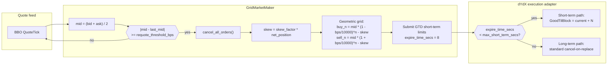
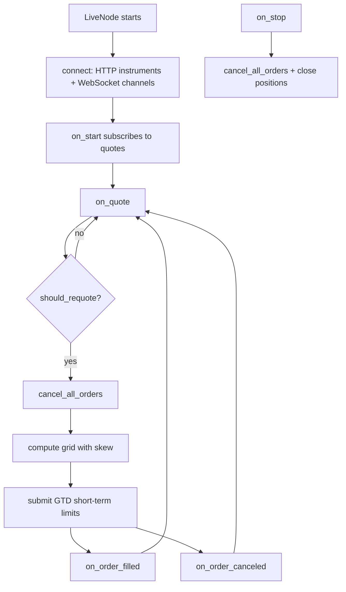
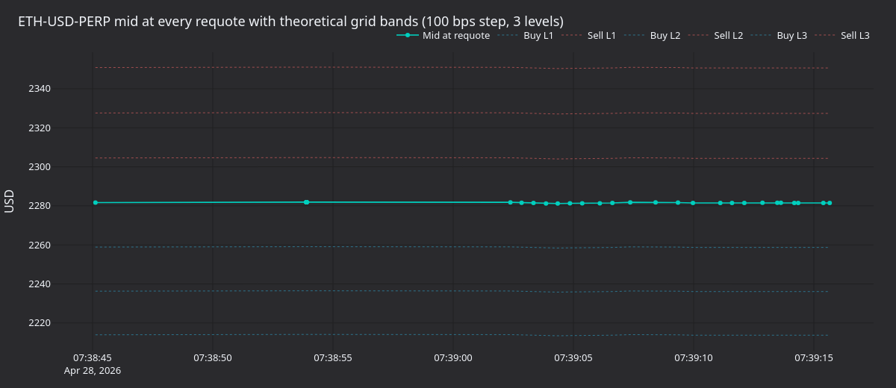
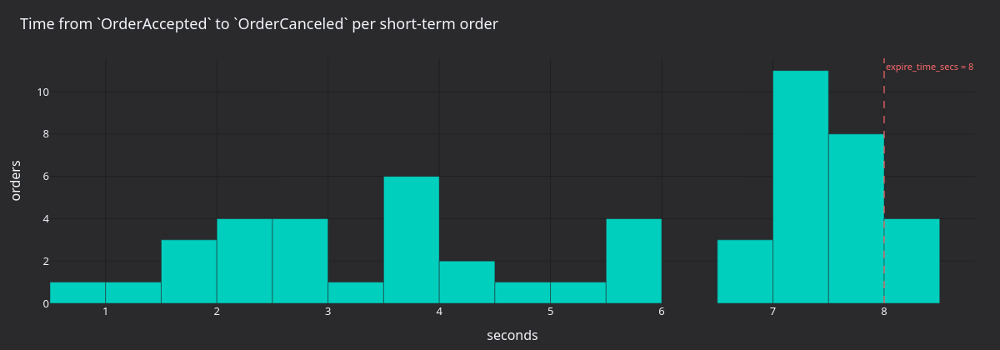
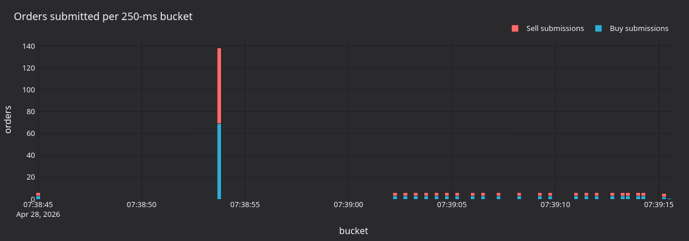
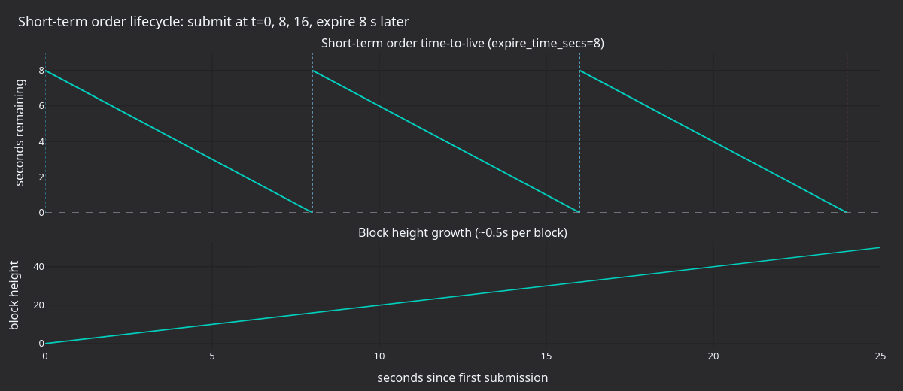

# On-Chain Grid Market Making with Short-Term Orders (dYdX)

This tutorial runs the shipped `GridMarketMaker` strategy on dYdX v4
through the Rust `LiveNode`. The strategy places symmetric limit orders
around the mid, skews the grid to manage inventory, and lets the venue
cycle short-term orders by time-to-block expiry instead of explicit
cancels.

## Introduction

A grid market maker maintains a ladder of resting buy and sell limits at
fixed price intervals around the current mid. When an order fills, the
strategy profits from the spread between the buy and sell levels.
Inventory management keeps net exposure within `max_position` so the grid
does not accumulate a directional position.



### Inventory skewing (Avellaneda-Stoikov inspired)

When the position grows long the entire grid shifts down (cheaper buys,
cheaper sells) to encourage the next fill on the sell side. When the
position grows short the grid shifts up. This mirrors the Avellaneda-Stoikov
framework adapted to a discrete grid.

### Why dYdX v4

dYdX v4 fits market-making well:

- **Short-term orders** with ~20-second expiry: low-latency placement, no
  on-chain storage cost.
- **~0.5-second block times** for fast confirmation cycles.
- **No gas fees for cancellations**: short-term cancels are free under GTB
  replay protection.
- **On-chain order book** with deterministic per-block matching.
- **Batch cancel**: one `MsgBatchCancel` clears every short-term order.

## Prerequisites

### Funded dYdX account

You need a dYdX account with USDC collateral. See the
[Testnet setup](../integrations/dydx.md#testnet-setup) section in the
integration guide for instructions on creating and funding a testnet
account. The testnet wallet also needs an API trading key registered
through the dYdX UI.

### Environment variables

```bash
# Mainnet
export DYDX_PRIVATE_KEY="0x..."
export DYDX_WALLET_ADDRESS="dydx1..."

# Testnet
export DYDX_TESTNET_PRIVATE_KEY="0x..."
export DYDX_TESTNET_WALLET_ADDRESS="dydx1..."
```

## Strategy overview

### Geometric grid pricing

Each level is a fixed percentage (basis points) away from mid:

```
Buy level N:  mid * (1 - bps/10000)^N - skew
Sell level N: mid * (1 + bps/10000)^N - skew
```

Where `skew = skew_factor * net_position`.

For a 3-level grid with `grid_step_bps=100` (1%) around a mid of 1000.00:

```
                        Sell 3: 1030.30
                    Sell 2: 1020.10
                Sell 1: 1010.00
            ─── Mid: 1000.00 ───
                Buy 1:  990.00
                    Buy 2:  980.10
                        Buy 3:  970.30
```

With a long-2 position and `skew_factor=1.0`, the entire grid shifts down
by 2.0:

```
                        Sell 3: 1028.30
                    Sell 2: 1018.10
                Sell 1: 1008.00
            ─── Mid: 1000.00 ───
                Buy 1:  988.00
                    Buy 2:  978.10
                        Buy 3:  968.30
```

### Inventory management

The strategy enforces position limits through two mechanisms:

1. **`max_position`**: a hard cap on net exposure (long or short). When the
   projected exposure from adding the next grid level would breach this
   cap, that level is skipped.
2. **Projected exposure tracking**: before placing each level the strategy
   tracks the worst-case per-side exposure (current position + all pending
   buy / sell orders) to avoid over-committing.

`cancel_all_orders` is asynchronous, so pending orders may still fill
between the cancel request and acknowledgement. Tracking worst-case
per-side exposure prevents momentary over-exposure during cancel-requote
transitions.

### Requote threshold

`requote_threshold_bps` controls how much the mid must move before the
strategy cancels all open orders and places a fresh grid:

- **Lower threshold** (5 bps): more responsive, more cancel/place
  transactions.
- **Higher threshold** (50 bps): fewer transactions, but orders may sit
  further from the current price.

## Configuration

| Parameter               | Type           | Default    | Description                                                              |
| ----------------------- | -------------- | ---------- | ------------------------------------------------------------------------ |
| `instrument_id`         | `InstrumentId` | *required* | Instrument to trade (e.g. `ETH-USD-PERP.DYDX`).                          |
| `max_position`          | `Quantity`     | *required* | Maximum net exposure (long or short).                                    |
| `trade_size`            | `Quantity`     | `None`     | Size per grid level. If `None`, uses instrument's `min_quantity` or 1.0. |
| `num_levels`            | `usize`        | `3`        | Number of buy and sell levels.                                           |
| `grid_step_bps`         | `u32`          | `10`       | Grid spacing in basis points (10 = 0.1%).                                |
| `skew_factor`           | `f64`          | `0.0`      | How aggressively to shift the grid based on inventory.                   |
| `requote_threshold_bps` | `u32`          | `5`        | Minimum mid‑price move in bps before re‑quoting.                         |
| `expire_time_secs`      | `Option<u64>`  | `None`     | Order expiry in seconds. Uses GTD when set, GTC otherwise.               |
| `on_cancel_resubmit`    | `bool`         | `false`    | Resubmit grid on next quote after an unexpected cancel.                  |

### Choosing parameters

- **`grid_step_bps`**: 50-100 bps in volatile markets, 5-20 bps in calm
  conditions. Wider grids capture more spread per fill but fill less
  often.
- **`skew_factor`**: start at `0.0`. A value of `0.5` shifts the grid by
  0.5 price units per unit of net position. Too aggressive a skew can move
  the grid entirely above or below mid.
- **`expire_time_secs`**: for dYdX short-term orders, set to `8` seconds.
  That fits inside the 40-block (~20 s) short-term window and keeps the
  orders on the fast short-term path. When `None`, orders use GTC and the
  long-term path.
- **`on_cancel_resubmit`**: triggers a resubmission on the next quote tick
  after an unexpected cancel (self-trade prevention, risk limits).
  Short-term order expiry is silent and does not generate cancel events,
  so the grid refreshes via continuous requoting rather than this flag.

## dYdX-specific considerations

### Short-term order expiry

When `expire_time_secs=8`, orders are classified as short-term by the
adapter:

1. The adapter checks `8s < max_short_term_secs (40 blocks * ~0.5s = ~20s)`.
2. The order is submitted as short-term with
   `GoodTilBlock = current_height + N`.
3. The order expires silently after about eight seconds if not filled.

This is the recommended configuration for market making because:

- Short-term orders have lower latency.
- Expiry has no gas cost (GTB replay protection handles it).
- Continuous requoting replaces expired orders.

See the [order classification](../integrations/dydx.md#order-classification)
section in the integration guide for full details.

### Unexpected cancels and `on_cancel_resubmit`

The `pending_self_cancels` set distinguishes self-initiated from
unexpected cancels:

1. When the strategy calls `cancel_all_orders`, it records all open order
   IDs in `pending_self_cancels`.
2. When `on_order_canceled` fires:
   - If the order ID is in `pending_self_cancels`, it is a self-cancel
     and no action is needed.
   - Otherwise it is unexpected (self-trade prevention or a risk limit).
     Reset `last_quoted_mid` so the next quote triggers a full grid
     resubmission.

This stops the strategy re-quoting unnecessarily during its own cancel
waves while still responding to surprises.

`on_order_filled` also removes the order from `pending_self_cancels`. If
an order fills before the cancel acknowledgement arrives, this prevents
stale entries from accumulating.

### Order quantization

Price and size quantization for dYdX markets is handled automatically by
the adapter's `OrderMessageBuilder`. No manual rounding or conversion is
needed. See
[Price and size quantization](../integrations/dydx.md#price-and-size-quantization)
for details.

### Post-only orders

All grid orders are submitted with `post_only=true`. The exchange rejects
any order that would cross the spread at match time, so every fill lands
at the maker fee rate and the grid never inadvertently lifts its own
offers during requote transitions.

## Running and stopping

### Environment setup

Credentials load from environment variables or a `.env` file at the
project root (loaded automatically via `dotenvy`):

```bash
# Direct export
export DYDX_PRIVATE_KEY="0x..."
export DYDX_WALLET_ADDRESS="dydx1..."
```

```bash
# .env equivalent
DYDX_PRIVATE_KEY=0x...
DYDX_WALLET_ADDRESS=dydx1...
```

### Run the example

```bash
# Mainnet (default)
cargo run --example dydx-grid-mm --package nautilus-dydx --features examples

# Testnet (set DYDX_NETWORK=testnet, requires testnet API trading key)
DYDX_NETWORK=testnet \
  cargo run --example dydx-grid-mm --package nautilus-dydx --features examples
```

### Graceful shutdown

Press **Ctrl+C** to stop the node. The shutdown sequence:

1. SIGINT received, trader stops, `on_stop` fires.
2. Strategy cancels all orders and closes positions.
3. 5-second grace period (`delay_post_stop_secs`) processes residual events.
4. Clients disconnect, node exits.

## Code walkthrough

The `main` function lives at
[`crates/adapters/dydx/examples/node_grid_mm.rs`](https://github.com/nautechsystems/nautilus_trader/tree/develop/crates/adapters/dydx/examples/node_grid_mm.rs):

```rust
#[tokio::main]
async fn main() -> Result<(), Box<dyn std::error::Error>> {
    dotenvy::dotenv().ok();

    let network = match std::env::var("DYDX_NETWORK") {
        Err(_) => DydxNetwork::Mainnet,
        Ok(value) => match value.to_ascii_lowercase().as_str() {
            "testnet" => DydxNetwork::Testnet,
            "mainnet" | "" => DydxNetwork::Mainnet,
            other => {
                return Err(format!(
                    "DYDX_NETWORK must be 'mainnet' or 'testnet' (case-insensitive), got '{other}'",
                )
                .into());
            }
        },
    };

    let environment = Environment::Live;
    let trader_id = TraderId::from("TESTER-001");
    let account_id = AccountId::from("DYDX-001");
    let node_name = "DYDX-GRID-MM-001".to_string();
    let instrument_id = InstrumentId::from("ETH-USD-PERP.DYDX");

    let data_config = DydxDataClientConfig {
        network,
        ..Default::default()
    };

    let exec_config = DydxExecClientConfig {
        trader_id,
        account_id,
        network,
        ..Default::default()
    };

    let data_factory = DydxDataClientFactory::new();
    let exec_factory = DydxExecutionClientFactory::new();

    let log_config = LoggerConfig {
        stdout_level: LevelFilter::Info,
        ..Default::default()
    };

    let mut node = LiveNode::builder(trader_id, environment)?
        .with_name(node_name)
        .with_logging(log_config)
        .add_data_client(None, Box::new(data_factory), Box::new(data_config))?
        .add_exec_client(None, Box::new(exec_factory), Box::new(exec_config))?
        .with_reconciliation(false)
        .with_delay_post_stop_secs(5)
        .build()?;

    let config = GridMarketMakerConfig::new(instrument_id, Quantity::from("0.10"))
        .with_num_levels(3)
        .with_grid_step_bps(100)
        .with_skew_factor(0.5)
        .with_requote_threshold_bps(10)
        .with_expire_time_secs(8)
        .with_on_cancel_resubmit(true);
    let strategy = GridMarketMaker::new(config);

    node.add_strategy(strategy)?;
    node.run().await?;

    Ok(())
}
```

Configuration points:

- **`dotenvy::dotenv().ok()`**: loads `.env` from the project root if
  present.
- **`with_reconciliation(false)`**: disabled for simplicity; enable in
  production to resume state across restarts.
- **`with_delay_post_stop_secs(5)`**: grace period for pending cancel and
  close events to finalize during shutdown.

### Event flow



## Strategy internals

The key Rust snippets from `grid_mm.rs` follow.

### Trade size resolution (`on_start`)

Trade size resolves from the instrument cache: config value first, then
the instrument's `min_quantity`, then `1.0` as a final fallback.

```rust
fn on_start(&mut self) -> anyhow::Result<()> {
    let instrument_id = self.config.instrument_id;
    let (instrument, size_precision, min_quantity) = {
        let cache = self.cache();
        let instrument = cache
            .instrument(&instrument_id)
            .ok_or_else(|| anyhow::anyhow!("Instrument {instrument_id} not found in cache"))?;
        (
            instrument.clone(),
            instrument.size_precision(),
            instrument.min_quantity(),
        )
    };
    self.price_precision = Some(instrument.price_precision());
    self.instrument = Some(instrument);

    if self.trade_size.is_none() {
        self.trade_size =
            Some(min_quantity.unwrap_or_else(|| Quantity::new(1.0, size_precision)));
    }

    self.subscribe_quotes(instrument_id, None, None);
    Ok(())
}
```

### Quote handler (`on_quote`, abbreviated)

```rust
fn on_quote(&mut self, quote: &QuoteTick) -> anyhow::Result<()> {
    let mid_f64 = (quote.bid_price.as_f64() + quote.ask_price.as_f64()) / 2.0;
    let mid = Price::new(
        mid_f64,
        self.price_precision
            .expect("price_precision should be resolved in on_start"),
    );

    if !self.should_requote(mid) {
        return Ok(()); // Mid hasn't moved enough, keep existing grid
    }

    self.cancel_all_orders(instrument_id, None, None)?;

    let (net_position, worst_long, worst_short) = { /* ... */ };

    let grid = self.grid_orders(mid, net_position, worst_long, worst_short);

    if grid.is_empty() {
        return Ok(()); // Don't advance requote anchor when fully constrained
    }

    let (tif, expire_time) = match self.config.expire_time_secs {
        Some(secs) => {
            let now_ns = self.core.clock().timestamp_ns();
            let expire_ns = now_ns + secs * 1_000_000_000;
            (Some(TimeInForce::Gtd), Some(expire_ns))
        }
        None => (None, None),
    };

    for (side, price) in grid {
        let order = self.core.order_factory().limit(
            instrument_id,
            side,
            trade_size,
            price,
            tif,
            expire_time,
            Some(true), // post_only
        );
        self.submit_order(order, None, None)?;
    }

    self.last_quoted_mid = Some(mid);
    Ok(())
}
```

### Grid pricing (`grid_orders`)

Computes geometric grid prices and enforces `max_position` per level:

```rust
fn grid_orders(
    &self,
    mid: Price,
    net_position: f64,
    worst_long: Decimal,
    worst_short: Decimal,
) -> Vec<(OrderSide, Price)> {
    let instrument = self
        .instrument
        .as_ref()
        .expect("instrument should be resolved in on_start");
    let mid_f64 = mid.as_f64();
    let skew_f64 = self.config.skew_factor * net_position;
    let pct = self.config.grid_step_bps as f64 / 10_000.0;
    let trade_size = self
        .trade_size
        .expect("trade_size should be resolved in on_start")
        .as_decimal();
    let max_pos = self.config.max_position.as_decimal();
    let mut projected_long = worst_long;
    let mut projected_short = worst_short;
    let mut orders = Vec::new();

    for level in 1..=self.config.num_levels {
        let buy_f64 = mid_f64 * (1.0 - pct).powi(level as i32) - skew_f64;
        let sell_f64 = mid_f64 * (1.0 + pct).powi(level as i32) - skew_f64;
        let buy_price = instrument.next_bid_price(buy_f64, 0);
        let sell_price = instrument.next_ask_price(sell_f64, 0);

        if let Some(buy_price) = buy_price
            && projected_long + trade_size <= max_pos
        {
            orders.push((OrderSide::Buy, buy_price));
            projected_long += trade_size;
        }

        if let Some(sell_price) = sell_price
            && projected_short - trade_size >= -max_pos
        {
            orders.push((OrderSide::Sell, sell_price));
            projected_short -= trade_size;
        }
    }

    orders
}
```

## What a 35-second mainnet run produces

A 35-second mainnet run on `ETH-USD-PERP.DYDX` with the example config
(`grid_step_bps=100`, `num_levels=3`, `skew_factor=0.5`,
`requote_threshold_bps=10`, `expire_time_secs=8`) captures 47 requote
events, 276 order submissions, 67 accepts, and 54 cancels. ETH was
trading near 2,281 USD: the price never moved enough to trip the 10 bps
requote threshold, so most cycles trigger from the periodic 8-second
short-term order expiry rather than from price movement.



**Figure 1.** *ETH-USD-PERP mid at every requote with the six theoretical
grid bands (3 levels each side, 100 bps step). Mid sits near 2,281 USD;
the inner buy and sell levels are at ~2,258 and ~2,304 USD.*



**Figure 2.** *Time from `OrderAccepted` to `OrderCanceled` per short-term
order, in seconds. The mass near 7-8 seconds matches the
`expire_time_secs=8` setting; the smaller cluster below 6 seconds is
strategy-initiated cancels during requote transitions.*



**Figure 3.** *Order submission count per 250-ms bucket, split by side.
Each requote cycle places six orders (3 buys + 3 sells); the spacing
between bursts is the requote interval.*



**Figure 4.** *Theoretical short-term order timeline with
`expire_time_secs=8` and 0.5-second blocks. The bottom panel tracks how
the chain block height advances; each order's `GoodTilBlock` target is
set to ~16 blocks ahead, giving the eight-second expiry.*

### Regenerate the panels

```bash
# Capture a 35-second mainnet run.
timeout 35 ./target/release/examples/dydx-grid-mm > /tmp/dydx_main.log 2>&1

uv sync --extra visualization
DYDX_LOG=/tmp/dydx_main.log \
    python3 docs/tutorials/assets/grid_market_maker_dydx/render_panels.py
```

## Monitoring and understanding output

### Key log messages

| Log message                                         | Meaning                                            |
| --------------------------------------------------- | -------------------------------------------------- |
| `Requoting grid: mid=X, last_mid=Y`                 | Mid moved beyond threshold, refreshing grid.       |
| `Submit short‑term order N`                         | Order submitted via short‑term broadcast path.    |
| `BatchCancel N short-term orders`                   | Batch cancel executed for expired/stale orders.   |
| `benign cancel error, treating as success`          | Cancel for an already‑filled or expired order (normal). |
| `Sequence mismatch detected, will resync and retry` | Cosmos SDK sequence error, auto‑recovering.        |

### Expected behaviour patterns

1. **Startup**: instruments load, WebSocket connects, first quote
   triggers initial grid.
2. **Steady state**: grid persists across ticks; requotes only when mid
   moves more than `requote_threshold_bps`.
3. **Fills**: position updates, skew adjusts, the next requote shifts the
   grid.
4. **Expiry**: short-term orders expire silently after about eight
   seconds; the next requote refreshes the grid.
5. **Shutdown**: all orders cancelled, positions closed, WebSocket
   disconnected.

## Customization tips

### High vs low volatility

| Condition       | Adjustment                                                               |
| --------------- | ------------------------------------------------------------------------ |
| High volatility | Wider `grid_step_bps` (100-200), fewer `num_levels`, lower `skew_factor`.|
| Low volatility  | Tighter `grid_step_bps` (10-30), more `num_levels`, higher `skew_factor`.|
| Thin liquidity  | Increase `requote_threshold_bps` to reduce cancel frequency.             |

### Multiple instruments

Run separate `GridMarketMaker` instances per instrument. Each instance
manages its own grid, position, and cancel state independently:

```rust
let btc_config = GridMarketMakerConfig::new(
    InstrumentId::from("BTC-USD-PERP.DYDX"),
    Quantity::from("0.001"),
)
.with_strategy_id(StrategyId::from("GRID_MM-BTC"))
.with_order_id_tag("BTC".to_string())
.with_grid_step_bps(50);

let eth_config = GridMarketMakerConfig::new(
    InstrumentId::from("ETH-USD-PERP.DYDX"),
    Quantity::from("0.10"),
)
.with_strategy_id(StrategyId::from("GRID_MM-ETH"))
.with_order_id_tag("ETH".to_string())
.with_grid_step_bps(100);

node.add_strategy(GridMarketMaker::new(btc_config))?;
node.add_strategy(GridMarketMaker::new(eth_config))?;
```

### Mainnet vs testnet toggle

The example reads `DYDX_NETWORK` and selects the appropriate endpoint and
credential set. Set `DYDX_NETWORK=testnet` to run against testnet; leave
unset for mainnet.

## Further reading

- [dYdX v4 Integration Guide](../integrations/dydx.md): full adapter
  reference.
- [dYdX Protocol Documentation](https://docs.dydx.xyz/): official protocol
  docs.
- [Order types](https://docs.dydx.xyz/concepts/trading/orders):
  protocol-level order mechanics.
- [Grid Market Making with a Deadman's Switch (BitMEX)](./grid_market_maker_bitmex.md):
  comparison with deadman's switch as an alternative to short-term order
  expiry.
