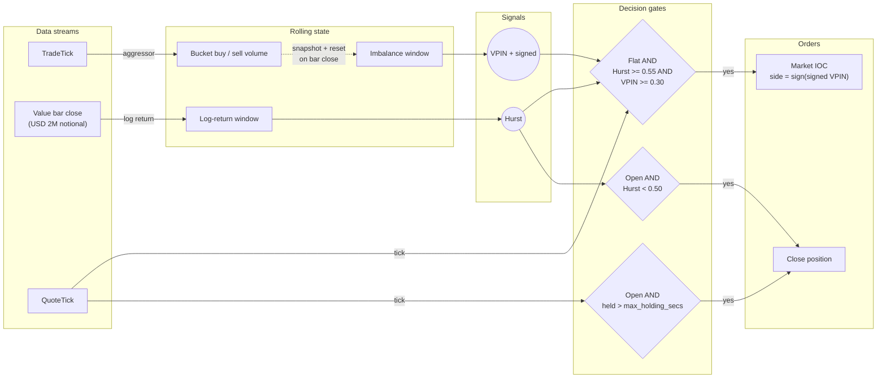
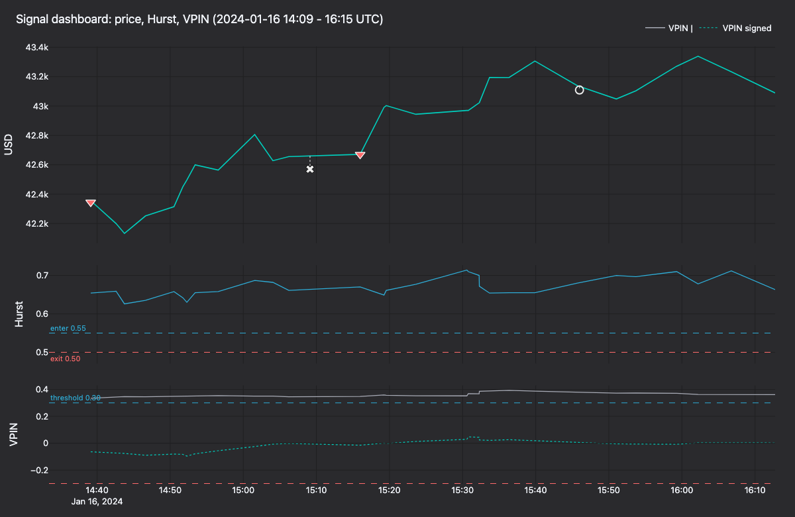
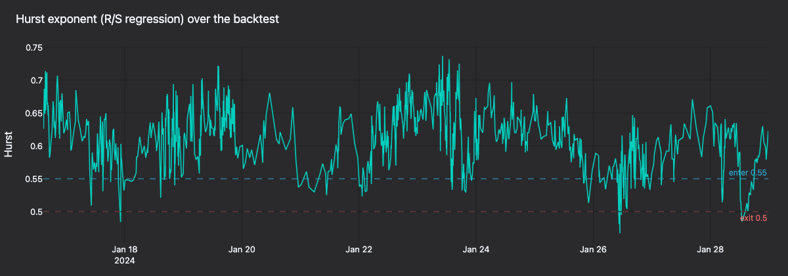
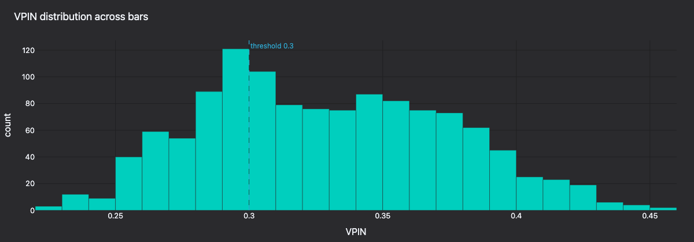
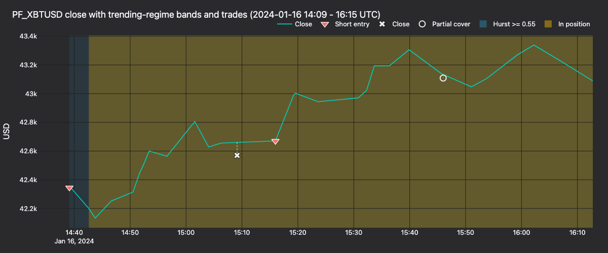
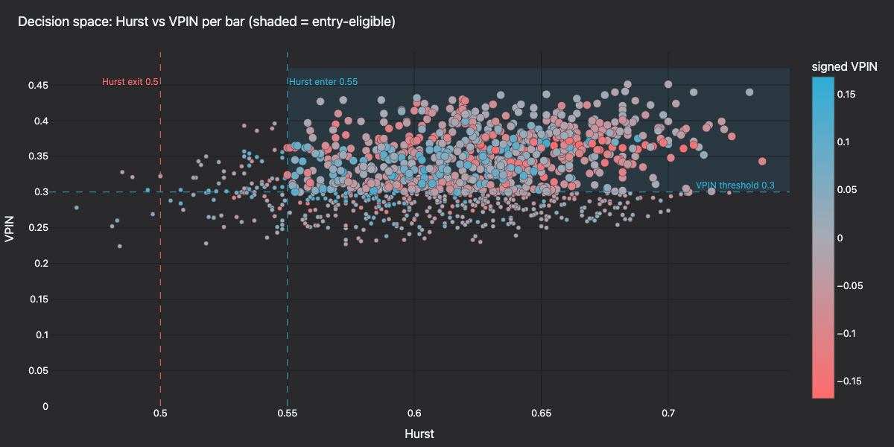

# Hurst/VPIN Directional Strategy (Kraken Futures)

:::note
This is a **Rust-only** tutorial. The strategy, backtest wiring, and tests
all live in the compiled core.
:::

This tutorial backtests a directional strategy on **PF_XBTUSD**, the
USD-margined Bitcoin perpetual on [Kraken Futures](https://futures.kraken.com).
The strategy combines a **Hurst-exponent regime filter** with a **VPIN**
(Volume-synchronized Probability of Informed Trading) flow signal.
Historical trades and quotes come from [Tardis.dev](https://tardis.dev)
and replay through the Rust `BacktestEngine`.

## Introduction

The strategy combines three components: a **slow regime filter** derived from bars,
a **fast informed-flow signal** derived from trades, and a **quote-driven
entry** that fires only when both align.

- **Hurst exponent on dollar bars.** Sampled on constant-notional (value)
  bars, following Lopez de Prado (*Advances in Financial Machine
  Learning*, Chapter 2). A rescaled-range (R/S) estimate above `0.55`
  indicates persistent, trending behavior; below `0.50` the series is
  mean-reverting or noise.

- **VPIN from trade aggressor flow.** Each completed dollar bar is
  treated as one volume bucket. The absolute imbalance between aggressive
  buy and aggressive sell volume, averaged over the last fifty buckets,
  gives the VPIN level. The signed imbalance gives the net informed
  direction.

- **Quote-driven entry.** Once both signals agree, the strategy opens a
  position on the next quote tick. Entry timing stays tied to the live
  top of book rather than to bar closes.

Exit is driven by the same ingredients: position is closed when the
Hurst estimate decays back through a lower threshold, or when a
holding-time cap is reached.

The strategy is shipped as
[`HurstVpinDirectional`](https://github.com/nautechsystems/nautilus_trader/tree/develop/crates/trading/src/examples/strategies/hurst_vpin_directional)
in the `nautilus_trading::examples::strategies` module. As with all
shipped example strategies, it is intentionally simple and has no alpha
advantage.

### Why Kraken Futures

Kraken Futures lists perpetuals on Bitcoin and Ether in two forms:

- **`PI_` inverse perpetuals**: quoted in USD, margined and settled in
  the underlying.
- **`PF_` linear perpetuals**: quoted in USD, margined and settled in
  USD (via multi-collateral).

The tutorial uses **`PF_XBTUSD`** so the account currency, quote
currency, and dollar-bar sampling frame are all USD.

### Why dollar bars and VPIN together

VPIN is defined on *volume* buckets rather than *time* buckets. Dollar
bars (`VALUE` aggregation in NautilusTrader) close after a fixed
notional has traded, so the sampling frame adapts to market activity.
Defining each VPIN bucket as one dollar bar keeps both signals on the
same clock, and Hurst sampled on the same bars uses the same frame.

## Prerequisites

- A working Rust toolchain (see [rustup.rs](https://rustup.rs)).
- The NautilusTrader repository cloned and building.
- Internet access to download a free Tardis sample (no API key required
  for the first day of each month).

## Data preparation

Kraken Futures is published by Tardis under the historical slug
`cryptofacilities`. The first day of each month is available for free
without an API key, which is enough for a single-day plumbing check. A
full backtest needs at least two sessions to warm the 128-bar Hurst
window, which requires a paid Tardis API key (see the tip below).

```bash
mkdir -p /tmp/tardis_kraken

curl -L -o /tmp/tardis_kraken/PF_XBTUSD_trades.csv.gz \
  https://datasets.tardis.dev/v1/cryptofacilities/trades/2024/01/01/PF_XBTUSD.csv.gz

curl -L -o /tmp/tardis_kraken/PF_XBTUSD_quotes.csv.gz \
  https://datasets.tardis.dev/v1/cryptofacilities/quotes/2024/01/01/PF_XBTUSD.csv.gz
```

The runnable example binary shown later in this tutorial reads from
`/tmp/tardis_kraken/` by default, so downloading into that directory up front
means `cargo run` works without needing `KRAKEN_TRADES` or `KRAKEN_QUOTES`
overrides.

:::tip
Full historical ranges require a paid Tardis API key. Use the
[Tardis download utility](https://docs.tardis.dev/downloadable-csv-files)
for bulk fetches once you move beyond single-day samples.
:::

The Rust Tardis loader parses `.csv.gz` directly and tags each record
with the instrument ID we supply, so no symbology mapping is needed at
the strategy level:

```rust
use nautilus_model::identifiers::InstrumentId;
use nautilus_tardis::csv::load::{load_quotes, load_trades};

let instrument_id = InstrumentId::from("PF_XBTUSD.KRAKEN");
let trades = load_trades(
    "PF_XBTUSD_trades.csv.gz",
    Some(1),               // price_precision
    Some(4),               // size_precision
    Some(instrument_id),
    None,                  // limit
)?;
let quotes = load_quotes(
    "PF_XBTUSD_quotes.csv.gz",
    Some(1),
    Some(4),
    Some(instrument_id),
    None,
)?;
```

Pass the instrument's `price_precision` and `size_precision` explicitly. The
loader otherwise infers precision from the first few records, and a sample
day without fractional prices can infer `0`, which the matching engine will
reject when it sees a quote tick that does not match the instrument's
declared precision.

## Instrument definition

Since we are loading CSV data directly rather than through the live
Kraken adapter, we define `PF_XBTUSD` manually as a
[`CryptoPerpetual`](https://github.com/nautechsystems/nautilus_trader/blob/develop/crates/model/src/instruments/crypto_perpetual.rs).
Linear perpetuals on Kraken Futures are quoted and margined in USD:

```rust
use nautilus_model::{
    identifiers::{InstrumentId, Symbol},
    instruments::CryptoPerpetual,
    types::{Currency, Price, Quantity},
};
use rust_decimal_macros::dec;

let instrument = CryptoPerpetual::new(
    InstrumentId::from("PF_XBTUSD.KRAKEN"),
    Symbol::from("PF_XBTUSD"),
    Currency::BTC(),      // base
    Currency::USD(),      // quote
    Currency::USD(),      // settlement (linear)
    false,                // is_inverse
    1,                    // price_precision
    4,                    // size_precision
    Price::from("0.5"),
    Quantity::from("0.0001"),
    None,                 // multiplier
    None,                 // lot_size
    None, None,           // max/min quantity
    None, None,           // max/min notional
    None, None,           // max/min price
    Some(dec!(0.02)),     // margin_init
    Some(dec!(0.01)),     // margin_maint
    Some(dec!(0.0002)),   // maker_fee
    Some(dec!(0.0005)),   // taker_fee
    None,                 // info
    0.into(),             // ts_event
    0.into(),             // ts_init
);
```

Fees and margin are explicit backtest assumptions. Check the
[Kraken Futures fee schedule](https://futures.kraken.com/features/fee-schedule)
for current rates.

## Dollar-bar sampling

NautilusTrader ships all the information-driven bar aggregators from
AFML Chapter 2: tick, volume, value (dollar), plus imbalance and runs
variants for each. We use plain `VALUE` bars here, which close after a
fixed notional has traded on the tape.

The bar type is expressed as a string. The `INTERNAL` suffix tells the
engine to aggregate inside NautilusTrader from the underlying trade
stream (price type `LAST`):

```rust
use nautilus_model::data::BarType;

let bar_type = BarType::from("PF_XBTUSD.KRAKEN-2000000-VALUE-LAST-INTERNAL");
```

Each bar closes after **USD 2,000,000** of traded notional. A session
typically prints under 150 bars at this size, short of the 128-bar Hurst
window, so warming the defaults needs multiple sessions. For a single-day
run, either shrink the bar size to **USD 500,000** or drop `hurst_window`
and `vpin_window` accordingly. Full multi-day backtests should use the
defaults.

:::note
`VALUE` bars are a *view* onto the trade tape. The backtest engine
consumes the same stream that drives VPIN, so there is no double
counting.
:::

## Strategy overview

The `HurstVpinDirectional` strategy runs three concurrent pipelines that
synchronize at bar close: trades feed a bucket accumulator, bar close
triggers signal recomputation, and quotes drive entry and timeout
checks.



1. **Per trade**: accumulate aggressive buy and aggressive sell volume
   for the current dollar-bar bucket using `TradeTick::aggressor_side`.
2. **Per bar** (bucket close): append the bar's log return to the Hurst
   window, compute the bucket's signed and absolute imbalance, reset
   the accumulators, re-estimate rolling Hurst and VPIN, clear
   `exit_cooldown`, and check regime exit.
3. **Per quote**: if flat and both signals agree (Hurst trending, VPIN
   above threshold, signed imbalance non-zero), open a market IOC
   order. If already positioned, check the holding-time cap.

Regime exit fires from the bar pipeline when Hurst drops below
`hurst_exit`. Holding timeout fires from the quote pipeline when the
position has been open longer than `max_holding_secs`.



**Figure 1.** *Signal dashboard for 2024-01-16 14:09-16:15 UTC: close, Hurst,
VPIN. Markers sit at actual fill price; dotted connector shows slip against
the bar-close line.*

### Hurst estimator

The strategy uses classical rescaled-range (R/S) regression. For each
lag `k` in `(4, 8, 16, 32)`, the return window
is split into non-overlapping chunks of length `k`, each chunk's
rescaled range is computed, and the mean R/S is recorded. The slope of
`log(R/S)` vs `log(k)` across the lag set gives the Hurst estimate.



**Figure 2.** *Rolling Hurst across 14 days of PF_XBTUSD (2024-01-15 to
2024-01-28) with enter 0.55 and exit 0.50 thresholds.*

### VPIN estimator

With explicit trade aggressor side available from the venue feed,
VPIN collapses to

```
VPIN = mean_k ( |V_B_k - V_S_k| / (V_B_k + V_S_k) )
```

over the last `k` completed dollar-bar buckets. The signed variant
retains the sign of `V_B - V_S` and is used to choose direction. This
is more accurate than the bulk-volume classification used in the
original Easley/Lopez de Prado formulation, which was only necessary
when aggressor side was not directly observable.



**Figure 3.** *VPIN distribution across all bars with the 0.30 entry threshold.*

### Configuration

| Parameter          | Value            | Description                                          |
| ------------------ | ---------------- | ---------------------------------------------------- |
| `bar_type`         | `2M-VALUE-LAST`  | Dollar bars closing every USD 2,000,000 of notional. |
| `trade_size`       | `0.0100`         | 0.0100 XBT per trade (matches instrument precision). |
| `hurst_window`     | `128`            | Rolling window of dollar bar log returns.            |
| `hurst_lags`       | `[4, 8, 16, 32]` | Lag set used in the R/S regression.                  |
| `hurst_enter`      | `0.55`           | Above this, the regime is treated as trending.       |
| `hurst_exit`       | `0.50`           | Below this, open positions are flattened.            |
| `vpin_window`      | `50`             | Completed volume buckets averaged for VPIN.          |
| `vpin_threshold`   | `0.30`           | Minimum VPIN for flow to be considered informed.     |
| `max_holding_secs` | `1800`           | Seconds a position may be held (default `3600`; overridden here). |

:::tip
Dollar-bar size, Hurst lags, and VPIN window are all coupled. Smaller
bars give faster reaction but noisier Hurst; larger bars smooth both
signals but risk too few samples in a single-day backtest.
:::

## Backtest setup

Configure a `BacktestEngine` with a Kraken venue and a USD starting balance:

```rust
use nautilus_backtest::{
    config::{BacktestEngineConfig, SimulatedVenueConfig},
    engine::BacktestEngine,
};
use nautilus_model::{
    data::Data,
    enums::{AccountType, BookType, OmsType},
    identifiers::Venue,
    instruments::{Instrument, InstrumentAny},
    types::Money,
};

let mut engine = BacktestEngine::new(BacktestEngineConfig::default())?;

engine.add_venue(
    SimulatedVenueConfig::builder()
        .venue(Venue::from("KRAKEN"))
        .oms_type(OmsType::Netting)
        .account_type(AccountType::Margin)
        .book_type(BookType::L1_MBP)
        .starting_balances(vec![Money::from("100_000 USD")])
        .build(),
)?;

engine.add_instrument(&InstrumentAny::CryptoPerpetual(instrument))?;
```

Feed the loaded trades and quotes as `Data` enum variants:

```rust
let mut data: Vec<Data> = trades.into_iter().map(Data::Trade).collect();
data.extend(quotes.into_iter().map(Data::Quote));
engine.add_data(data, None, true, true)?;
```

### Add the strategy

```rust
use nautilus_model::types::Quantity;
use nautilus_trading::examples::strategies::{
    HurstVpinDirectional, HurstVpinDirectionalConfig,
};

let config = HurstVpinDirectionalConfig::new(
    instrument_id,
    bar_type,
    Quantity::from("0.0100"),  // match instrument size_precision
)
.with_max_holding_secs(1800);

engine.add_strategy(HurstVpinDirectional::new(config))?;
```

### Run the backtest

```rust
engine.run(None, None, None, false)?;
```

With the default 128/50 windows and USD 2,000,000 bars, a single-day
sample stays in warmup for the whole run. The run will show the engine
aggregating dollar bars and driving the strategy at trade and quote
granularity, but Hurst and VPIN will not emit until the windows are
full. To see signal updates and entry/exit logic fire on a single day,
shrink the bar size or windows as noted above, or provide two or more
sessions of data.

A 14-day run (2024-01-15 to 2024-01-28) on this configuration prints
1,224 bars and fires only 2 entries, 1 partial cover, and 1 close.
Entries are sparse by design: both `hurst_enter` and `vpin_threshold`
must clear on the same quote. The residual size after the partial IOC
cover stays open through the rest of the session, which is how a Netting
OMS resolves an exit IOC that only fills part of the resting position.

The wiring above is shipped as a runnable binary:

```bash
cargo run -p nautilus-kraken --features examples \
  --example kraken-hurst-vpin-backtest --release
```

By default it reads `PF_XBTUSD_trades.csv.gz` and `PF_XBTUSD_quotes.csv.gz`
from `/tmp/tardis_kraken/`. Override with `KRAKEN_TRADES` and
`KRAKEN_QUOTES` environment variables.



**Figure 4.** *Close price for 2024-01-16 14:09-16:15 UTC. Teal bands mark
`Hurst >= 0.55` bars; gold bands mark periods with an open position. Markers
sit at actual fill price; dotted connector shows slip against the bar-close
line.*



**Figure 5.** *Per-bar Hurst vs. VPIN across the backtest, colored by signed
VPIN. Shaded quadrant marks the entry-eligible region.*

### Regenerate the panels

The backtest strategy logs `Hurst=… VPIN=… signed=… bar_close=…` on every
bar close and standard `OrderFilled` events on entries and exits, so the
panels above are fully reproducible from the run's stdout:

```bash
RUST_LOG=info cargo run -p nautilus-kraken --features examples \
    --example kraken-hurst-vpin-backtest --release > /tmp/backtest.log 2>&1

uv sync --extra visualization
BACKTEST_LOG=/tmp/backtest.log \
    python3 docs/tutorials/assets/hurst_vpin_kraken/render_panels.py
```

The renderer uses the shared `nautilus_dark` tearsheet theme and writes
static PNGs via Plotly's Kaleido exporter.

## Next steps

- **Tune the sampling frame**. Try larger or smaller dollar-bar
  thresholds. The `VALUE_IMBALANCE` and `VALUE_RUNS` aggregators
  produce bars that close on information arrival itself, which may be
  an interesting substitute for constant-dollar sampling.
- **Tighten the thresholds**. `hurst_enter`, `hurst_exit`, and
  `vpin_threshold` all interact: a higher enter threshold makes signals
  rarer but more specific; a tighter exit shortens average holding
  time.
- **Add a volatility gate**. Overlay a realized-volatility estimator
  on the same bars to suppress entries during clearly chaotic
  sessions.
- **Go live on Kraken Futures demo**. Once the backtest behaves, drive
  the same strategy through the Kraken live client factories against
  [demo-futures.kraken.com](https://demo-futures.kraken.com). A runnable
  live wiring ships as:

  ```bash
  cargo run -p nautilus-kraken --features examples \
    --example kraken-hurst-vpin-live
  ```

  Set `KRAKEN_FUTURES_API_KEY` and `KRAKEN_FUTURES_API_SECRET` in the
  environment before running.

## Further reading

- [`HurstVpinDirectional` strategy source](https://github.com/nautechsystems/nautilus_trader/tree/develop/crates/trading/src/examples/strategies/hurst_vpin_directional)
- [Data concepts: bar types and aggregation](../concepts/data.md)
- [Tardis integration guide](../integrations/tardis.md)
- [Kraken integration guide](../integrations/kraken.md)
- [Kraken Futures documentation](https://docs.kraken.com/api/docs/futures-api)
- Lopez de Prado, M. (2018). *Advances in Financial Machine Learning*,
  Wiley. Chapter 2 (information-driven bars) and Chapter 19 (VPIN).
