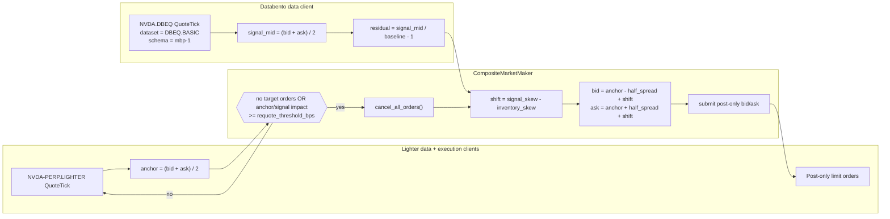

# Composite Market Making on Lighter RWA with Databento DBEQ NVDA

This tutorial runs the shipped `CompositeMarketMaker` strategy on Lighter's
`NVDA-PERP.LIGHTER` RWA market using Databento `NVDA.DBEQ` quotes as an external
signal. The strategy quotes one post-only bid and one post-only ask around the
Lighter mid, then shifts both sides from a normalized Databento residual and the
current Lighter inventory.

The setup uses a Rust `LiveNode`, while the strategy itself runs as the native
Rust `CompositeMarketMaker` strategy.

## Introduction

Lighter lists real-world asset (RWA) perpetuals that trade continuously, including
single-name equity markets. See Lighter's [RWA docs] and [market specifications]
for current venue details. Databento's [DBEQ.BASIC] feed provides basic US equity
top-of-book data for `NVDA`, with `mbp-1` available through the Nautilus
Databento adapter.

`CompositeMarketMaker` is a small two-input market maker:

- The **target instrument** is the Lighter market to quote: `NVDA-PERP.LIGHTER`.
- The **signal instrument** is the Databento reference feed: `NVDA.DBEQ`.
- The **anchor** is the Lighter mid.
- The **signal residual** is `(databento_mid / baseline) - 1.0`.
- The **quote shift** is `signal_skew_factor * residual - inventory_skew_factor * net_position`.

With no configured baseline, the strategy captures the first observed `NVDA.DBEQ`
mid as the reference price. The residual starts at zero and measures NVDA's move
from that first signal mid, not the Lighter/Databento basis. Set the
`SIGNAL_BASELINE` constant in the example source to pin the reference price for
deterministic runs.

In this setup, the Lighter BBO remains the spread anchor. Databento moves the
quote center up or down through the normalized residual.



The focus is the adapter wiring: one engine consumes a direct US equity feed and
a crypto-native RWA venue, while order lifecycle, inventory, and quote state stay
inside the same event-driven runtime.

## Prerequisites

- A Rust toolchain.
- A NautilusTrader checkout.
- Python 3.12+ to regenerate the rendered panels.
- A Databento API key with live access to `DBEQ.BASIC`.
- A funded Lighter account, numeric account index, API key index, and API secret
  for the hard-coded Lighter environment.
- The Lighter integration guide: [Lighter](../integrations/lighter.md).
- The Databento integration guide: [Databento](../integrations/databento.md).

The example reads credentials from environment variables and keeps the strategy
parameters as editable Rust constants. It defaults to
`LighterEnvironment::Testnet`, so set the testnet Lighter credentials:

```bash
export DATABENTO_API_KEY="your-databento-api-key"
export LIGHTER_TESTNET_ACCOUNT_INDEX="123456"
export LIGHTER_TESTNET_API_KEY_INDEX="0"
export LIGHTER_TESTNET_API_SECRET="your-lighter-api-secret"
```

For mainnet, change `LIGHTER_ENVIRONMENT` in the source to
`LighterEnvironment::Mainnet` and use the mainnet `LIGHTER_*` credential
variables described in the integration guide. Set `DATABENTO_API_KEY` before
running the example.

## Why NVDA

`NVDA` works well as a first RWA tutorial instrument because it is a liquid
Nasdaq-listed single-name equity and Lighter maps its RWA perpetual to
`NVDA-PERP.LIGHTER`. That gives a licensed signal/traded-market pair:

| Role              | Instrument ID       | Source    | Notes                                      |
| ----------------- | ------------------- | --------- | ------------------------------------------ |
| Signal instrument | `NVDA.DBEQ`         | Databento | DBEQ.BASIC top‑of‑book quote updates.      |
| Target instrument | `NVDA-PERP.LIGHTER` | Lighter   | RWA perpetual traded through Lighter.      |

The Databento publisher file maps the `DBEQ` venue to `DBEQ.BASIC`. When the
strategy subscribes to `NVDA.DBEQ`, the adapter sends a Databento `mbp-1`
subscription for raw symbol `NVDA` on `DBEQ.BASIC`. The live decoder uses the
requested `NVDA.DBEQ` instrument ID for the emitted `QuoteTick`s, so the strategy
receives one signal stream even though DBEQ.BASIC contains several publishers.

DBEQ.BASIC provides L1 coverage from basic equity venues, so it has less venue
coverage than Nasdaq TotalView. Treat it as a licensed signal proxy for the
tutorial wiring, not as a full primary Nasdaq book.

The example starts at `trade_size=0.05`, which aligns with the Lighter NVDA
minimum base amount observed during tutorial validation. Check the
[market details endpoint] before increasing size or changing instruments.

## Session constraint

Lighter RWA markets trade continuously. `NVDA.DBEQ` follows the US equity market
data session. The first live test should run during the regular cash session,
13:30 to 20:00 UTC during US daylight time, with special handling for holidays
and half-days.

`CompositeMarketMaker` does not include a built-in session gate or signal-age
guard. For production use, add an actor or strategy variant that cancels quotes
when the Databento signal goes stale. The tutorial example keeps this explicit
instead of hiding it in a custom strategy.

## Example node

The runnable example lives in the
[Lighter NVDA composite market maker example][example-script].

With the credential variables set, the default source builds the node, registers
both clients, adds the native strategy, and exits without connecting:

```bash
cargo run --bin lighter-nvda-composite-mm --package nautilus-tutorials --features examples
```

Databento is a multi-venue data client without a fixed venue route, so the engine
uses it as the default route for `NVDA.DBEQ`. Lighter registers with the `LIGHTER`
venue route and receives `NVDA-PERP.LIGHTER` subscriptions.

The core of the setup is the three-client node plus `CompositeMarketMaker`:

```rust
let lighter_environment = LIGHTER_ENVIRONMENT;
let trader_id = TraderId::from(TRADER_ID);
let account_id = AccountId::from(ACCOUNT_ID);
let instrument_id = InstrumentId::from(INSTRUMENT_ID);
let signal_instrument_id = InstrumentId::from(SIGNAL_INSTRUMENT_ID);

let databento_api_key = get_env_var("DATABENTO_API_KEY")?;
let databento_config =
    DatabentoLiveClientConfig::new(databento_api_key, publishers_filepath, true, true);
let lighter_data_config = LighterDataClientConfig {
    environment: lighter_environment,
    ..Default::default()
};
let lighter_exec_config = LighterExecClientConfig::builder()
    .trader_id(trader_id)
    .account_id(account_id)
    .environment(lighter_environment)
    .build();

let strategy_config =
    CompositeMarketMakerConfig::new(instrument_id, signal_instrument_id, max_position)
        .with_strategy_id(StrategyId::from("NVDA_COMPOSITE_MM-001"))
        .with_order_id_tag("001".to_string())
        .with_trade_size(trade_size)
        .with_half_spread_bps(HALF_SPREAD_BPS)
        .with_inventory_skew_factor(INVENTORY_SKEW_FACTOR)
        .with_signal_skew_factor(SIGNAL_SKEW_FACTOR)
        .with_requote_threshold_bps(REQUOTE_THRESHOLD_BPS)
        .with_on_cancel_resubmit(ON_CANCEL_RESUBMIT);

let mut node = LiveNode::builder(trader_id, Environment::Live)?
    .with_name("LIGHTER-NVDA-COMPOSITE-MM-001".to_string())
    .with_reconciliation(RUN_LIVE)
    .add_data_client(
        None,
        Box::new(DatabentoDataClientFactory::new()),
        Box::new(databento_config),
    )?
    .add_data_client(
        None,
        Box::new(LighterDataClientFactory::new()),
        Box::new(lighter_data_config),
    )?
    .add_exec_client(
        None,
        Box::new(LighterExecutionClientFactory::new()),
        Box::new(lighter_exec_config),
    )?
    .build()?;

node.add_strategy(CompositeMarketMaker::new(strategy_config))?;
```

To connect and allow order submission, edit the constants near the top of the
example source:

```rust
const RUN_LIVE: bool = true;
const ALLOW_LIVE_ORDERS: bool = true;
```

Then run the same command:

```bash
cargo run --bin lighter-nvda-composite-mm --package nautilus-tutorials --features examples
```

:::warning
This command can submit live orders. Start with the smallest accepted size on a
funded test account or a mainnet account sized for loss. Confirm the active
instrument ID, account ID, numeric account index, and Lighter credentials before
setting `RUN_LIVE` and `ALLOW_LIVE_ORDERS` to `true`.
:::

For a testnet smoke run, keep `LIGHTER_ENVIRONMENT` as
`LighterEnvironment::Testnet` and use the `LIGHTER_TESTNET_*` credential
variables. If the run is outside the DBEQ.BASIC cash session, it can still
validate node startup, routing, Lighter data, and the order lifecycle. The
Databento residual remains zero until the first `NVDA.DBEQ` quote arrives.

## Strategy parameters

| Parameter               | Value               | Description                                                    |
| ----------------------- | ------------------- | -------------------------------------------------------------- |
| `instrument_id`         | `NVDA-PERP.LIGHTER` | Lighter RWA perpetual to quote.                                |
| `signal_instrument_id`  | `NVDA.DBEQ`         | Databento DBEQ.BASIC signal feed.                              |
| `trade_size`            | `0.05`              | Size per bid or ask.                                           |
| `max_position`          | `0.20`              | Hard cap on net Lighter exposure.                              |
| `half_spread_bps`       | `25`                | Half‑spread around the Lighter anchor.                         |
| `inventory_skew_factor` | `2.0`               | Price units per unit of net position.                          |
| `signal_skew_factor`    | `55.0`              | Price units per unit of normalized Databento residual.         |
| `signal_baseline`       | First signal mid    | Optional reference price for the Databento residual.           |
| `requote_threshold_bps` | `5`                 | Anchor or signal‑impact move that triggers cancel and requote. |

With a Lighter mid of `207.00` and `half_spread_bps=25`, the unskewed half
spread is `0.5175` USD. If Databento is 30 bps above its baseline, a
`signal_skew_factor` of `55.0` shifts both sides up by `0.165` USD before
inventory skew. A long position of `0.05` with `inventory_skew_factor=2.0`
shifts both sides down by `0.10` USD.

## Requote behavior

Signal ticks update internal state but do not submit orders by themselves. Until
the first Databento quote arrives, the residual is zero. The next Lighter quote
tick reads the latest signal residual and checks the quote state. A quote cycle
occurs when:

- no target orders are open or in-flight;
- the Lighter anchor moves by at least `requote_threshold_bps`; or
- the price impact of the signal residual change clears the same threshold.

The strategy then cancels open orders, reads current net position and pending
exposure from the cache, computes one bid and one ask, drops any side that
breaches `max_position`, and submits the remaining sides as post-only limits.

## Panels

The panels below use deterministic replay data. They show the quoting mechanics
and the cash-session constraint. They are not a captured live Lighter fill trace.

![NVDA composite quote center against Databento and Lighter mids][panel-a]

**Figure 1.** *Databento `NVDA.DBEQ` mid, Lighter `NVDA-PERP.LIGHTER` mid,
composite bid, composite ask, and quote center.*

![Databento residual, Lighter basis, and quote-center shift][panel-b]

**Figure 2.** *Databento residual, Lighter basis, and quote-center shift in bps.*

![Inventory skew terms for the composite market maker][panel-c]

**Figure 3.** *Net position, signal shift, inventory adjustment, and total shift
for a `0.05` NVDA trade size and `0.20` NVDA position cap.*

![Lighter continuous trading and Databento session clock][panel-d]

**Figure 4.** *Lighter's continuous RWA market clock against the Databento
`DBEQ.BASIC` cash-session signal, with signal age after the regular session.*

## Regenerate the panels

```bash
uv sync --extra visualization
python3 docs/tutorials/assets/lighter_rwa_composite_mm/render_panels.py
```

The renderer writes four PNGs into
`docs/tutorials/assets/lighter_rwa_composite_mm/`. It uses the
`nautilus_dark` Plotly theme and deterministic replay data so docs builds do not
depend on vendor data licenses or live exchange access.

## Extensions

The next useful improvement is a signal-age gate. For example, cancel all
Lighter orders when the latest `NVDA.DBEQ` quote is older than 30 seconds during
the cash session, or immediately after the cash session closes. That makes the
Databento signal an explicit operating dependency instead of an implicit one.

For a pure fair-value strategy, use this tutorial as the client wiring and write
a small variant that anchors bid/ask directly on the Databento mid, then checks
the Lighter BBO only for post-only and basis limits.

[RWA docs]: https://docs.lighter.xyz/trading/real-world-assets-rwas
[market specifications]: https://docs.lighter.xyz/trading/real-world-assets-rwas/market-specifications
[market details endpoint]: https://mainnet.zklighter.elliot.ai/api/v1/orderBookDetails
[DBEQ.BASIC]: https://databento.com/blog/dbeq-basic
[example-script]: https://github.com/nautechsystems/nautilus_trader/blob/develop/examples/tutorials/src/bin/lighter_nvda_composite_mm.rs
[panel-a]: ./assets/lighter_rwa_composite_mm/panel_a_reference_overlay.png
[panel-b]: ./assets/lighter_rwa_composite_mm/panel_b_signal_basis.png
[panel-c]: ./assets/lighter_rwa_composite_mm/panel_c_inventory_skew.png
[panel-d]: ./assets/lighter_rwa_composite_mm/panel_d_session_clock.png
