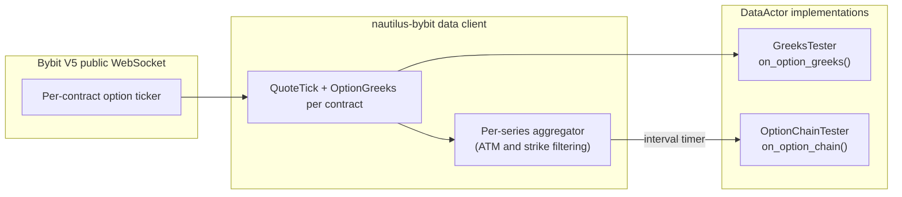
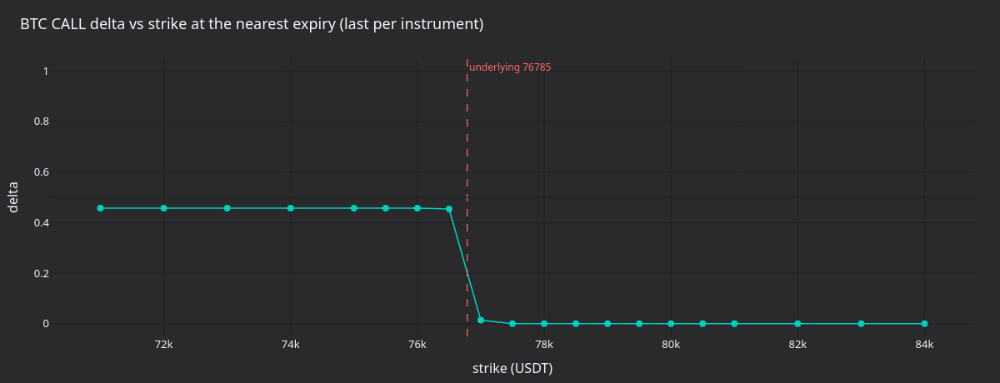
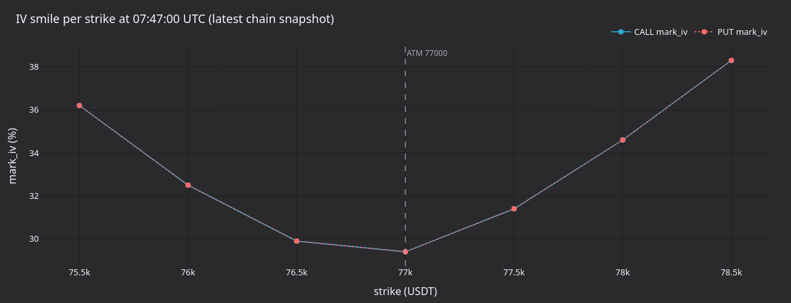
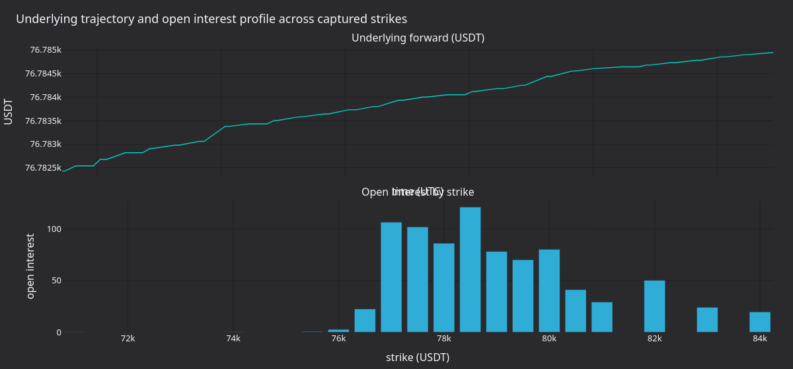
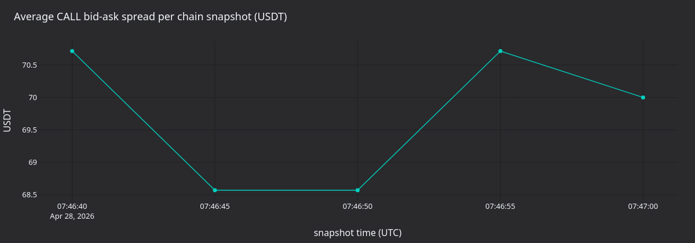

# Options Data and Greeks (Bybit)

:::note
This is a **Rust-only** v2 system tutorial. It uses the Rust `LiveNode`
with the Bybit adapter to stream live option Greeks and aggregated chain
snapshots.
:::

This tutorial connects to Bybit's live options market and consumes Greeks
and option chain data through two `DataActor` examples. It covers
instrument discovery, venue-provided Greeks subscriptions, and periodic
chain snapshots with ATM-relative strike filtering.

## Introduction

Bybit publishes Greeks (delta, gamma, vega, theta) and implied volatility
alongside every option ticker update. NautilusTrader exposes this data at
two levels:

- **Per-instrument Greeks**: subscribe to a single option contract and
  receive an `OptionGreeks` event on every ticker update.
- **Option chain snapshots**: subscribe to an entire expiry series and
  receive periodic `OptionChainSlice` events that aggregate quotes and
  Greeks across all active strikes.

Two example binaries back these patterns: the first subscribes to
individual Greeks streams, the second subscribes to an aggregated chain
with ATM-relative strike filtering.



## Prerequisites

- A working Rust toolchain ([rustup.rs](https://rustup.rs)).
- The NautilusTrader repository cloned and building.
- A Bybit API key with read permissions. No trading permissions are
  needed for data-only use. Create keys at
  [bybit.com](https://www.bybit.com/app/user/api-management).
- Environment variables set for authentication:

```bash
export BYBIT_API_KEY="your-api-key"
export BYBIT_API_SECRET="your-api-secret"
```

A `.env` file in the repository root also works. The examples load it via
`dotenvy`.

:::warning
Bybit demo trading uses `stream-demo.bybit.com` only for private streams.
Public option market data uses the mainnet public stream
`wss://stream.bybit.com/v5/public/option`.
:::

## The DataActor pattern

A Rust `DataActor` needs three pieces:

1. A struct with a `core: DataActorCore` field plus your own state.
2. The `nautilus_actor!(YourType)` macro plus a `Debug` implementation.
3. A `DataActor` trait implementation with your callbacks.

The macro generates blanket `Actor` and `Component` implementations, so
you only implement the callbacks you need. Every callback has a default
no-op implementation.

## Part 1: per-instrument Greeks

The `bybit-greeks-tester` example subscribes to `OptionGreeks` for all
BTC CALL options at the nearest expiry and logs each update.

### Actor structure

```rust
#[derive(Debug)]
struct GreeksTester {
    core: DataActorCore,
    client_id: ClientId,
    subscribed_instruments: Vec<InstrumentId>,
}

nautilus_actor!(GreeksTester);

impl GreeksTester {
    fn new(client_id: ClientId) -> Self {
        Self {
            core: DataActorCore::new(DataActorConfig {
                actor_id: Some("GREEKS_TESTER-001".into()),
                ..Default::default()
            }),
            client_id,
            subscribed_instruments: Vec::new(),
        }
    }
}
```

The `core` field is required by the macro. The `client_id` identifies
which data client to route subscriptions to. The `subscribed_instruments`
vector tracks what we subscribed to so we clean up on stop.

### Discovering instruments

On start, the actor queries the cache for all option instruments,
filters for BTC CALLs that have not expired, and finds the nearest
expiry:

```rust
fn on_start(&mut self) -> anyhow::Result<()> {
    let venue = Venue::new("BYBIT");
    let underlying_filter = Ustr::from("BTC");

    let mut options: Vec<(InstrumentId, f64, u64)> = {
        let cache = self.cache();
        let instruments = cache.instruments(&venue, Some(&underlying_filter));

        instruments
            .iter()
            .filter_map(|inst| {
                if inst.option_kind() == Some(OptionKind::Call) {
                    let expiry = inst.expiration_ns()?.as_u64();
                    let strike = inst.strike_price()?.as_f64();
                    Some((inst.id(), strike, expiry))
                } else {
                    None
                }
            })
            .collect()
    }; // cache borrow dropped here

    let now_ns = self.timestamp_ns().as_u64();
    options.retain(|(_, _, exp)| *exp > now_ns);

    let nearest_expiry = options.iter().map(|(_, _, exp)| *exp).min().unwrap();
    options.retain(|(_, _, exp)| *exp == nearest_expiry);
    options.sort_by(|(_, a, _), (_, b, _)| a.partial_cmp(b).unwrap());

    // ...subscribe to each
}
```

:::warning
Release the cache borrow before calling any subscription methods. The
cache uses `Rc<RefCell<...>>` internally, and subscription methods may
need to borrow it. Collect owned data into a local `Vec`, drop the cache
reference, then subscribe.
:::

### Subscribing to Greeks

After discovering instruments, subscribe to each one:

```rust
let client_id = self.client_id;
for (instrument_id, _, _) in &options {
    self.subscribe_option_greeks(*instrument_id, Some(client_id), None);
    self.subscribed_instruments.push(*instrument_id);
}
```

### Handling updates

Each ticker update from Bybit triggers `on_option_greeks` with an
`OptionGreeks` event:

```rust
fn on_option_greeks(&mut self, greeks: &OptionGreeks) -> anyhow::Result<()> {
    log::info!(
        "GREEKS | {} | delta={:.4} gamma={:.6} vega={:.4} theta={:.4} rho={:.6} | \
         mark_iv={} bid_iv={} ask_iv={} | underlying={} oi={}",
        greeks.instrument_id,
        greeks.delta,
        greeks.gamma,
        greeks.vega,
        greeks.theta,
        greeks.rho,
        greeks.mark_iv.map_or("-".to_string(), |v| format!("{v:.2}")),
        greeks.bid_iv.map_or("-".to_string(), |v| format!("{v:.2}")),
        greeks.ask_iv.map_or("-".to_string(), |v| format!("{v:.2}")),
        greeks.underlying_price.map_or("-".to_string(), |v| format!("{v:.2}")),
        greeks.open_interest.map_or("-".to_string(), |v| format!("{v:.1}")),
    );
    Ok(())
}
```

The `OptionGreeks` fields:

| Field              | Type           | Description                                        |
|--------------------|----------------|----------------------------------------------------|
| `instrument_id`    | `InstrumentId` | The option contract.                               |
| `delta`            | `f64`          | Price sensitivity to underlying.                   |
| `gamma`            | `f64`          | Delta sensitivity to underlying.                   |
| `vega`             | `f64`          | Price sensitivity to a 1% change in volatility.    |
| `theta`            | `f64`          | Daily time decay.                                  |
| `rho`              | `f64`          | Sensitivity to interest rate changes.              |
| `mark_iv`          | `Option<f64>`  | Mark price implied volatility.                     |
| `bid_iv`           | `Option<f64>`  | Bid implied volatility.                            |
| `ask_iv`           | `Option<f64>`  | Ask implied volatility.                            |
| `underlying_price` | `Option<f64>`  | Current underlying forward price for this expiry.  |
| `open_interest`    | `Option<f64>`  | Open interest for this contract.                   |

The `delta`, `gamma`, `vega`, `theta`, and `rho` values live on a nested
`greeks: OptionGreekValues` struct. `OptionGreeks` implements
`Deref<Target = OptionGreekValues>`, so `greeks.delta` and friends work
as shown above.

Bybit does not provide rho; the adapter sets it to `0.0`.

### Cleanup

On stop, unsubscribe from all instruments:

```rust
fn on_stop(&mut self) -> anyhow::Result<()> {
    let ids: Vec<InstrumentId> = self.subscribed_instruments.drain(..).collect();
    let client_id = self.client_id;
    for instrument_id in ids {
        self.unsubscribe_option_greeks(instrument_id, Some(client_id), None);
    }
    log::info!("Unsubscribed from all option greeks");
    Ok(())
}
```

## Part 2: option chain snapshots

The `bybit-option-chain` example subscribes to an aggregated option chain
and logs periodic snapshots showing calls and puts at each strike with
their quotes and Greeks.

### Why use option chains

Per-instrument subscriptions give granular control, but monitoring an
entire surface means managing individual streams and correlating updates
across strikes. An option chain subscription handles this: the
`DataEngine` aggregates quotes and Greeks across all strikes in a series
and publishes a single `OptionChainSlice` on a timer.

This aggregation happens inside NautilusTrader. Bybit publishes
per-contract option market data and does not expose a native option
chain stream in the V5 public WebSocket docs.

### Key types

**`OptionSeriesId`** identifies a single expiry series:

```rust
let series_id = OptionSeriesId::new(
    Venue::new("BYBIT"),    // venue
    Ustr::from("BTC"),      // underlying
    Ustr::from("USDT"),     // settlement currency
    UnixNanos::from(expiry), // expiration timestamp
);
```

**`StrikeRange`** controls which strikes are active:

| Variant       | Description                                            |
|---------------|--------------------------------------------------------|
| `Fixed`       | A fixed set of strike prices.                          |
| `AtmRelative` | `strikes_above` above and `strikes_below` below ATM.   |
| `AtmPercent`  | All strikes within `pct` of the ATM price.             |

For ATM-based variants, subscriptions are deferred until the ATM price
is determined from the venue-provided forward price.

### Subscribing

```rust
let strike_range = StrikeRange::AtmRelative {
    strikes_above: 3,
    strikes_below: 3,
};

let snapshot_interval_ms = Some(5_000); // snapshot every 5 seconds

self.subscribe_option_chain(
    series_id,
    strike_range,
    snapshot_interval_ms,
    Some(client_id),
    None, // params
);
```

Pass `None` for `snapshot_interval_ms` to use raw mode, where every
quote or Greeks update publishes a slice immediately.

### Handling snapshots

The `on_option_chain` callback receives an `OptionChainSlice` containing
all active strikes with their call and put data:

```rust
fn on_option_chain(&mut self, slice: &OptionChainSlice) -> anyhow::Result<()> {
    log::info!(
        "OPTION_CHAIN | {} | atm={} | calls={} puts={} | strikes={}",
        slice.series_id,
        slice.atm_strike.map_or("-".to_string(), |p| format!("{p}")),
        slice.call_count(),
        slice.put_count(),
        slice.strike_count(),
    );

    for strike in slice.strikes() {
        let call_info = slice.get_call(&strike).map(|d| {
            let greeks_str = d.greeks.as_ref().map_or("-".to_string(), |g| {
                format!(
                    "d={:.3} g={:.5} v={:.2} iv={:.1}%",
                    g.delta, g.gamma, g.vega,
                    g.mark_iv.unwrap_or(0.0) * 100.0,
                )
            });
            format!("bid={} ask={} [{}]", d.quote.bid_price, d.quote.ask_price, greeks_str)
        });

        let put_info = slice.get_put(&strike).map(|d| {
            let greeks_str = d.greeks.as_ref().map_or("-".to_string(), |g| {
                format!(
                    "d={:.3} g={:.5} v={:.2} iv={:.1}%",
                    g.delta, g.gamma, g.vega,
                    g.mark_iv.unwrap_or(0.0) * 100.0,
                )
            });
            format!("bid={} ask={} [{}]", d.quote.bid_price, d.quote.ask_price, greeks_str)
        });

        log::info!(
            "  K={} | CALL: {} | PUT: {}",
            strike,
            call_info.unwrap_or_else(|| "-".to_string()),
            put_info.unwrap_or_else(|| "-".to_string()),
        );
    }

    Ok(())
}
```

The `OptionChainSlice` fields and methods:

| Name             | Type / Returns              | Description                          |
|------------------|-----------------------------|--------------------------------------|
| `series_id`      | `OptionSeriesId`            | The series this snapshot covers.     |
| `atm_strike`     | `Option<Price>`             | ATM strike from the forward price.   |
| `call_count()`   | `usize`                     | Number of call strikes with data.    |
| `put_count()`    | `usize`                     | Number of put strikes with data.     |
| `strike_count()` | `usize`                     | Union of all strikes.                |
| `strikes()`      | `Vec<Price>`                | Sorted list of all strike prices.    |
| `get_call(k)`    | `Option<&OptionStrikeData>` | Call quote and Greeks at strike `k`. |
| `get_put(k)`     | `Option<&OptionStrikeData>` | Put quote and Greeks at strike `k`.  |

Each `OptionStrikeData` contains a `quote: QuoteTick` (bid/ask) and an
optional `greeks: Option<OptionGreeks>`.

## Node setup

Both examples use the same `LiveNode` pattern. No execution client is
needed for data-only use:

```rust
#[tokio::main]
async fn main() -> Result<(), Box<dyn std::error::Error>> {
    dotenvy::dotenv().ok();

    let environment = Environment::Live;
    let trader_id = TraderId::test_default();
    let client_id = ClientId::new("BYBIT");

    let bybit_config = BybitDataClientConfig {
        api_key: None,    // loaded from BYBIT_API_KEY env var
        api_secret: None, // loaded from BYBIT_API_SECRET env var
        product_types: vec![BybitProductType::Option],
        ..Default::default()
    };

    let client_factory = BybitDataClientFactory::new();

    let mut node = LiveNode::builder(trader_id, environment)?
        .with_name("BYBIT-OPTIONS-001".to_string())
        .add_data_client(None, Box::new(client_factory), Box::new(bybit_config))?
        .with_delay_post_stop_secs(5)
        .build()?;

    let actor = GreeksTester::new(client_id); // or OptionChainTester
    node.add_actor(actor)?;
    node.run().await?;

    Ok(())
}
```

Setting `product_types` to `[BybitProductType::Option]` loads only option
instruments. Startup blocks while the instrument provider fetches and
parses every listed option.

## Running the examples

```bash
# Per-instrument Greeks
cargo run --example bybit-greeks-tester --package nautilus-bybit --features examples

# Option chain snapshots
cargo run --example bybit-option-chain --package nautilus-bybit --features examples
```

Stop either example with Ctrl+C. The actor's `on_stop` callback
unsubscribes from all streams before shutdown.

## What the examples produce

A 30-second mainnet run on April 28 (BTC near 76,800 USDT, expiry
2026-04-28 08:00 UTC) captures **938 Greeks updates** across 22 BTC CALL
contracts in the per-instrument tester, plus **5 chain snapshots**
covering 7 strikes each in the chain tester.

### Per-instrument Greeks output

```
Found 22 BTC CALL options at nearest expiry (ts=1777359600000000000)
Subscribed to option greeks for 22 instruments
GREEKS | BTC-28APR26-72000-C-USDT-OPTION.BYBIT | delta=0.4733 gamma=0.000000 vega=0.0000 theta=-0.0000 rho=0.000000 | mark_iv=0.66 bid_iv=0.00 ask_iv=5.00 | underlying=76782.43 oi=0.0
GREEKS | BTC-28APR26-71000-C-USDT-OPTION.BYBIT | delta=0.4733 gamma=0.000000 vega=0.0000 theta=-0.0000 rho=0.000000 | mark_iv=0.74 bid_iv=0.00 ask_iv=5.00 | underlying=76782.43 oi=0.1
GREEKS | BTC-28APR26-73000-C-USDT-OPTION.BYBIT | delta=0.4733 gamma=0.000000 vega=0.0000 theta=-0.0000 rho=0.000000 | mark_iv=0.57 bid_iv=0.00 ask_iv=5.00 | underlying=76782.43 oi=0.0
```

### Option chain output

```
OPTION_CHAIN | BYBIT:BTC:USDT:2026-04-28T08:00:00Z | atm=77000 | calls=7 puts=7 | strikes=7
  K=75500 | CALL: bid=1210 ask=1430 [d=0.445 g=0.00000 v=0.00 iv=36.2%] | PUT: bid=0 ask=5 [d=0.000 g=0.00000 v=0.00 iv=36.2%]
  K=76000 | CALL: bid=700 ask=850 [d=0.445 g=0.00000 v=0.00 iv=32.5%] | PUT: bid=0 ask=5 [d=0.000 g=0.00000 v=0.00 iv=32.5%]
  K=76500 | CALL: bid=265 ask=370 [d=0.442 g=0.00000 v=0.07 iv=29.9%] | PUT: bid=0 ask=5 [d=-0.003 g=0.00000 v=0.07 iv=29.9%]
```

### Panels



**Figure 1.** *Last delta per BTC CALL strike at the nearest expiry,
underlying ~77,000 USDT marked. Delta drops from ~0.45 below the
underlying to near zero past the underlying. Bybit's delta on near-zero
gamma contracts close to expiry compresses to a step-like profile around
the forward.*



**Figure 2.** *Mark IV per strike for the latest chain snapshot (CALL and
PUT overlaid). The smile is symmetric around ATM at 77,000 USDT, with IV
dipping from 36% at 75,500 to 30% at 77,000 and rising back to 38% at
78,500.*



**Figure 3.** *Underlying forward price reported in each Greeks update
(top) and open interest by strike at the last update (bottom). OI
concentrates in the 70,000-76,000 USDT band: at-the-money to slightly
out-of-the-money strikes.*



**Figure 4.** *Average CALL bid-ask spread per chain snapshot in USDT.
Snapshots arrive every five seconds (`snapshot_interval_ms=5000`).*

### Regenerate the panels

```bash
timeout 30 ./target/release/examples/bybit-greeks-tester > /tmp/bybit_greeks.log 2>&1
timeout 30 ./target/release/examples/bybit-option-chain > /tmp/bybit_chain.log 2>&1

uv sync --extra visualization
GREEKS_LOG=/tmp/bybit_greeks.log CHAIN_LOG=/tmp/bybit_chain.log \
    python3 docs/tutorials/assets/options_data_bybit/render_panels.py
```

## Complete source

- [`crates/adapters/bybit/examples/node_greeks.rs`](https://github.com/nautechsystems/nautilus_trader/tree/develop/crates/adapters/bybit/examples/node_greeks.rs)
- [`crates/adapters/bybit/examples/node_option_chain.rs`](https://github.com/nautechsystems/nautilus_trader/tree/develop/crates/adapters/bybit/examples/node_option_chain.rs)

## Next steps

- **Combine both patterns**. Use per-instrument Greeks for near-ATM
  contracts alongside the aggregated chain view in a single actor.
  Subscribe to Greeks for contracts you want to track individually, and
  the chain for a surface-level view.
- **Add quote and depth subscriptions**. Call `subscribe_quotes` for
  top-of-book `QuoteTick` updates on individual option contracts. Call
  `subscribe_order_book_deltas` when you need the dedicated option
  orderbook stream. Bybit supports option depths 25 and 100.
- **Options execution**. The
  [delta-neutral strategy tutorial](delta_neutral_options_bybit.md) walks
  through a short strangle with perpetual hedging, including IV-based
  order placement via Bybit's `order_iv` parameter.

## See also

- [Options](../concepts/options.md): option instrument types, Greeks
  data types, and chain architecture.
- [Bybit integration](../integrations/bybit.md): full Bybit adapter
  reference including options order parameters and limitations.
