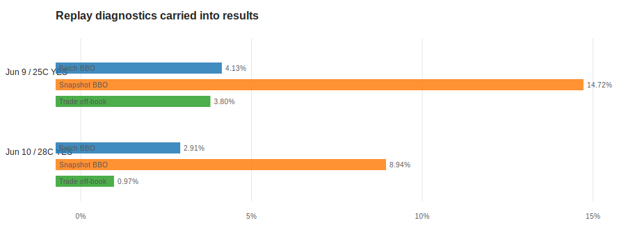
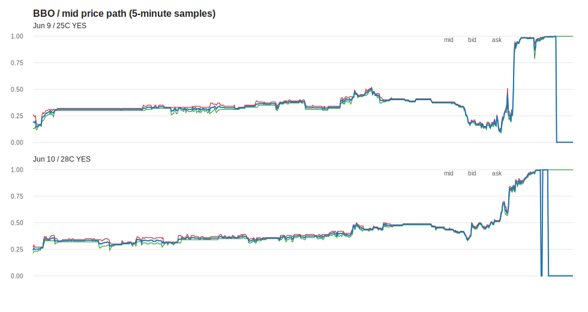
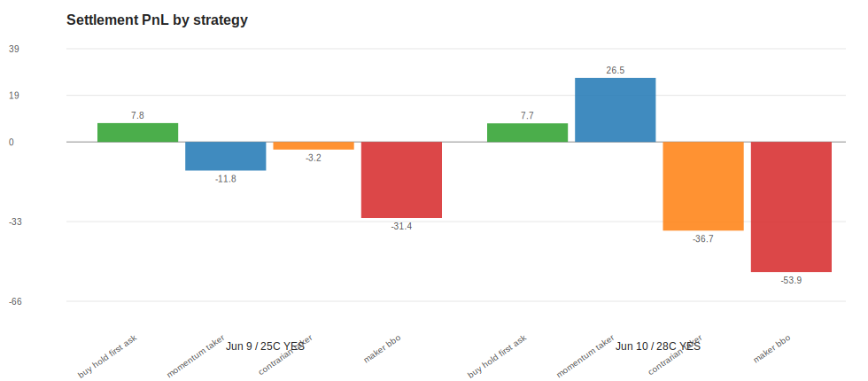
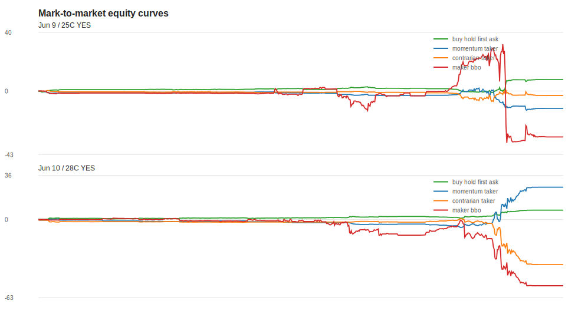

# Polymarket Shanghai event backtest: ideal-sort smoke report

Date: 2026-06-26
Scope: two curated Shanghai temperature Polymarket events from PMXT parquet, selected winning YES token only.
Status: **research smoke test, not production validation**.

This report is the first version of the Polymarket strategy-report format. It is intentionally more than a log: every run should carry (1) replay contract, (2) data-quality diagnostics, (3) strategy assumptions, (4) PnL/equity/fill outputs, and (5) explicit validity labels.

## 0. Why the previous report was too thin

NautilusTrader is a strong event-driven trading/backtest engine, but it does not magically produce a Polymarket research report by itself. For this repo we still need a Polymarket research layer around it:

1. **Data adapter layer**: PMXT parquet -> ordered L2 book events -> strategy inputs.
2. **Market semantics layer**: condition/token mapping, YES/NO settlement, fees, rewards, tick-size/delay rules.
3. **Fill model layer**: taker/maker assumptions, partial fill rules, queue approximation.
4. **Report layer**: replay quality, charts, strategy assumptions, result labels, and known invalidation risks.

This note starts that report layer. The current strategies are deliberately simple; the report shape is the more important deliverable at this stage.

## 1. Replay ordering used in this pass

Current replay code sorts PMXT rows by:

```text
timestamp, timestamp_received, original_row
```

Meaning:

- `timestamp` is treated as the ideal source/event-time order.
- `timestamp_received` is only the tie-breaker and price_change batch boundary.
- `original_row` keeps sorting stable when both timestamps are equal.
- `price_change` rows with the same `(timestamp_received, timestamp, market, asset_id, event_type)` are applied as one batch before comparing PMXT batch-level BBO.

This is the right mode for a first "ideal historical research" test. It is **not** yet the final live-realistic replay contract. Later we still need to decide whether production historical replay should use source-time order, receive-time order, or a hybrid with snapshot resets and drift markers.

## 2. Replay quality dashboard



| Event | Market | Price-change batch BBO mismatch | Snapshot BBO mismatch | Raw snapshot BBO mismatch | Trade off-book rate |
| --- | --- | ---: | ---: | ---: | ---: |
| highest-temperature-in-shanghai-on-june-9-2026 | 25C YES | 4.13% | 14.72% | 24.41% | 3.80% |
| highest-temperature-in-shanghai-on-june-10-2026 | 28C YES | 2.91% | 8.94% | 20.49% | 0.97% |

Read:

- The replay is usable for an ideal-sort smoke test: event processing completes, L2 books are maintained, simple strategies run end-to-end, and trade-vs-book checks are not obviously broken.
- It is not yet a validated production backtest: BBO mismatch is still non-zero, especially around snapshots.
- June 10 looks cleaner than June 9 by these diagnostics.
- These diagnostics must travel with every strategy result; otherwise PnL alone is misleading.

## 3. Market path



These charts are 5-minute BBO samples from the replayed selected YES token.

Why this chart belongs in every report:

1. It shows whether the strategy was trading a market that actually moved.
2. It catches obviously broken books, e.g. crossed/empty/stale-looking paths.
3. It gives intuition for momentum/contrarian results before looking at PnL.

## 4. Strategy definitions in this smoke suite

| Strategy | Purpose | Current limitation |
| --- | --- | --- |
| `buy_hold_first_ask` | Settlement sanity check: buy winning YES once and hold to final payout. | Not a tradable strategy benchmark; uses hindsight-selected winning token in this report. |
| `momentum_taker` | Simple path-following taker rule based on mid-price changes. | No fees, no latency, no market-impact model. |
| `contrarian_taker` | Opposite of momentum, useful as a sign/sanity pair. | Same limitations as momentum. |
| `maker_bbo` | Plumbing test for maker-style quotes around BBO. | Current fill model is naive/harsh; do **not** interpret as real maker edge. |

## 5. Result dashboard



| Event | Market | Strategy | Fills | Ending inventory | Gross notional | Settlement PnL | Return on gross notional |
| --- | --- | --- | ---: | ---: | ---: | ---: | ---: |
| Jun 9 | 25C YES | maker_bbo | 287 | -71.78 | 1144.85 | -31.45 | -2.75% |
| Jun 9 | 25C YES | buy_hold_first_ask | 1 | 10.00 | 2.20 | 7.80 | 354.55% |
| Jun 9 | 25C YES | momentum_taker | 34 | 20.00 | 129.56 | -11.84 | -9.14% |
| Jun 9 | 25C YES | contrarian_taker | 34 | -20.00 | 126.59 | -3.15 | -2.49% |
| Jun 10 | 28C YES | maker_bbo | 182 | -52.59 | 767.51 | -53.87 | -7.02% |
| Jun 10 | 28C YES | buy_hold_first_ask | 1 | 10.00 | 2.30 | 7.70 | 334.78% |
| Jun 10 | 28C YES | momentum_taker | 27 | 90.00 | 145.70 | 26.50 | 18.19% |
| Jun 10 | 28C YES | contrarian_taker | 27 | -90.00 | 143.90 | -36.70 | -25.50% |

## 6. Equity curves



Read:

- `buy_hold_first_ask` is the basic settlement sanity check. It is positive on both events because both selected YES tokens resolved YES.
- June 10 momentum being positive while contrarian is negative is directionally plausible if the winning YES token trends upward during the sampled path.
- `maker_bbo` loses on both events here, but this mainly reflects the current conservative/naive fill model. It is a harness test, not a maker-strategy conclusion.

## 7. Validity label

Current label remains:

```text
smoke_test_unvalidated
```

This label is correct because the following are still open:

1. PMXT historical replay contract: source-time vs receive-time vs hybrid.
2. Snapshot handling: when to reset local book, and how to mark drift.
3. Fee/reward/rebate model.
4. Polymarket tick-size and delay rule snapshots.
5. Maker fill model, partial fills, and queue approximation.
6. Settlement/result metadata and event semantics.

## 8. Proposed standard report format going forward

Every strategy/factor report should have these sections:

1. **Run manifest**: data source, event universe, tokens, date range, code commit, parameters.
2. **Replay contract**: ordering rule, batch rule, snapshot reset rule, fill model version.
3. **Data quality dashboard**: BBO mismatch, snapshot mismatch, trade-vs-book, missing windows, schema drift.
4. **Market overview**: price path, spread/depth, volume/trade count, settlement outcome.
5. **Strategy definition**: signal, execution rule, inventory/risk limits, fee assumptions.
6. **Performance dashboard**: PnL, return on gross, equity curve, drawdown, turnover, inventory.
7. **Fill/execution diagnostics**: fills by side, fill price vs BBO, maker/taker split, off-book trades.
8. **Sensitivity checks**: alternative fill model, latency, fees, queue assumptions, replay ordering.
9. **Validity label**: smoke / research / validated / production-candidate.
10. **Decision**: continue, modify, discard, or needs data/infra work.

## 9. Current conclusion

For near-term research we can proceed with this ideal-sort mode:

```text
sort by source timestamp -> group same-message price_change batches -> replay L2 -> run simple strategies -> carry replay-quality diagnostics into every result
```

This is enough to start organizing strategy experiments and factor-style research. It is not enough to claim production-grade historical execution accuracy.
