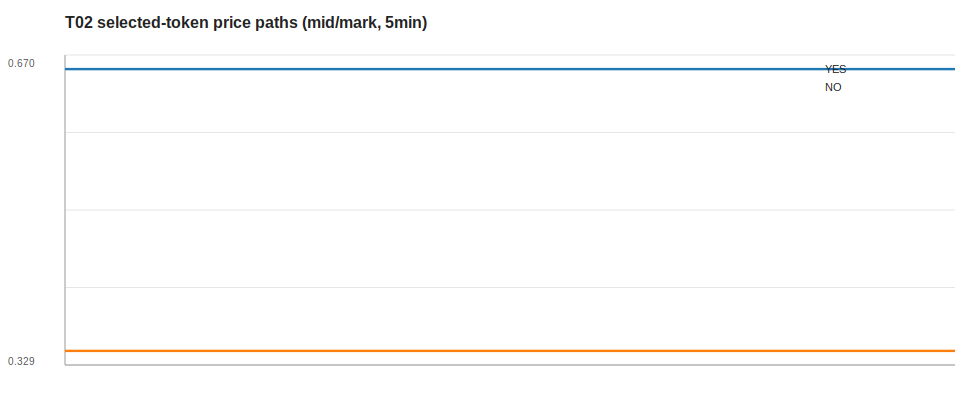
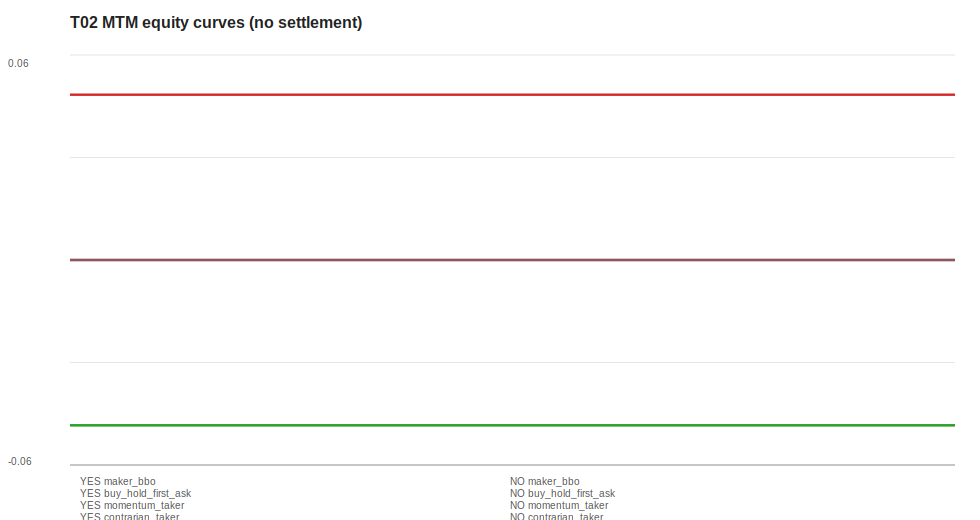

# T02 PMXT 无接收乱序样本：received-time replay 回测 smoke

## 1. 这次跑的是什么

这次不是重新证明 PMXT/raw 对齐，而是在已经确认 `live-until-1100 / T02` 样本接收顺序可用的前提下，把同一段数据喂给现有 Polymarket L2 replay / simple strategy harness，看短窗口回测输出是否合理。

- PMXT 小时包：`C:\Projects\PolyReaper\data\external\pmxt\polymarket\v2\orderbook\hourly\polymarket_orderbook_2026-06-26T02.parquet`
- raw WS：`C:\Projects\PolyReaper\research\2026-06-25-polymarket-raw-ws-ordering-capture\data\raw\ws_capture_20260626T022520Z.ndjson`
- raw window UTC：`2026-06-26T02:25:28.635Z` ～ `2026-06-26T02:59:53.643Z`
- 北京时间：`2026-06-26 10:25:28` ～ `10:59:53`
- 本次瘦身 parquet：`research/2026-07-01-polymarket-t02-no-ordering-backtest/curated/t02-pmxt-live-until-1100-no-receive-inversion/orderbook.parquet`
- 回放顺序：`received_time`，即按 `timestamp_received, timestamp, _row` 排序。

## 2. 为什么不是直接用全小时包跑

现有 harness 是 event/token 级，需要初始 `book` snapshot。T02 对齐窗口内 PMXT 可比 rows 一共 2611 条，但只有一个 binary market 的两只 token 在窗口内有 PMXT `book` snapshot；其它 token 只有 `price_change`，没有初始 book，直接跑会跳过早期变动，不能作为这轮 smoke 的主样本。

因此本次只选这两个可独立初始化的 token：

| Synthetic side | token_id 简写 | first book mid | rows | book | price_change | trade |
| --- | --- | ---: | ---: | ---: | ---: | ---: |
| YES | `13887983...542147` | 0.655 | 531 | 1 | 529 | 1 |
| NO | `41832664...631668` | 0.345 | 530 | 1 | 529 | 0 |

说明：这里的 YES/NO 是 synthetic label，只表示 first book mid 高/低的两只互补 token；本轮没有接入真实 resolution，因此不输出 settlement 结论。

## 3. 顺序与质量检查

| 检查项 | 结果 | 解读 |
| --- | ---: | --- |
| raw receive inversion | 0 | 本地接收墙钟没有倒退 |
| raw monotonic inversion | 0 | 本地 monotonic clock 没有倒退 |
| raw per-asset timestamp inversion | 0 | raw 口径同 asset 没有 source timestamp 倒序 |
| PMXT per-asset `timestamp_received` inversion | 0 | 对齐诊断中每个 selected asset 的 receive-time order 没倒序 |
| PMXT source `timestamp` inversion | 有 | 所以本轮不用 source-time 排序，而用 received-time replay 做理想化 smoke |

Replay 质量（取每个 token 的 buy_hold run，因为同 token 各策略共享同一条 L2 replay）：

| Side | result label | batch mismatch | split batch keys | snapshot BBO mismatch | trade off-book | final tick | fill tick violations |
| --- | --- | ---: | ---: | ---: | ---: | ---: | ---: |
| YES | `smoke_test_unvalidated` | 0.00% | 0 | n/a | 0.00% | 0.01 | 0 |
| NO | `smoke_test_unvalidated` | 0.00% | 0 | n/a | n/a | 0.01 | 0 |

## 4. 策略 smoke 结果

| Side | Strategy | Fills | Ending inventory | Gross notional | MTM PnL | Final mark |
| --- | --- | ---: | ---: | ---: | ---: | ---: |
| YES | maker_bbo | 1 | -10.00 | 6.60 | 0.05 | 0.655 |
| YES | buy_hold_first_ask | 1 | 10.00 | 6.60 | -0.05 | 0.655 |
| YES | momentum_taker | 0 | 0.00 | 0.00 | 0.00 | 0.655 |
| YES | contrarian_taker | 0 | 0.00 | 0.00 | 0.00 | 0.655 |
| NO | maker_bbo | 0 | 0.00 | 0.00 | 0.00 | 0.345 |
| NO | buy_hold_first_ask | 1 | 10.00 | 3.50 | -0.05 | 0.345 |
| NO | momentum_taker | 0 | 0.00 | 0.00 | 0.00 | 0.345 |
| NO | contrarian_taker | 0 | 0.00 | 0.00 | 0.00 | 0.345 |

## 5. 怎么看结果

- 这轮能跑通：T02 的两个可初始化 token 都完成 L2 replay，8 个 simple strategy run 都产出 summary / fills / BBO time series。
- `split_price_change_batch_key_count=0`，说明在 received-time replay 口径下，同一个 PMXT price_change batch 没被 sort 拆开。
- `fill_tick_price_violations=0`，说明当前模拟成交价格都落在 active tick grid 上。
- `maker_bbo` 基本没有太多成交机会：T02 这段在选中 pair 里只有一条 `last_trade_price`，所以 maker 结果只能看 plumbing，不能看策略 edge。
- 这轮没有真实 settlement，也没有 fee / taker delay / queue / partial fill，所以 MTM 只能代表短窗口 mark-to-market smoke，不代表最终收益。
- 最值得看的不是 PnL 大小，而是：received-time replay 后 BBO/batch/tick/fill 链路是否稳定；这点当前结果是可用的。

## 6. 产物

- suite summary：`research/2026-07-01-polymarket-t02-no-ordering-backtest/data/t02_strategy_suite_summary.csv`
- chart：`research/2026-07-01-polymarket-t02-no-ordering-backtest/report_assets/t02_price_paths.svg`
- chart：`research/2026-07-01-polymarket-t02-no-ordering-backtest/report_assets/t02_mtm_equity.svg`
- synthetic curated event：`research/2026-07-01-polymarket-t02-no-ordering-backtest/curated/t02-pmxt-live-until-1100-no-receive-inversion`
