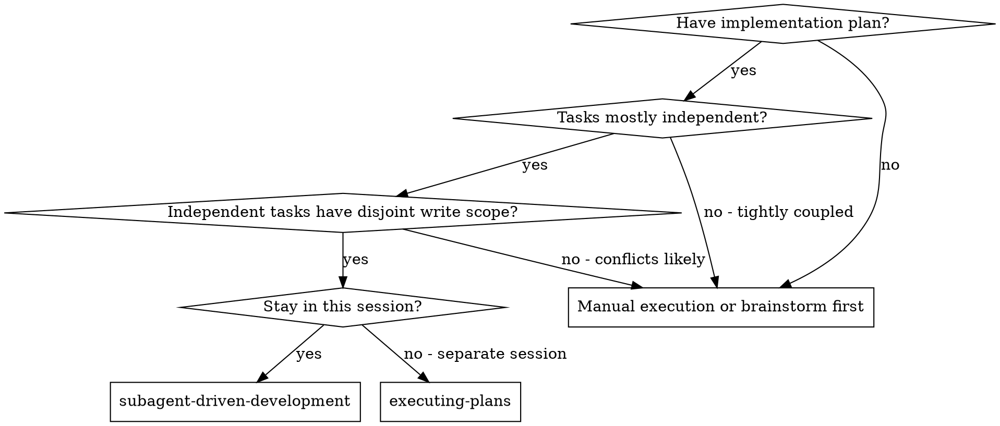
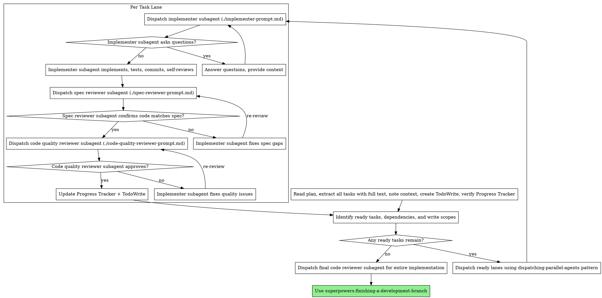

# Subagent-Driven Development

Execute plan by dispatching fresh subagents per task lane. Use parallel task lanes when tasks are independent and have disjoint ownership. When implementer lanes run in parallel, each write-capable lane gets its own branch-backed worktree. Every lane keeps the same two-stage review order: spec compliance first, then code quality.

**Core principle:** Fresh subagent per task lane + dedicated lane worktrees for parallel implementers + safe parallel dispatch + two-stage review (spec then quality) = high quality without unnecessary serial bottlenecks

## When to Use



**vs. Executing Plans (separate session):**

- Same session (no context switch)
- Fresh subagent per task lane (no context pollution)
- Can batch independent tasks in parallel when the plan proves they are disjoint
- Two-stage review after each task: spec compliance first, then code quality
- Faster iteration (no human-in-loop between tasks)

## The Process



## Prompt Templates

- `./implementer-prompt.md` - Dispatch implementer subagent
- `./spec-reviewer-prompt.md` - Dispatch spec compliance reviewer subagent
- `./code-quality-reviewer-prompt.md` - Dispatch code quality reviewer subagent

## Parallelization Gate

Use `dispatching-parallel-agents` as a subroutine only when every task in the batch passes all of these checks:

- No dependency edge between tasks
- No overlapping write scope, owned files, or owned modules
- A dedicated branch-backed worktree can be assigned to each write-capable implementer lane
- No shared mutable external state that can invalidate another lane's verification
- Targeted verification can run independently per lane
- The controller can describe each lane's boundaries in one prompt without ambiguity

If any check is uncertain, keep the work serial for that boundary. Speed is optional; correctness is not.

Recommended lane size:

- 2-4 implementer lanes at once for clearly independent tasks
- Review lanes may also run in parallel when each reviewer is locked to one task's diff and owned scope

## Lane Worktree Policy

Use one orchestration worktree for the controller, then choose lane topology deliberately:

- Single-lane serial execution: one isolated worktree is enough. Record `shared` in tracker fields if every task stays in the same workspace.
- Parallel implementer lanes: every write-capable implementer lane MUST get its own branch-backed worktree before implementation begins.
- Fix/rework loops: keep spec-fix and quality-fix cycles in the same lane worktree and branch that produced the reviewed diff.
- Reviewer lanes: default to pinned diff review without a dedicated mutable worktree. Provision a reviewer worktree only when the reviewer must run verification against that lane's exact tree.
- Controller integration: after both reviews pass, integrate the approved lane commit back into the orchestration branch, then update the tracker to record the integrated commit/diff.

Never let parallel implementer lanes share the controller worktree or a shared mutable branch. If two lanes need the same files, they are not parallel-safe.

## Progress Tracker Contract

The plan document's `## Progress Tracker` is the source of truth for task state and scheduling.

Before starting execution:

- Read the tracker and confirm every task has a row
- Confirm every row includes `Depends On`, `Write Scope`, `Lane Branch`, `Worktree Path`, `Commit / Diff`, and `Verification`
- Mirror it into TodoWrite, but do not treat TodoWrite as authoritative

During execution, update the tracker immediately when:

- a task starts
- ownership changes
- a lane branch or worktree path is assigned or changed
- a task creates or replaces a commit the lane now depends on
- a reviewer pins a new diff range for inspection
- a verification command passes or fails
- a task becomes blocked
- spec review starts or finishes
- code quality review starts or finishes
- the task is completed

Use this status vocabulary unless the plan explicitly overrides it:

- `not_started`
- `in_progress`
- `in_review_spec`
- `in_review_quality`
- `blocked`
- `completed`

Recommended transition pattern per task:

- `not_started` -> `in_progress` when the implementer begins work
- `in_progress` -> `in_review_spec` before dispatching the spec reviewer
- `in_review_spec` -> `in_progress` if spec issues require implementation fixes
- `in_review_spec` -> `in_review_quality` once spec review passes
- `in_review_quality` -> `in_progress` if quality issues require implementation fixes
- `in_review_quality` -> `completed` once quality review passes and verification is recorded
- `*` -> `blocked` whenever progress stops pending clarification or dependency

Controller responsibilities:

- Update the tracker in the plan doc before dispatching each subagent and after every subagent reply that changes state
- Use `Depends On` plus completed-task state to decide which lanes are ready
- Use `Write Scope` to reject unsafe parallel batches before dispatch
- Allocate a dedicated lane branch and worktree before dispatching any parallel implementer lane, then record both in the tracker
- Keep `Commit / Diff` current so every review is pinned to a stable target
- Keep `Verification` current so the tracker shows the latest test/command evidence, not just a narrative summary
- Integrate approved lane commits back into the orchestration branch before marking the task complete, and update the tracker if integration rewrites the SHA
- Pass the current tracker row with the task context so subagents know the latest status without rereading the whole plan
- Keep TodoWrite synchronized with the tracker, but resolve conflicts in favor of the tracker

Subagent responsibilities:

- Report explicit status transitions in every handoff, including verification or blocker notes
- Stay inside the assigned lane worktree and branch when write-capable work is requested
- Report commit SHAs or diff ranges they expect the tracker to record
- Report exact verification commands and whether they passed or failed
- Respect the tracker row's dependency and write-scope boundaries
- If instructed to edit the plan directly, touch only the assigned tracker row and task-specific notes
- Never assume chat history is current; use the tracker row provided by the controller

## Example Workflow

```
You: I'm using Subagent-Driven Development to execute this plan.

[Read plan file once: docs/plans/feature-plan.md]
[Extract all 5 tasks with full text and context]
[Create TodoWrite with all tasks]
[Verify Progress Tracker rows include dependencies, write scope, commit/diff, and verification state]
[Identify ready tasks with no unmet dependencies]

Tasks 1 and 2 are independent:
- Task 1 owns `scripts/install-hook.sh`, `tests/install-hook.test.ts`
- Task 2 owns `src/recovery.ts`, `tests/recovery.test.ts`

[Allocate Task 1 lane branch `lanes/task-1-hook` in `.worktrees/task-1-hook`]
[Allocate Task 2 lane branch `lanes/task-2-recovery` in `.worktrees/task-2-recovery`]
[Update Task 1 + Task 2 tracker rows to in_progress, owner=implementer, lane branch/worktree assigned, commit/diff=none, verification=not_run]
[Dispatch both implementer lanes using dispatching-parallel-agents pattern]

Task 1: Hook installation script

[Get Task 1 text and context (already extracted)]
[Dispatch implementation subagent with full task text + context + assigned branch/worktree]

Implementer: "Before I begin - should the hook be installed at user or system level?"

You: "User level (~/.config/superpowers/hooks/)"

Implementer: "Got it. Implementing now..."
[Later] Implementer:
  - Implemented install-hook command
  - Added tests, 5/5 passing
  - Self-review: Found I missed --force flag, added it
  - Committed (`abc1234`) on `lanes/task-1-hook`

[Update Task 1 tracker row to in_review_spec, owner=spec-reviewer, commit/diff=abc1234, verification=`npm test PASS`]
[Dispatch spec compliance reviewer]
Spec reviewer: ✅ Spec compliant - all requirements met, nothing extra

[Update Task 1 tracker row to in_review_quality, owner=code-quality-reviewer, commit/diff=`base000..abc1234`]
[Get git SHAs, dispatch code quality reviewer]
Code reviewer: Strengths: Good test coverage, clean. Issues: None. Approved.

[Cherry-pick `abc1234` onto orchestration branch -> `13579bd`]
[Update Task 1 tracker row to completed, commit/diff=13579bd, verification=`npm test PASS`, note=`reviewed on lane branch lanes/task-1-hook`, sync TodoWrite]

Task 2: Recovery modes

[Get Task 2 text and context (already extracted)]
[Dispatch implementation subagent with full task text + context + assigned branch/worktree]

Implementer: [No questions, proceeds]
Implementer:
  - Added verify/repair modes
  - 8/8 tests passing
  - Self-review: All good
  - Committed (`def5678`) on `lanes/task-2-recovery`

[Update Task 2 tracker row to in_review_spec, owner=spec-reviewer, commit/diff=def5678, verification=`npm test PASS`]
[Dispatch spec compliance reviewer]
Spec reviewer: ❌ Issues:
  - Missing: Progress reporting (spec says "report every 100 items")
  - Extra: Added --json flag (not requested)

[Update Task 2 tracker row to in_progress, owner=implementer, commit/diff=def5678, verification=`npm test PASS`, note=`fixing spec issues in lanes/task-2-recovery`]
[Implementer fixes issues]
Implementer: Removed --json flag, added progress reporting

[Update Task 2 tracker row to in_review_spec, owner=spec-reviewer, commit/diff=`def5678..fedcba9`, verification=`npm test PASS`]
[Spec reviewer reviews again]
Spec reviewer: ✅ Spec compliant now

[Update Task 2 tracker row to in_review_quality, owner=code-quality-reviewer, commit/diff=`def5678..fedcba9`]
[Dispatch code quality reviewer]
Code reviewer: Strengths: Solid. Issues (Important): Magic number (100)

[Update Task 2 tracker row to in_progress, owner=implementer, commit/diff=fedcba9, verification=`npm test PASS`, note=`fixing quality issues in lanes/task-2-recovery`]
[Implementer fixes]
Implementer: Extracted PROGRESS_INTERVAL constant

[Update Task 2 tracker row to in_review_quality, owner=code-quality-reviewer, commit/diff=`fedcba9..9876abc`, verification=`npm test PASS`]
[Code reviewer reviews again]
Code reviewer: ✅ Approved

[Cherry-pick `9876abc` onto orchestration branch -> `2468ace`]
[Update Task 2 tracker row to completed, commit/diff=2468ace, verification=`npm test PASS`, note=`reviewed on lane branch lanes/task-2-recovery`, sync TodoWrite]

Task 3 depends on Task 1 and Task 2

[Scheduler sees Task 3 is now unblocked]
[Dispatch next lane]

...

[After all tasks]
[Dispatch final code-reviewer]
Final reviewer: All requirements met, ready to merge

Done!
```

## Advantages

**vs. Manual execution:**

- Subagents follow TDD naturally
- Fresh context per task (no confusion)
- Safe parallel lanes when the plan proves ownership is disjoint
- Subagent can ask questions (before AND during work)
- Plan doc stays current as shared execution state

**vs. Executing Plans:**

- Same session (no handoff)
- Continuous progress (no waiting)
- Review checkpoints automatic

**Efficiency gains:**

- No file reading overhead (controller provides full text)
- Controller curates exactly what context is needed
- Subagent gets complete information upfront
- Questions surfaced before work begins (not after)
- Ready tasks can move in parallel instead of waiting behind unrelated work

**Quality gates:**

- Self-review catches issues before handoff
- Two-stage review: spec compliance, then code quality
- Review loops ensure fixes actually work
- Spec compliance prevents over/under-building
- Code quality ensures implementation is well-built

**Cost:**

- More subagent invocations (implementer + 2 reviewers per task)
- Controller does more prep work (extracting all tasks upfront)
- Parallel scheduling requires explicit dependency and write-scope thinking
- Review loops add iterations
- But catches issues early (cheaper than debugging later)

## Red Flags

**Never:**

- Start implementation on main/master branch without explicit user consent
- Skip reviews (spec compliance OR code quality)
- Skip Progress Tracker updates when state changes
- Let commit or verification state live only in chat instead of the tracker
- Proceed with unfixed issues
- Parallelize tasks without explicit dependency and write-scope checks
- Put two implementers on the same file or module
- Make subagent read plan file (provide full text instead)
- Skip scene-setting context (subagent needs to understand where task fits)
- Ignore subagent questions (answer before letting them proceed)
- Accept "close enough" on spec compliance (spec reviewer found issues = not done)
- Skip review loops (reviewer found issues = implementer fixes = review again)
- Let implementer self-review replace actual review (both are needed)
- **Start code quality review before spec compliance is ✅** (wrong order)
- Move to next task while either review has open issues
- Let reviewers inspect a moving target instead of a pinned task diff

**If subagent asks questions:**

- Answer clearly and completely
- Provide additional context if needed
- Don't rush them into implementation

**If reviewer finds issues:**

- Implementer (same subagent) fixes them
- Reviewer reviews again
- Repeat until approved
- Don't skip the re-review

**If subagent fails task:**

- Dispatch fix subagent with specific instructions
- Don't try to fix manually (context pollution)

## Integration

**Required workflow skills:**

- **superpowers:using-git-worktrees** - REQUIRED: Set up isolated workspace before starting
- **superpowers:writing-plans** - Creates the plan this skill executes
- **superpowers:dispatching-parallel-agents** - Use as the controller's parallel batching pattern when ready tasks are truly independent
- **superpowers:requesting-code-review** - Code review template for reviewer subagents
- **superpowers:finishing-a-development-branch** - Complete development after all tasks

**Subagents should use:**

- **superpowers:test-driven-development** - Subagents follow TDD for each task

**Alternative workflow:**

- **superpowers:executing-plans** - Use for separate-session execution with human checkpoints instead of same-session orchestration
